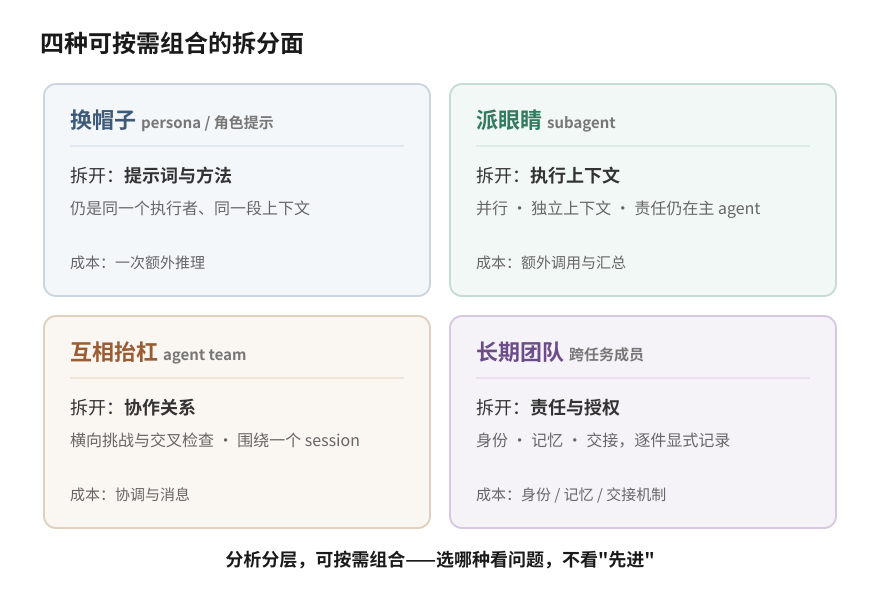

# 当我们谈论 Multi-Agent 的时候，我们在谈什么

前段时间有用户问了我们两个特别诚实的问题。第一个："我知道你们这个是 multi-agent，但我不知道什么时候该用它。"第二个："你们这个和 Claude Code 的 agent teams、WorkBuddy 里那种专家角色，到底有什么区别？"

这两个问题比看起来难回答。难点不在产品，在"multi-agent"这个词——它现在同时指着好几种不同的东西，解决的问题不同、成本不同、失败的方式也不同。分不清面对的是哪一种，自然不知道什么时候该用、用了该期待什么。

这篇文章结合我们过去几个月在自己系统上的实践，把这件事讲清楚。读完你不一定同意我们的设计，但应该能回答自己的那个"什么时候该用"。

## 一个词，几个时代

Multi-agent 不是 LLM 时代的新词。智能体与多智能体系统在 1990 年代就是成体系的研究领域，agent 该怎么定义、多个 agent 之间怎么协商合作，三十年前已有严肃讨论（[Wooldridge & Jennings, 1995](https://www.cs.ox.ac.uk/people/michael.wooldridge/pubs/ker95/ker95-html.html) 的综述是那个时代的代表作）。

到了 LLM 应用这一波，我们在工程里最常遇到的动机有两个：一个模型的上下文窗口装不下所有事；一个视角容易自我强化。2023 年前后，[AutoGen](https://arxiv.org/abs/2308.08155) 这类工作把"多个 LLM 之间对话协作"做成可编程的框架，各种角色分工的产品跟着长了出来。再往后，Anthropic 陆续公开了自家 [Research 系统](https://www.anthropic.com/engineering/multi-agent-research-system)的 orchestrator-worker 实践和 Claude Code 的 [Agent Teams](https://code.claude.com/docs/en/agent-teams)。这里的措辞值得较真：他们是把某几类 multi-agent 模式产品化并公开了工程经验，不是"提出了 multi-agent"。

所以你今天在不同产品里看到的"multi-agent"，是不同时代、不同问题域的东西共用了一个名字——同一个词被反复复用。麻烦在于：名字一样，就很难看出它们各自拆开的东西完全不同。

"拆开的东西"，是理解这一切的钥匙，也是这篇文章的中心：

**当我们谈论 multi-agent，谈的不是界面上有几个角色，而是为了解决什么问题、有意识地拆开了什么——执行上下文、协作关系、责任还是授权——以及愿意为这次拆分付多少协调成本。**

## 同一个任务，四种做法

空谈分类没意思。拿一个我们真实反复面对的任务来看：一篇技术文章写完了，发布前想提高质量。你有四种做法，每种都是市面上某类"multi-agent"。

换一顶帽子。给你的 agent 一段"资深审稿人"提示词，让它以这个身份把稿子过一遍。它的注意方向和方法确实变了，会开始挑结构、抠措辞，付出的只是一次额外推理，不需要任何新的协作设施。但拆开的只有提示词：执行它的还是同一个上下文、同一段对话历史，审读时仍可能继承作者的隐含前提。

这里埋一个后面会回来的问题：它挑出来的毛病，有多少是作者自己想不到的？

多派几双眼睛。把稿子拆开，派几个 subagent 并行去读，一个查引用、一个过代码示例、一个校对术语。每个 subagent 有自己干净的上下文，读完把结果交回来。这次拆开的是执行上下文，换来并行和容量；责任没拆，汇总结果、决定采纳什么的仍是主 agent。Anthropic 的 Research 系统是这个形态在检索场景的代表性实现：lead 拆问题、并行 worker、综合结果。代价是额外的模型调用与汇总开销——他们在工程博客里自报过约 15 倍于单聊天的 token 量级（vendor 自报、特定系统的数字，不是通用 benchmark；Claude Code Agent Teams 的[官方文档](https://code.claude.com/docs/en/agent-teams)同样提示团队模式会显著增加 token 消耗）。

让它们互相抬杠。几个独立 agent 同时在场：一个守作者立场，一个专职挑刺，一个盯技术事实。它们能看到彼此的意见、直接对话。拆开的是协作关系——不再是"派活收活"，出现了横向的挑战与交叉检查。Claude Code 的 Agent Teams 就在这一层：独立 session 的 teammate 共享任务表、互发消息。按官方文档的边界（核验于文档自报的 v2.1.178），它当前是实验性的、围绕一个 session 的协作结构——团队运行态随 session 结束清理，任务表可以在恢复的 session 里保留；跨 session 的稳定成员身份与责任连续性，还不是它承诺的东西。

把这件事交给一个团队。固定的几个成员，各有名字、各有擅长、互相记得上次的分歧。一个当作者、一个当审稿人，按流程走完写、审、修、验收；谁审的谁签字，下一篇还是他们。拆开的是责任与授权：每一步有明确的"现在归谁"，审稿人的批准权不因为作者着急就消失，事后能查"这段是谁放行的"。成本也最重——身份、记忆、责任记录都要有地方放，交接要有手续。

四种做法之间没有优劣排序，它们在回答不同的问题：

| | 拆开了什么 | 责任落在哪 | 新增成本 | 仍不解决什么 |
|---|---|---|---|---|
| 换帽子（persona） | 提示词与方法 | 同一个执行者 | 一次额外推理，无新增协作设施 | 视角仍然同源 |
| 派眼睛（subagent） | 执行上下文 | 主 agent | 额外模型调用与汇总 | 结果仍由一个头脑裁决 |
| 互相抬杠（agent team） | 协作关系 | 共享任务表 + lead | 协调与消息 | 跨 session 的成员连续性 |
| 长期团队 | 责任与授权（可与前三层组合） | 逐件显式记录 | 身份、记忆、交接机制 | 不会自动更正确——买的是可治理 |

## 我们真实做的那次：冷读

第四种做法听起来最重，值不值？讲一件我们前不久真实做的事，你自己判断。

我们有一篇三万字的技术长文。团队里两个 agent 成员——分属不同的模型家族——当作者和审稿人，来回改了多轮，双方都认为设计已经完整。发布前我们加了一个动作：再派一个全新的读者进来。它只拿到发布文本这一个文件，没有讨论历史，没有内部规范，没有任何背景，从头冷读，在真实卡住的地方提问。

结果让我们有点下不来台。这个零上下文读者连续扎穿三个承重缺口：文章反复依赖的"身份锚点"物理上是什么，全文没有定义；高风险操作的"受控边界"在一个以自由 shell 为主要工具的运行时里放在哪，没有答案；文中声称"精确可证伪"的规则，实际只覆盖一个极窄的反驳角落，却被写成了完整的证伪规则。三个问题，内部多轮往返没有一轮碰到。

最刺的是第四件事。审稿成员在回答读者时，引用"正文 §1.2 的四个代价维度"去纠正对方；读者把全文重读一遍后指出：发布文本里根本没有 §1.2，那段内容只存在于我们的内部规范里。作者把自己脑子里的状态当成了纸上已经写出的东西——而且是在纠正别人的时候。

这件事能直接落账的是一个事实：只拿发布文本的读者，发现了内部作者和审稿链多轮往返都没发现的问题。为什么会这样？我们的解释是，独立的上下文让读者不携带作者群体的隐含前提——一起讨论了几个月，"锚点当然存在"这类共识早就变成看不见的空气。这个解释与整个过程高度吻合。但说老实话，我们没有做过"有隔离对比无隔离"的受控实验，所以它是一个机制推断，不是定理。

据此我们把两条做法定成了自己的铁律。审读高价值产出时用 fresh-context：审读者只从发布物独立重建理解，不接收作者的转述。关键审查跨模型家族做。目的说得很克制——降低盲点相关的概率。角色提示词能制造分工，审稿人确实会去挑审稿人该挑的毛病；但分工不等于独立性，两个 agent 如果共享上下文、模型倾向和工具链，它们看不见的东西也可能是同一批。

回到上一节埋的那个问题：换一顶帽子的审稿人，挑出的毛病有多少是作者想不到的？我们的经验是，分工会变，盲区不一定变。这就是我们愿意为隔离审读付出成本的原因。至于整条"长期团队"的路是怎么走出来的——那来自更早几个月里的一串协作事故，是下一篇要从头讲的故事。

## 所以，我们在谈什么

把各种形态拆开看，用 multi-agent 你买的其实是三类东西：

- 执行容量与并行，在上下文装不下、一个人读不完的时候；
- 独立的观察、质疑与验证，在一个视角会自我强化的时候；
- 跨任务的身份、责任与记忆连续性，在工作跨天、换手、要追责的时候。

而责任与授权的分离，是让这些收益可治理的边界：没有它，并行的结果没人裁决归属，独立的意见没人签字负责，连续性无从记账。执行上下文、协作关系、责任、授权——这就是开头那句话里"拆开的东西"的完整清单：前两项主要扩展能力，后两项给协作一个能持续承担与裁决的边界。

顺带给一个可自检的边界——怎么判定一个系统真的拆开了责任与授权，而不是把审批流程或审计日志改名叫 multi-agent：**至少两个可以独立承担责任的执行主体，且责任转移是脱离任一单独执行者上下文的双边事务**。三条短测试：一，"这件事现在谁负责"能由一条权威状态记录直接回答，不靠问执行者、也不靠事后翻日志推断；二，责任从 A 转到 B 时，B 有显式的接受动作、A 的旧授权同时失效——改一个 owner 字段或者切一段提示词都不算；三，执行者失效之后，它名下的责任仍然是可转移或可显式悬置的系统状态，不依赖把它的上下文抢救回来。审计日志过不了第一条，单 agent 工作流过不了第二条，把 agent 当工具的审批系统过不了第三条。

买这些都要付钱：token 消耗通常显著增加、并随活跃成员数增长，协调开销、交接手续，还有一条最容易被忽略的——相关性失效。多个 agent 一起错得一样，比一个 agent 出错更难被发现。

最后回到"什么时候该用"。从上往下问，停在第一个"是"：

1. 一次性的活、顺序清楚、一个上下文装得下？单 agent，别给自己加协调成本。
2. 只是需要专业方法？给现在的 agent 加一套方法（skill，或你所在平台的等价物）。
3. 活能并行拆、子任务之间不用商量？subagent。
4. 一次任务里需要独立视角互相挑战？agent team。
5. 工作跨天、责任换手、人要审批、失败不能整单重跑、事后要查"谁决定的"？这时候你需要的才是那个最重的形态。

判断第 5 问的信号是责任，不是复杂度。任务复杂不等于需要长期团队；任务简单但责任必须连续——比如一次生产迁移，多方交接、人工审批、事后审计——反而值得。

既然有的场景确实需要最重的那一层，它具体应该怎么设计：身份怎么锚定、上下文怎么交接、记忆怎么分层、责任怎么记账？这是下一篇的事——《我们期望中的 Multi-Agent 是怎样的》。那一篇从我们踩过的事故出发，把设计一步步推导给你看。

---

*来源说明：文中对外部系统的描述基于官方一手材料——[Wooldridge & Jennings (1995)](https://www.cs.ox.ac.uk/people/michael.wooldridge/pubs/ker95/ker95-html.html)、[AutoGen](https://arxiv.org/abs/2308.08155)、Anthropic [Building Effective Agents](https://www.anthropic.com/engineering/building-effective-agents) 与 [Research 系统](https://www.anthropic.com/engineering/multi-agent-research-system)工程博客、Claude Code [sub-agents](https://code.claude.com/docs/en/sub-agents) 与 [agent-teams](https://code.claude.com/docs/en/agent-teams) 文档（Agent Teams 边界描述核验于文档自报的 v2.1.178；其发布日期 v2.1.32 / 2026-02-05 见[官方 changelog](https://code.claude.com/docs/en/changelog)）；用户提问中的 WorkBuddy 拼写核验自[腾讯云官方产品页](https://cloud.tencent.com.cn/product/workbuddy)。对我们自身实践的描述按四级证据边界披露：实测失效 / 已上线局部机制 / 未实现的统一本体 / 未验证的组合效果。冷读案例为直接观察加机制推断，非受控实验。*
