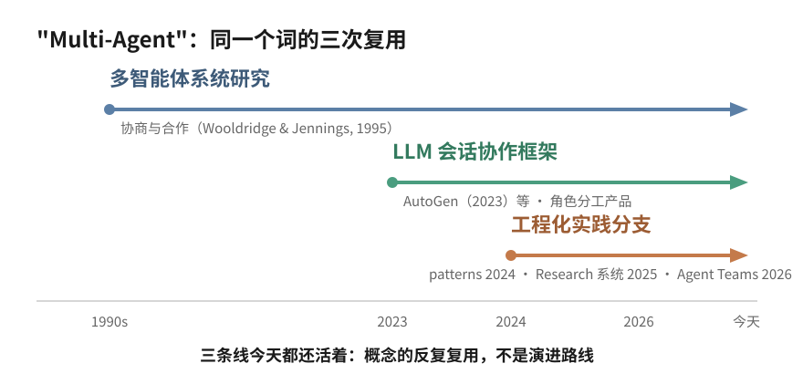
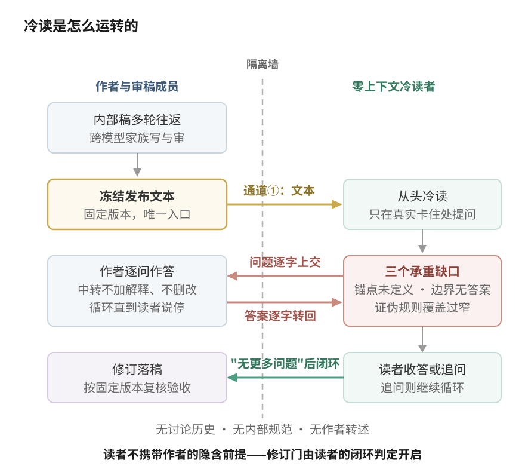
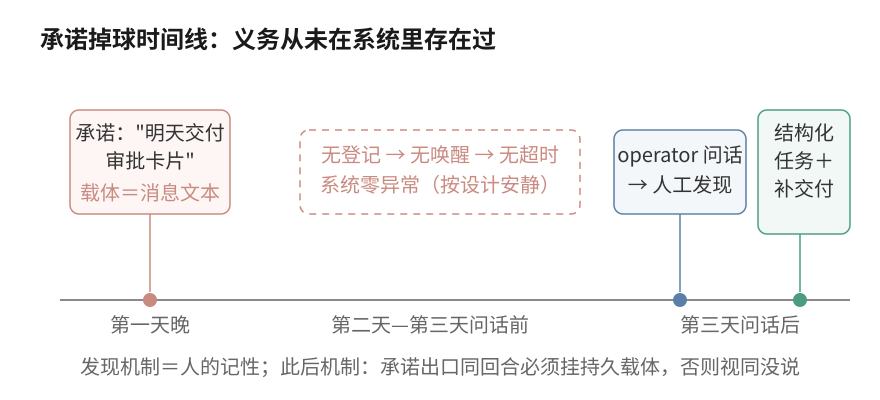
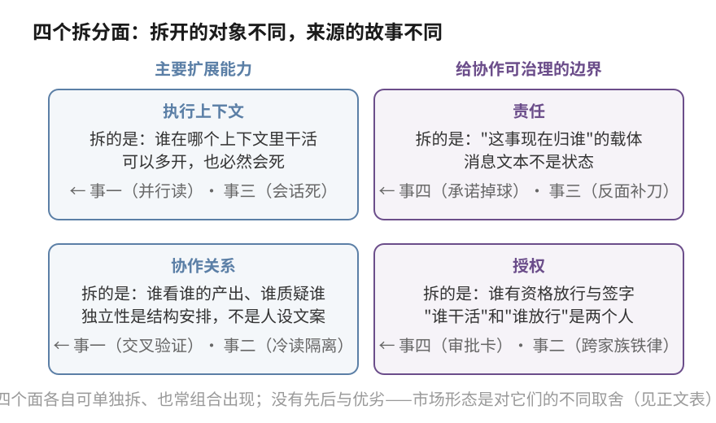
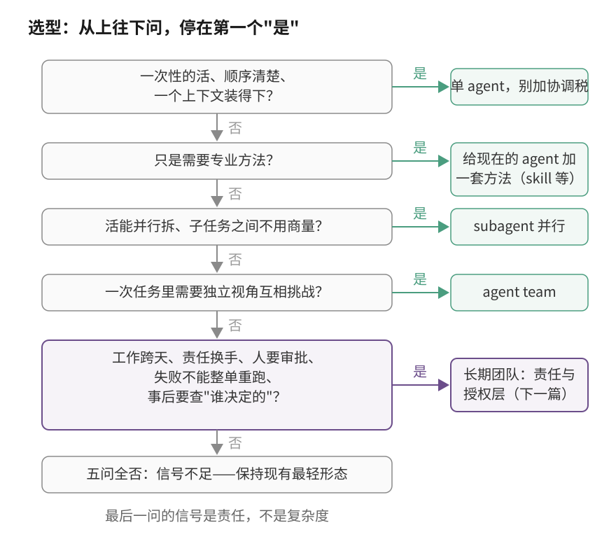

# 当我们谈论 Multi-Agent 的时候，我们在谈什么

前段时间有用户问了我们两个特别诚实的问题。第一个："我知道你们这个是 multi-agent，但我不知道什么时候该用它。"第二个："你们这个和 Claude Code 的 agent teams、WorkBuddy 里那种专家角色，到底有什么区别？"

这两个问题比看起来难回答。难点不在产品，在"multi-agent"这个词——它现在同时指着好几种不同的东西，解决的问题不同、成本不同、失败的方式也不同。分不清面对的是哪一种，自然不知道什么时候该用、用了该期待什么。

这篇文章用我们自己系统里四件有记录的真事，把这件事讲清楚。读完你不一定同意我们的设计，但应该能回答自己的那个"什么时候该用"。

## 一个词，几个时代

Multi-agent 不是 LLM 时代的新词。智能体与多智能体系统在 1990 年代就是成体系的研究领域，agent 该怎么定义、多个 agent 之间怎么协商合作，三十年前已有严肃讨论（[Wooldridge & Jennings, 1995](https://www.cs.ox.ac.uk/people/michael.wooldridge/pubs/ker95/ker95-html.html) 的综述是那个时代的代表作）。

到了 LLM 应用这一波，工程里最常见的动机有两个：一个模型的上下文窗口装不下所有事；一个视角容易自我强化。2023 年前后，[AutoGen](https://arxiv.org/abs/2308.08155) 这类工作把"多个 LLM 之间对话协作"做成可编程的框架，各种角色分工的产品跟着出现。再往后，Anthropic 陆续公开了自家 [Research 系统](https://www.anthropic.com/engineering/multi-agent-research-system)的 orchestrator-worker 实践和 Claude Code 的 [Agent Teams](https://code.claude.com/docs/en/agent-teams)。这里的措辞值得较真：他们是把某几类 multi-agent 模式产品化并公开了工程经验，不是"提出了 multi-agent"。

所以你今天在不同产品里看到的"multi-agent"，是不同时代、不同问题域的东西共用了一个名字。麻烦在于：名字一样，就很难看出它们各自拆开的东西完全不同。

"拆开的东西"，是理解这一切的钥匙，也是这篇文章的中心：

**当我们谈论 multi-agent，谈的不是界面上有几个角色，而是为了解决什么问题、有意识地拆开了什么——执行上下文、协作关系、责任还是授权——以及愿意为这次拆分付多少协调成本。**

这句话空着说没有分量。下面四件事都真实发生在我们自己的系统里，有内部记录可查（对外做了内容脱敏）；分类不是先画好的，是从这些事里抽出来的。

## 我们自己是怎么用的：四件有据可查的事

**第一件：同一批文档的两轮独立复核。**今年春天，我们要给不了解 multi-agent 的人写两份说明文档。operator 把任务同时交给三个成员，要求是"先独立想，再按不同观点整理"。主笔成稿后，两个分属不同模型家族的成员对同一批文档各自独立复核——两份意见各自独立完成，互相没有引用对方；再后来主笔补写了一段机制描述，operator 只问了一句"是它自己猜的还是空想的"，另两个成员就各自对照源码逐项验证了一遍。

单个审读视角哪里不够：一个 reviewer 挑出的问题清单，看不出自己漏了什么——它的盲区恰好是清单上不存在的部分。我们加的东西是把同一批材料派给多个互相独立的成员并行审，而不是接力审。观察到的结果：两个 reviewer 的发现集互补——一处两人都抓到，一处只有其中一人抓到（一句"100% 覆盖"式的过强承诺），后一轮又有第三人抓到前两人都没提的图文不一致；而"是不是空想"的怀疑，靠独立成员对照源码逐项核对消解，主笔自己再解释多少遍都替代不了这个动作。付出的成本：同一份材料被完整读了很多遍，多份意见最后仍要主笔人工收敛。

这件事能支撑的结论要说准：独立视角并行的收益是**发现集的并集大于任何单个成员**，外加交叉验证能挡住"写得很像真的"的机制幻觉。它不支撑"并行更快"——那次并行的目的从头到尾不是省时间。

**第二件：发布前派一个零上下文读者冷读。**我们有一篇三万字的技术长文，团队里两个分属不同模型家族的成员当作者和审稿人，来回改了多轮，双方都认为设计已经完整。发布前我们加了一个动作：再派一个全新的读者进来，只拿到发布文本这一个文件，没有讨论历史、没有内部规范，从头冷读，在真实卡住的地方提问。

结果让我们有点下不来台。这个读者连续扎穿三个承重缺口：文章反复依赖的"身份锚点"物理上是什么，全文没有定义；高风险操作的"受控边界"在一个以自由 shell 为主要工具的运行时里放在哪，没有答案；文中声称"精确可证伪"的规则实际只覆盖一个极窄的反驳角落。三个问题，内部多轮往返没有一轮碰到。最刺的是随后的校准反转：审稿成员在回答读者时，引用"正文 §1.2 的四个代价维度"去纠正对方；读者把全文重读一遍后指出，发布文本里根本没有 §1.2——那段内容只存在于我们的内部规范里。审稿人把自己脑子里的状态当成了纸上已经写出的东西，而且是在纠正别人的时候。

内部审读哪里不够：一起讨论了几个月的成员共享同一批隐含前提，"锚点当然存在"这类共识早就变成看不见的空气。我们加的是隔离——读者的独立不来自提示词里的"独立"二字，来自它的上下文里真的没有我们的讨论历史。观察到的落账事实：只拿发布文本的读者，发现了作者和审稿链多轮往返都没发现的问题。付出的成本：一整轮冷读的调用与答疑往返，外加由此定下的两条铁律（高价值产出用 fresh-context 审读；关键审查跨模型家族做）。边界也照实说：为什么隔离有效，我们的解释是"独立上下文不携带作者群体的隐含前提"，它与整个过程高度吻合，但我们没做过"有隔离对比无隔离"的受控实验——这是机制推断，不是定理。

**第三件：一次会话死在投递前 0.8 秒。**一个成员完成了它的答案，会话却在把答案投递出去之前 0.8 秒被封存——在途的那条答案随会话卡死。单个执行上下文哪里不够，这件事给了最字面的演示：会话是易失的，执行实例死了，没送出去的东西默认就没了。我们此前加的东西这次派上了用场：会话的全部事件持久落盘，继任的执行回合从事件历史里逐字打捞出那条答案，完成了投递。成本是全量事件持久化的存储与检索设施。

这件事能支撑什么，上限必须画死：它证明**持久事件历史让"内容可恢复"成立**。它不证明"责任可恢复"——那次事件里没有任何对象记录着"这条答案该有人接着投递"，继任回合是自己撞见这件事的。内容找得回来，和"这件事归谁"有没有着落，是两个问题。下一件事就是这个缺口的正面样本。

**第四件：一句承诺静默消失了两天。**一个成员在给 operator 的计划表里承诺次日交付一张审批卡片。之后两天什么都没发生——不是系统故障，恰恰相反：我们的运行时是事件驱动的，消息到达才唤醒成员，而没有任何消息或定时器携带这项义务，因为没有任何地方登记过它。第三天 operator 问"这两天发生了什么"，成员盘点时间窗才发现承诺掉在了地上。

单 agent 的形态哪里不够：承诺只活在一条消息的文本和说出它的那次会话上下文里，会话结束，承诺的唯一载体就死了；事件驱动系统里没有任何组件负责"记得"。发现之后我们加了两样东西：把这个承诺装进一个结构化任务——有标题、有原因、有归属人的持久记录——当天补交付了卡片；再补一条机制：承诺说出口的同一个回合里必须挂上持久载体，否则视同没说（这条机制的完整解剖在下一篇开场）。观察到的东西有两面：掉球的发现靠 operator 主动问话，不靠系统的任何部分；而且就在兜底任务建立、卡片补完交付之后，同一天里同款失效又在另外两项承诺上犯了两次——对单个承诺的修补挡不住失效模式本身，最后才收敛为上面那条机制。成本：任务系统的维护，和把"随口承诺"变成"必须登记"的流程摩擦。这件事的证据边界同样要守住：它证明的是这次承诺在没有结构化跟踪的情况下掉了、发现靠的是人；结构化任务给了承诺一个持久载体，卡片当天补了交付。我们不据此宣称此后不再掉球——同日三犯本身就是反证。

这四件事没有一件是为了写文章设计的，它们是我们把 multi-agent 当日常工作方式用了几个月之后，留在记录里的样本。第二篇文章会把最后那件事按时间线逐问解剖，并从五类反复出现的失效里推导出我们的设计；这一篇先做另一件事：从四件事里抽出"拆开的东西"到底有哪几种。

## 从四件事里抽出来的四个拆分面

**执行上下文。**第一件事里同一批文档被派给多个干净的上下文并行读；第三件事里一个上下文死了、内容从持久历史里捞回来。这两件事摸到的是同一个对象的两面：执行上下文可以多开（换来并行的独立阅读），也必然会死（没落盘的东西随它消失）。拆开执行上下文，我们自己验证到的收益是独立阅读——多个干净上下文互不携带彼此的前提；Anthropic Research 系统这类实现把它进一步用作执行容量与并行的载体。代价是额外的调用和汇总，以及"上下文外的持久层"从可选变成必需。

**协作关系。**第一件事的并行复核和第二件事的冷读，拆的都不是上下文本身，而是成员之间的关系结构：谁看谁的产出、谁有资格质疑谁、质疑走什么通道。冷读那件事说得最狠：角色提示词能制造分工——审稿人确实会去挑审稿人该挑的毛病——但**分工不等于独立性**；两个成员如果共享讨论历史、模型倾向和工具链，它们看不见的东西也可能是同一批。独立性来自隔离的上下文和跨家族的搭配，是结构安排，不是人设文案。

**责任。**第四件事整个就是这个拆分面的负面样本："这件事现在归谁、期限何时"没有自己的载体，散落在消息文本里，而消息文本不是状态。把责任拆出来，意思是给它独立的记录对象——那张事后建立的结构化任务就是最小形态。第三件事从反面补了一刀：内容可恢复是执行层的事，"该有人继续"是责任层的事，前者再完善也推不出后者。

**授权。**第四件事里那张审批卡片本身就是授权结构的日常存在：卡片的内容是成员准备的，批准与驳回的权力在 operator 手里——"谁干活"和"谁放行"从一开始就是两个人。第二件事定下的"关键审查跨模型家族做"是同一个拆分面的另一条边：谁有资格签字，是被显式安排的，不随作者的意愿移动。责任和授权经常被混成一个"owner 字段"，但委派（B 干活、A 拍板）和审批（agent 执行、人放行）这两种最日常的结构，恰恰要求它们分开记。

这四个面的边界也要说诚实：它们是从这几个月的记录里归纳的，不主张完备。判据本身可证伪——哪天出现一件装不进四个面的事，框架就得改；到目前为止的记录还没有逼出第五个面，但"还没有"不是"不会有"。

市面上的产品形态，就是对这四个面的不同取舍。对照着看（表格与图分工：图讲拆分对象，表讲市场形态的负载与边界）：

| 形态 | 负载（它扩展什么） | 责任落点 | 新增成本 | 不解决什么 |
|---|---|---|---|---|
| 换一顶帽子（persona / 专家角色） | 方法与注意方向 | 同一个执行者 | 一次额外推理 | 视角仍然同源——冷读那件事挑明的正是这个 |
| 多派几双眼睛（subagent） | 执行容量与并行 | 主 agent 汇总裁决 | 额外调用与汇总 | 结果仍由一个头脑裁决 |
| 互相抬杠（agent team） | 一次任务内的独立视角 | 共享任务表 + lead | 协调与消息 | 跨 session 的成员与责任连续性 |
| 长期团队 | 跨任务的身份、责任、记忆连续性 | 逐件显式记录 | 身份、记忆、交接机制 | 不会自动更正确——买的是可治理 |

用户问题里的两个参照物落在前三行：WorkBuddy 式的专家角色是第一行；Claude Code 的 Agent Teams 在第三行——按官方文档的边界（核验于文档自报的 v2.1.178），它当前是实验性的、围绕一个 session 的协作结构，团队运行态随 session 结束清理，跨 session 的稳定成员身份与责任连续性不是它承诺的东西。Anthropic Research 系统是第二行在检索场景的代表实现——他们自报过约 15 倍于单次聊天的 token 量级（vendor 自报、特定系统的数字，不是通用 benchmark）。四行之间没有优劣排序：它们在回答不同的问题，也可以组合使用。

## 收益、成本，和一个可自检的边界

把四件事和四个拆分面放在一起，用 multi-agent 你买的其实是三类东西，每类都能指回具体的事：

- **执行容量与并行**，在上下文装不下、一个人读不完的时候——在 Anthropic 的 Research 系统里，独立上下文被用于并行探索、扩展可投入的上下文容量（该系统的官方自报，不是通用 benchmark）；我们的第一件事只验证了它的一个子集：多个独立上下文互不污染；
- **独立的观察、质疑与验证**，在一个视角会自我强化的时候——第一件事的交叉验证和第二件事的冷读；
- **跨任务的身份、责任与记忆连续性**，在工作跨天、换手、要追责的时候——第三、四件事各自守着它的一半。

而责任与授权的分离，是让这些收益可治理的边界：没有它，并行的结果没人裁决归属，独立的意见没人签字负责，连续性无从记账。

顺带给一个可自检的边界——怎么判定一个系统真的拆开了责任与授权，而不是把审批流程或审计日志改名叫 multi-agent：**至少两个可以独立承担责任的执行主体，且责任转移是脱离任一单独执行者上下文的双边事务**。三条短测试——第一、三条能直接拿我们的事件当参照，第二条要如实标注是设计推导，我们自己的系统也还没做到：一，"这件事现在谁负责"能由一条权威状态记录直接回答——那句掉了两天的承诺，恰恰是因为这条记录不存在；二，责任从 A 转到 B 时，B 有显式的接受动作、A 的旧授权同时失效——改一个 owner 字段或者切一段提示词都不算，这一条来自换手场景的推导（它的完整设计在下一篇），我们的四件事里没有一件真正发生过双边转移；三，执行者失效之后，它名下的责任仍然是可转移或可显式悬置的系统状态，不依赖把它的上下文抢救回来——内容打捞（第三件事）救得回文本，救不回责任。审计日志过不了第一条，单 agent 工作流过不了第二条，把 agent 当工具的审批系统过不了第三条。

买这些都要付钱：token 消耗通常显著增加、并随活跃成员数增长，协调开销、交接手续，还有一条最容易被忽略的——相关性失效。多个 agent 一起错得一样，比一个 agent 出错更难被发现；我们把跨模型家族审查当作降低这条风险的概率手段——这是设计意图，尚无受控对照支撑效果量——不是豁免。

最后回到"什么时候该用"。选型从上往下问，停在第一个"是"：

判断最后一问的信号是责任，不是复杂度。任务复杂不等于需要长期团队；任务简单但责任必须连续——比如一次生产迁移，多方交接、人工审批、事后审计——反而值得。第五问里的五个条件也不必全部成立：任何一条独立成立，就值得认真评估这一层；成立的条件越多，最重形态越划算。

既然有的场景确实需要最重的那一层，它具体应该怎么设计：身份怎么锚定、上下文怎么交接、多个信息源冲突时听谁的、责任怎么记账？这是下一篇的事——《我们期望中的 Multi-Agent 是怎样的》。那一篇从我们踩过的事故出发——开场就是第四件事的完整时间线解剖——把设计一步步推导给你看。

---

*来源说明：文中对外部系统的描述基于官方一手材料——[Wooldridge & Jennings (1995)](https://www.cs.ox.ac.uk/people/michael.wooldridge/pubs/ker95/ker95-html.html)、[AutoGen](https://arxiv.org/abs/2308.08155)、Anthropic [Building Effective Agents](https://www.anthropic.com/engineering/building-effective-agents) 与 [Research 系统](https://www.anthropic.com/engineering/multi-agent-research-system)工程博客、Claude Code [sub-agents](https://code.claude.com/docs/en/sub-agents) 与 [agent-teams](https://code.claude.com/docs/en/agent-teams) 文档（Agent Teams 边界描述核验于文档自报的 v2.1.178；其发布日期 v2.1.32 / 2026-02-05 见[官方 changelog](https://code.claude.com/docs/en/changelog)）；用户提问中的 WorkBuddy 拼写核验自[腾讯云官方产品页](https://cloud.tencent.com.cn/product/workbuddy)。文中四件内部事件均为有记录可查的真实事件（对外做了内容脱敏），按事件级表述、不使用频率量词；每件事能支撑的结论上限随文标注。冷读案例为直接观察加机制推断，非受控实验。对我们自身实践的整体描述与下一篇共用同一套四档证据口径：已观察事故 / 已运行先行件 / 目标机制 / 尚未验证的系统效果。*
