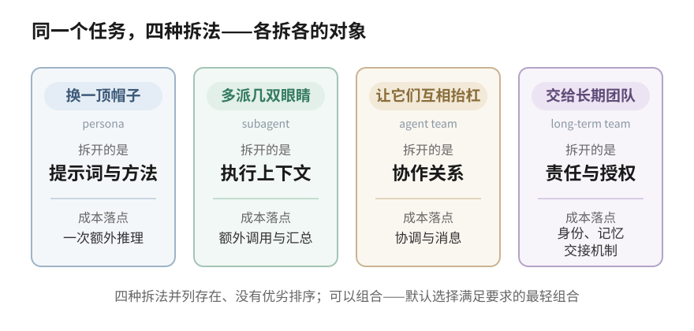
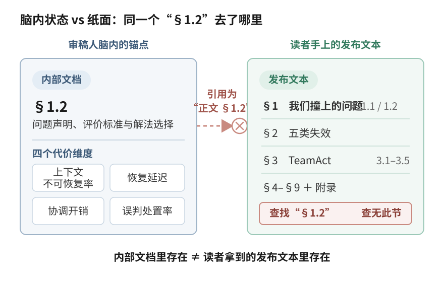

# 当工作跨越会话：为什么需要长期团队

*《Clowder-AI 的 Multi-Agent 设计》· 上篇*

Clowder-AI 是一个让人和多个 AI 成员组成长期团队的协作平台：几个分属不同模型家族的 AI 成员有稳定的身份和各自的记忆，一个人类 operator（负责拍板和验收的那个人）也是团队的一员；大家围绕同一个软件产品长期协作，工作以天计、跨会话，靠消息、任务和共享文档配合——像一个远程小团队，只是大部分成员是 agent。

它面向的是这样一类工作：一件事从提出到验收要跨好几天；中途需求会变；执行它的会话会结束，接着做的可能换了一个执行者；出了岔子，工作要接着走而不是从头再来。这是对目标工作形态的描述，不是某一次事件的记录——这类工作真正的麻烦，下面用一件真实发生的事来说。

先交代一句背景。multi-agent 不是 LLM 时代的新词——1990 年代它就是成体系的研究领域（[Wooldridge & Jennings, 1995](https://www.cs.ox.ac.uk/people/michael.wooldridge/pubs/ker95/ker95-html.html)）；到 LLM 应用这一波，[AutoGen](https://arxiv.org/abs/2308.08155) 这类框架把"多个 LLM 对话协作"做成可编程的东西，Anthropic 又陆续把 [Research 系统](https://www.anthropic.com/engineering/multi-agent-research-system)和 Claude Code 的 [Agent Teams](https://code.claude.com/docs/en/agent-teams) 产品化。结果是：你今天在不同产品里看到的"multi-agent"，是不同时代、不同问题域的东西共用了一个名字——分不清面对的是哪一种，就不知道该期待什么、该在什么时候用。

## 一句承诺是怎么消失两天的

七月的一天，一个成员在给 operator 的计划表里写下一句承诺：

> 明天把那张审批卡交到你手上。
> ——某成员，写在计划表里

然后，两天里什么都没发生——不是系统故障，恰恰相反：我们的运行时是事件驱动的，消息到达才唤醒成员，而这句话没变成任何消息、也没挂上任何定时器，因为没有任何地方登记过它。承诺只活在这句话本身、和说出它的那次会话里；会话一结束，它唯一的载体就死了，系统里没有任何组件负责"记得"。第三天 operator 问"这两天发生了什么"，成员盘点时间窗才发现：这句承诺，早丢在了地上。

发现之后，我们把同一句承诺，装进了一个有结构的东西：

> 任务：交付审批卡片
> 负责人：该成员　·　状态：进行中　·　载体：持久记录，重启不丢

有标题、有归属人、有独立于任何会话的持久记录——当天就照着它补交付了卡片。我们还补了一条规矩：承诺说出口的同时必须挂上这样的持久载体，否则视同没说。代价同样直白：每句承诺多一步登记动作，外加维护这层持久设施本身。

有两个细节比修复本身更值得说。一个是发现方式：承诺丢了两天，最后靠的是 operator 主动问话，系统的任何部分都没有出声。另一个更扎心：就在兜底任务建立、卡片补完交付的当天，同款失效又在另外两项承诺上犯了两次——对单个承诺的修补，挡不住失效模式本身。所以这件事我们只敢说"承诺没有结构化跟踪就会丢、发现靠人"，不敢说此后不再丢——同一天的三次就是反证。

从这件事往外看，跨会话的工作有四个问题必须随时有答案：**现在谁负责？谁有权批准？换手之后谁继续？事后怎么追溯？**承诺消失是第一问的负面样本——"谁负责交付审批卡"这个问题，当时在系统里没有任何对象能回答。

## 市面的 multi-agent，各自停在哪

拿着这四个问题，再去看市面上叫"multi-agent"的东西，差异就清楚了。举同一个任务：一篇技术文章写完了，发布前想提高质量。四种做法，各拆各的。

**换一顶帽子（persona / 专家角色）**

给你的 agent 一段"资深审稿人"提示词，让它以这个身份把稿子过一遍。它的注意方向和方法确实变了，会开始挑结构、抠措辞，付出的只是一次额外推理，不需要任何新的协作设施。WorkBuddy 里的专家角色就在这一层。

但拆开的只有提示词：执行它的还是同一个上下文、同一段对话历史，审读时仍可能继承作者的隐含前提。对那四个问题，它一个都不碰——执行者和它的会话，自始至终是同一个。

**多派几双眼睛（subagent）**

把稿子拆开，派几个 subagent 并行去读：一个查引用、一个过代码示例、一个校对术语。每个 subagent 有自己干净的上下文，读完把结果交回来。

这次拆开的是执行上下文，换来并行和容量；责任没拆——汇总结果、决定采纳什么的仍是主 agent。Anthropic 的 Research 系统是这个形态在检索场景的代表实现：lead 拆问题、并行 worker、综合结果。代价是额外的调用与汇总开销——他们自报过约 15 倍于单次聊天的 token 量级（自报数字，非通用 benchmark）。对那四个问题：任务在一次会话内答案是清楚的（主 agent 负责），会话一结束，这个答案没有任何载体接着持有。

**让它们互相抬杠（agent team）**

几个独立 agent 同时在场：一个守作者立场，一个专职挑刺，一个盯技术事实。它们能看到彼此的意见、直接对话。拆开的是协作关系——不再是"派活收活"，出现了横向的挑战与交叉检查。

Claude Code 的 Agent Teams 就在这一层：独立 session 的 teammate 共享任务表、互发消息。按官方文档当前的边界，它是实验性的、一个 session 同时只运行一个 team 的协作结构：任务列表会持久保留，但 team 配置随 session 结束清理，恢复会话也不会恢复运行中的 teammate。跨 session 的稳定成员身份与责任连续性，不是它当前承诺的东西——那四个问题里的后两个（换手谁继续、事后怎么追溯），在这一层没有系统级的答案。

**把这件事交给一个团队**

固定的几个成员，各有名字、各有擅长、互相记得上次的分歧。一个当作者、一个当审稿人，按流程走完写、审、修、验收；谁审的谁签字，下一篇还是他们。

拆开的是责任与授权：每一步有明确的"现在归谁"，审稿人的批准权不因为作者着急就消失，事后能查"这段是谁放行的"。成本也最重——身份、记忆、责任记录都要有地方放，交接要有手续。四个问题在这一层才全部成为系统要正面回答的对象；Clowder-AI 的答案落在这里，下一节展开。

四种做法之间没有优劣排序，它们在回答不同的问题：

| 形态 | 拆开了什么 | 责任落在哪 | 新增成本 | 仍不解决什么 |
|---|---|---|---|---|
| 换帽子（persona） | 提示词与方法 | 同一个执行者 | 一次额外推理 | 视角仍然同源 |
| 派眼睛（subagent） | 执行上下文 | 主 agent 汇总裁决 | 额外调用与汇总 | 结果仍由一个头脑裁决 |
| 互相抬杠（agent team） | 协作关系 | 共享任务表 + lead | 协调与消息 | 跨 session 的成员与责任连续性 |
| 长期团队 | 责任与授权（可与前三层组合） | 逐件显式记录 | 身份、记忆、交接机制 | 不会自动更正确——增加的是可治理性 |

所以分辨它们的钥匙，不是界面上有几个角色，而是各自拆开了什么、愿意为这次拆分付多少协调成本。选择也从这里出发：不要先问哪一种更高级，而要问任务需要拆开什么——只需改变方法，用 persona 或 skill；需要并行和隔离上下文，用 subagent；需要多个主体在一次任务中直接协作，用 agent team；当责任、授权和交接必须跨会话持续时，才需要长期团队。四者可以组合，默认选择满足要求的最轻组合。

## 为什么把解法建在平台中心

persona、subagent 和 agent team 本身不保证那组跨会话的责任契约；其他框架也可以通过应用代码或外部控制面把它补上。Clowder-AI 的选择，是把它直接放在平台中心。

往平台中心放什么，分两层说，不能混。**已经在跑的基础**：稳定的成员（身份和记忆比任何一次会话活得久）、共享的真相源（讨论可以散，结论有唯一的家）、持久的工作项（承诺挂在上面，不挂在聊天记录里）、全量的事件历史。**仍在图纸上的目标设计**：责任与授权一等分离、每件在途工作有唯一归属、换手是双边确认的事务、旧授权随交接失效——这些是我们对着那四个问题给自己定的验收标准。开头丢承诺的事故，恰恰发生在"基础已有、目标设计落地之前"的缝里——这也是我们敢把它讲出来的原因。现状到底做到哪、怎么从现状走到目标，是下一篇的全部内容。

对照上面那张表：执行上下文、协作关系、责任、授权，四个拆分面没有一个是我们发明的问题；隔离上下文能暴露隐含前提，也算不上独占的洞见。差别在于把哪些交给平台：我们核验过的三个主流框架（LangGraph、AutoGen、CrewAI，2026 年 8 月按各自官方概念页核验，[逐项对照表在下一篇](article-2-the-multiagent-we-want.md)），其概念页未见把这组契约共同建模——它们完全可以在应用代码或外部控制面补足；我们的选择是把它当成平台的设计中心，而不是留给应用层。

长期团队也不排斥前三层——它是承载它们的底座，轻量机制在团队日常里随手组合。两个例子，各自只证明各自的事。

审读这两篇文章时，三个读者在零上下文里独立读同一份稿，扎出来的问题几乎不重叠。更早一次冷读留下了最刺的一幕：审稿成员引用"正文 §1.2 的四个代价维度"去纠正读者，读者把全文重读一遍后指出，发布文本里根本没有 §1.2——那一节只存在于我们内部另一份文档里。审稿人把自己脑子里的状态，当成了纸上已经写出的东西；暴露这一点的读者，上下文里真的没有我们的讨论历史。

另一件在更早的四月：三个成员被要求先独立想、再交叉复核一份对外文档，两轮并行复核的发现集几乎互补；主笔一处想当然的机制描述被 operator 质疑后，靠另一个成员独立对照源码才得到纠正。

这两件事证明的是独立视角与交叉验证的价值：发现的并集大于任何单个成员，幻觉在对照里现形。它们不证明"需要长期团队"——在这篇文章里，它们的角色是长期团队日常里组合使用的轻量机制。

## 你的任务需要这一层吗

长期团队这层增加的不是"更聪明的输出"，是**可治理性**：并行结果的归属、独立意见的签字、跨天工作的记账，都有一个比会话活得久的记录对象。一次会话内，编排者自己就能裁决 subagent 的结果——治理问题在工作跨过会话边界、参与者分散、事后要追责时才真正出现。

这层收益伴随明确成本：token 消耗通常显著增加、并随活跃成员数增长，还有协调开销、交接手续，以及一条最容易被忽略的——相关性失效。多个 agent 一起错得一样，比一个 agent 出错更难被发现；我们把跨模型家族审查当作降低这条风险的概率手段——这是设计意图，尚无受控对照支撑效果量——不是豁免。

顺带给一个可自检的边界，判定一个系统是真拆开了责任与授权，还是把审批流程改名叫 multi-agent。总标准一句话：**至少两个能独立承担责任的执行主体，而且责任转移是双边事务——不依赖任何一方的会话上下文活着**。三条短测试：

1. "这件事现在谁负责"能由一条权威状态记录直接回答——那句丢了两天的承诺，恰恰是因为这条记录不存在；
2. 责任从 A 转到 B 时，B 有显式的接受动作、A 的旧授权同时失效——改一个 owner 字段或者切一段提示词都不算。这一条是从换手场景推导的要求（完整设计在下一篇），我们自己的系统也还没做到，文中几件事里也没有一件真正发生过双边转移；
3. 执行者失效之后，它名下的责任仍然是可转移或可显式悬置的系统状态，不依赖把它的上下文抢救回来——内容打捞救得回文本（一次真实打捞的经过在下一篇），救不回责任。

审计日志过不了第一条，单 agent 工作流过不了第二条，把 agent 当工具的审批系统过不了第三条。

最后回到"什么时候该用"。从上往下问，停在第一个"是"：

判断最后一问的信号是责任，不是复杂度。任务复杂不等于需要长期团队；任务简单但责任必须连续——比如一次生产迁移，多方交接、人工审批、事后审计——反而值得。第五问里的五个条件也不必全部成立：任何一条独立成立，就值得认真评估这一层；成立的条件越多，最重形态越值得采用。

我们自己做到哪了、下一步怎么迭代、终态长什么样？这是下一篇的事：现状的诚实总账、目标设计的完整推导、以及从现状走到目标的路径。

---

*来源说明：
- 文中对外部系统的描述基于官方一手材料——[Wooldridge & Jennings (1995)](https://www.cs.ox.ac.uk/people/michael.wooldridge/pubs/ker95/ker95-html.html)
- [AutoGen](https://arxiv.org/abs/2308.08155)
- Anthropic [Building Effective Agents](https://www.anthropic.com/engineering/building-effective-agents) 
- [Research 系统](https://www.anthropic.com/engineering/multi-agent-research-system)工程博客
- Claude Code [sub-agents](https://code.claude.com/docs/en/sub-agents)
- [agent-teams](https://code.claude.com/docs/en/agent-teams) 文档（Agent Teams 边界描述核验于文档自报的 v2.1.178；其发布日期 v2.1.32 / 2026-02-05 见[官方 changelog](https://code.claude.com/docs/en/changelog)；15× token 为 Anthropic 对其特定系统的自报数字）
- WorkBuddy 拼写核验自[腾讯云官方产品页](https://cloud.tencent.com.cn/product/workbuddy)
- 三框架契约组对照的官方概念页：[LangGraph overview](https://docs.langchain.com/oss/python/langgraph/overview) · [AutoGen stable docs](https://microsoft.github.io/autogen/stable/index.html) · [CrewAI introduction](https://docs.crewai.com/v1.15.14/en/introduction)（access 2026-08-11，CrewAI 固定 v1.15.14、其余 rolling；完整核验账本与逐项比较见下一篇）。
文中内部事件均为有记录可查的真实事件（对外做了内容脱敏），按事件级表述、不使用频率量词；每件事能支撑的结论上限随文标注。冷读案例为直接观察加机制推断，非受控实验。对我们自身实践的整体描述与下一篇共用同一套四档证据口径：已观察事故 / 已运行先行件 / 目标机制 / 尚未验证的系统效果。*
