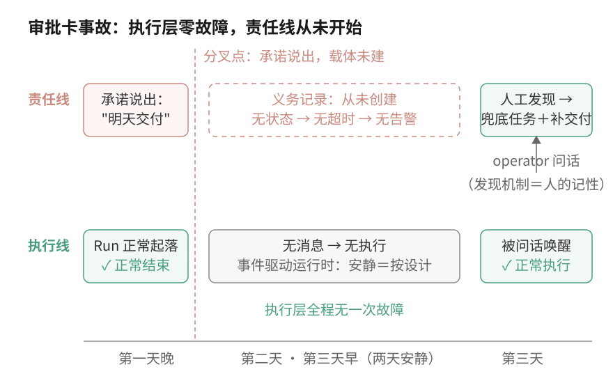
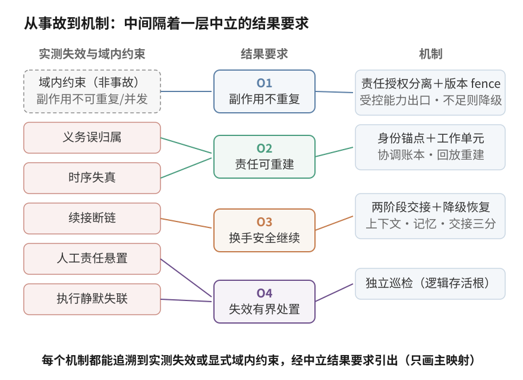
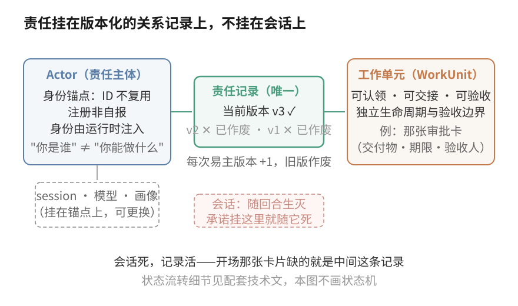
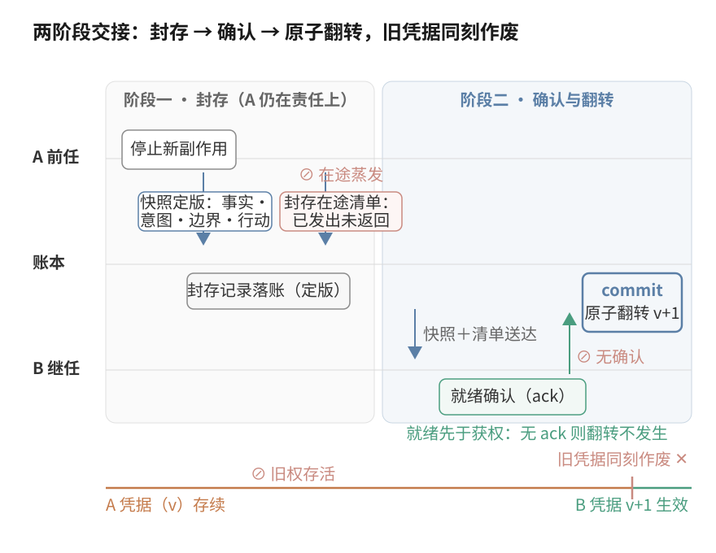
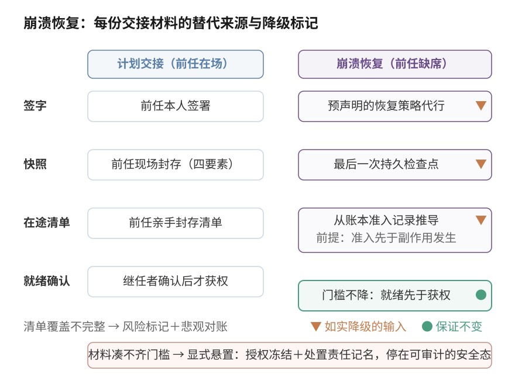
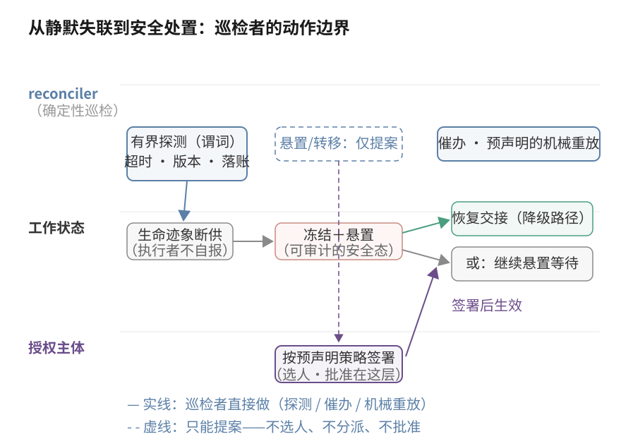

# 我们期望中的 Multi-Agent 是怎样的

上一篇我们说，multi-agent 的关键是为了解决什么问题、有意识地拆开了什么。这一篇讲我们自己的选择：为什么把最贵的那一层——责任与授权——单独建模。它不是从架构品味出发的，是被几个月里反复发生的事故一步步逼出来的。**这篇文章是一份推导记录：把反复发生的事故，逐步翻译成结果要求、状态模型、机制选择和可验证假设。**你不需要认同我们的结论——推导过程本身可检验、可反驳，这比结论有用。

先交代全文的证据口径，四档，每个机制讲到时都会如实标注：**已观察事故**（真实发生、有记录）；**已运行先行件**（比完整设计先落地的局部机制，像大楼开工前先打的试桩，已在生产运行）；**目标机制**（从事故推导出、尚未实现的设计——其中依赖运行时基础设施改造、比设计本身更远的，文中标注"目标态"）；**尚未验证的系统效果**（整套设计合起来的效果，还没有证据）。一条纪律贯穿全文：先行件不为目标机制背书——试桩能承重，不等于大楼已经站住了。

## 一张承诺次日交付的卡片，静默消失了两天

第一天晚上，我们的一个 agent 成员在给 operator 的计划表里写下一行：一张审批卡片——证据、建议动作、批准与驳回按钮——"明天送到你手上"。这是它对人的一句明确承诺，有明确的交付物和明确的期限。

第二天，什么都没有发生。第三天，还是什么都没有发生。

要交代清楚的是这两天里没有任何东西是坏的。这个团队的运行时是事件驱动的：消息到达才唤醒成员，为它启动一次短命的执行会话，回合结束即休眠。承诺发生的那个回合正常结束了；此后没有任何消息在第二天携带这项义务到来，也没有定时器会响——因为没有任何地方注册过"次日应当发生一次交付"。系统零异常，它做的每一件事都符合自己的设计。

第三天，operator 的一句问话作为一条消息把成员唤醒："这两天发生了什么？"成员盘点时间窗，才发现那句承诺掉在了地上。

按时间线解剖这次事故，四个问题：

- **中断信号是什么？** 没有。没有超时告警，没有失败事件——因为从系统的角度看，没有任何东西中断过。
- **系统看见了什么？** 一次正常结束的会话，和之后两天的安静。事件驱动系统里，安静不是异常。
- **系统没看见什么？** "明天交付审批卡"这条义务。它不存在于任何可查询的状态里——它只活在一条消息的文本里，和承诺发生时那次会话的上下文里。会话结束，承诺的唯一载体就死了。
- **人是什么时候、怎么发现的？** 两天后，靠 operator 主动问话。发现机制是人的记性，不是系统的任何部分。

*图 1：这次事故里执行与责任两条线的走向。执行线（下）的每次起落都正常——包括"没有消息就不启动"这份安静本身；责任线（上）在承诺说出口的那一刻就没有获得任何载体——它不是断了，是从未开始。分叉点不在第二天，在第一天晚上。*

发现之后的修复动作有两个：当天把这个承诺装进一个结构化任务——有标题、有原因、有归属人的持久记录——然后当天把欠了两天的卡片补交付。

但这个故事有个必须诚实交代的结尾：就在兜底任务建立、卡片补完交付之后，同一天里同款失效又出现了两次。另一项承诺的例行汇报断了更；晚些时候，"我现在去写代码"说完，回合一结束，这件事再次没有任何载体。一天三犯之后，这个成员对失效的归因才收敛到位：问题不是"忘了"，是"承诺随回合边界死亡"——说出"我去做 X"的那次执行结束时，X 若没有挂上持久的跟踪载体，它就随上下文一起蒸发。最后落下来的修复是一条机制而不是一个提醒：承诺说出口的同一个回合里，必须同时挂上结构化载体（任务或定时唤醒），否则这句承诺视同没说。这条机制自身的档位也要如实标：在义务被账本化之前，它靠成员纪律执行——按本文马上要讲的分界，它还在"行为"档；把它变成系统"性质"，正是后文机制要补的事。

这次事故全程可查（证据档位：已观察事故）。它把这篇文章的问题钉死了：**执行状态的恢复和责任状态的存在是两件事**。执行框架意义上的"恢复"是程序能接着跑——这一层我们没有任何抱怨，它每天都工作得很好。一个跨天、跨会话、有人参与的协作系统需要的是另一件事：任何时刻都能回答"谁对什么负责"。这两件事之间的缝，就是下面十三节要讲的东西。

## 三个主流框架各自持久化了什么

先说清楚我们站在什么之上，免得像在重新发明轮子。我们核验过三个主流框架的官方概念页（access 2026-08-11；CrewAI 固定 v1.15.14，其余 rolling；页面清单见文末来源说明）：

| 框架 | 官方定位（逐字引用） | 已有的身份与持久化原语（转述） | 核验页中未见共同建模的责任契约组 |
|---|---|---|---|
| LangGraph | "a low-level orchestration framework and runtime for building, managing, and deploying long-running, stateful agents" | `thread_id`、checkpoint/store、跨线程 memory；Server runtime 的 run / assistant / authenticated-user identity | 持久责任主体 · 唯一当前负责人 · 授权边界 · 可核验交接 |
| AutoGen | "An event-driven programming framework for building scalable multi-agent AI systems" | runtime 管理 identity / lifecycle；`AgentId = (AgentType, AgentKey)` 唯一标识实例 | 同上 |
| CrewAI | "the leading open-source framework for orchestrating autonomous AI agents and building complex workflows" | task→agent 指派、`state.id` resume/fork、per-agent memory 作用域、checkpoint lineage | 同上 |

这张表的读法要先说满，caveat 就贴在表边上：第四列说的是"在我们核验的官方概念页里未见这组契约被共同建模"，不是"这些框架做不到"——它们的原语相当扎实，你也许可以用它们拼出这组契约。所以不要被"它们没有身份和状态"这种粗糙说法带偏：三家都有身份，都有持久化，第二、三列就是证据。

我们比较的坐标是另一件事：**"持久的责任主体 + 唯一的当前负责人 + 授权边界 + 可核验的交接"这一整组契约，有没有被作为同一组可验证的东西共同建模。**上一节那张卡片需要的正是这一组——单独一个 `thread_id` 或一条 task 指派记录都装不下"承诺了什么、期限何时、掉了谁发现"。核验页中未见，结论只有一条：如果你的系统需要这四项性质，你必须另外说明并验证它们由哪一层保证——框架配置、你的应用代码，还是外部控制面。我们的选择是把这组契约单独建模，下面讲推导。

## 五种失效，各有各的触发结构

开场那类事故不是孤例，也不是全部。几个月下来，我们把反复出现的失效收敛成五类。先交代两条纪律，因为它们决定这张表该怎么读。

归因纪律：五类各有自己的触发条件，并不都是"agent 变成长期队友"导致的——前两类与执行者寿命正交，在一次性的 orchestrator + subagents 里同样会发生。长命、跨会话、与人混编放大它们的暴露和损失，但不是共同病因。

证据形态：内部材料是事件记录，不是统一口径的频率统计——它支撑"这些失效真实发生、被重复观察"，不支撑"高频"。我们的机制论证也不靠频率：每类失效的触发条件是结构性的，结构还在，就仍具备重现条件——治理的对象是结构，不是次数。

| 失效 | 现象 | 触发结构 | 丢失的状态 | 后果 |
|---|---|---|---|---|
| F1 义务误归属 | 群频道一条不指名消息派给 A；B 稍后因别的事被唤醒，频道里的"未读消息"被一股脑算进 B 的义务，A 名下的消息注入了 B 的执行上下文 | 系统把"看见了、收到了、被唤醒了"当成"这件事归你"——transport 事件被当成责任迁移 | 义务与其唯一来源（显式指派）的绑定 | 旁观者被塞进别人的工作；共享收件箱、"看见即该做"的黑板约定都会复现它 |
| F2 时序失真 | 两个 agent 并行工作，回复按到达时间交错渲染成一根时间线，读者看到精确到毫秒的混乱 | 三种视图需求被迫共用一个投影（见下） | 事件之间的因果与归属结构 | 并行协作在记录里不可读 |
| F3 续接断链 | 会话中断重启后，执行框架恢复了"程序跑到哪"，但回答不了：我认领的是哪项工作？第几次尝试？上次承诺过什么 | 工作寿命超过会话，责任状态未随之持久 | 认领关系、尝试谱系、对外承诺 | 开场事故是它的一个变体：承诺从未获得过持久载体 |
| F4 人工责任悬置 | 一件事升级给人审批，然后长期没人处理 | 人进入责任链，却没有等价的状态、SLA 与升级路径 | "还在等合理处理"与"已经没人跟了"的区分 | 我们最深的教训之一：交给人不等于责任链闭合——"升级给人之后"反而是最先暴露的责任盲区 |
| F5 执行静默失联 | 一个成员因供应商额度耗尽在夜里停止推进；调用层的错误其实已经发生，但没有任何系统把"一次调用失败"翻译成"这项跨几天的工作已失去推进"；直到人翻进度才发现 | 执行者可能停止，而"把停止升级为处置"不能指望停止者自己完成 | 责任级的失效事件 | 工作挂在原负责人名下停在原地，发现机制退化为人的巡视 |

F2 要单独交代一句处理方式。它的根子是三种不同的读需求被压进一个投影：审计要到达序，理解要因果树，追踪要执行泳道——三行就是三种正当的视图。它是"同一份事件历史需要多种读模型"的问题，不是责任归属问题，机制展开（投影与读模型的构造）本文显式不做，完整表述见配套技术文。下文的机制推导覆盖其余四类。

五类摆在一起，共同点浮出来：**责任协调没有被建模成一等的系统状态**。消息记录"说了什么"，执行状态记录"跑到哪了"，但"谁该做什么、做到什么程度、谁来验收"要么散落在对话里，要么只存在于每个成员自己的上下文里——而上下文会死。

## 在选机制之前，先写下验收结果的标准

从"缺一层状态"到"造哪些机制"，中间需要一步翻译，不然机制清单看起来就像凭空掉下来的。我们把四类事故（F2 已排除）、加上问题域自带的一条显式安全约束，翻译成四条结果要求。那条安全约束要先声明来源：**关键副作用不可重复、不可并发执行**——部署、花钱、合并、对外承诺，做两遍或两人同时做都有真实代价——这不是从事故里归纳的，是这类工作本身的硬前提。

四条结果要求，措辞刻意中立，不预设任何实现：

- **O1 排他**：关键副作用不被并发或重复执行；
- **O2 可归责**：任意时刻"谁在负责、谁做了什么"可事后重建；
- **O3 安全续接**：工作换手之后，继任者能在不违反前两条的前提下继续推进；
- **O4 有界处置**：失效能被发现，并在有限时间内进入声明的安全处置状态。

这四条不是我们先写好、再照着实现的；责任误归属、续接断链和静默失联反复出现之后，我们才把检查标准收敛到这里。它们也刻意不偏向我们的方案：别的方案不必长成我们的样子——中心编排或共享状态加锁，只要在相同约束下达到这些结果，也成立。下面各节我们的每个机制，都用这同一组标准检验自己。

还有一条输入要单独交代，它不在 F1–F5 里："做完了"这个声明本身可能为假——执行者自证完成是验收环节的固有风险，不是协作失效。它也不经 O1–O4 引出：那四条管的是结果的排他、可归责与安全续接——可归责能证明**是谁**声明了完成，证明不了声明**为真**。所以它对应的是一条独立的验收前提：执行终止不等于工作完成，终结必须按预先声明的验收策略收口。这条前提引出"执行结束不等于工作完成"那一节的完成门槛。推导地图把它与事故、域内约束并列为第三类输入。

*图 2：本文的推导地图——三类输入（实测事故、域内约束、验收风险）经结果要求或验收前提引出哪节机制。它只做导航：每节机制的解释在各节自己的正文里，这张图不承担。*

下面七节，每节回答一个问题。接上一篇的四个拆分面说一句分工：前两个面——执行上下文、协作关系——市场已有成熟方案（subagent、agent team），这七节展开的是后两个面的设计：责任与授权。这七个问题合起来，就是我们对"最贵的那一层"的具体回答。还有一句丑话说在前面：下面每节论证的都是"这个机制对这类失效是必要的"；至于把它们收进同一个统一本体、而不是各自做成独立的轻机制，是否带来叠加之外的收益——那是本文的隐含前提，它的证据落在文末总账"尚未验证"的那一行，我们把它当作显式假设，不当作既定结论。

## 谁在负责什么：session、对话和项目都不是责任单位

开场那张卡片暴露的第一个缺口是：承诺想找一个能挂靠的地方，但系统里没有一个对象的生命周期和它匹配。把候选一个个过一遍，就知道为什么都不行。

挂在 session 上？session 的寿命以一次执行计——承诺说出口的那次会话结束，挂在上面的东西一起死。开场事故就是这条路的实录。挂在对话（thread）上？对话太碎也太长寿：一条 thread 里流过几十件事，"这条 thread 归谁"回答不了"这张卡片归谁"。挂在项目上？粒度反过来太粗——项目有负责人，但项目负责人不欠这张具体的卡片。

所以责任需要自己的两个对象，谁都替代不了：

**能负责的"谁"——Actor**：跨会话、跨模型更换仍然稳定的责任主体。一次执行做不了这个主体（它会死），一个模型绑定也做不了（它会换）。Actor 是由身份管理机制注册的持久主体：ID 不复用、注册不能由成员自己声明、运行时从认证绑定注入身份。还要把一句容易混的话说死：知道一个 Actor 的 ID 不等于拥有任何权力——"你是谁"和"你能做什么"从一开始就是两个问题，后者下一节讲。

**能被负责的"什么"——工作单元（WorkUnit）**：一件可以被认领、被交接、被验收的事。判据是有独立的生命周期与验证边界。开场那张审批卡就是一个标准的工作单元：有明确的交付物、期限和验收人——它缺的只是一条真实存在的记录。"等一个人类的审批"同样是工作单元，这样人的环节才有状态和时限可言（F4 的机制回应从这里开始，下下节展开）。

责任状态本身则是这两者之间的一条关系记录：每个工作单元任何时刻有且只有一条有效的责任记录。"都以为对方在做"在这个结构里没有藏身之处——两个人不可能同时持有同一条记录。而 F1 的解药也在同一条原则里：**义务只由显式的责任事务产生**——"消息到了""被唤醒了""看见了"都不产生义务。唯一记录还有一层容易漏掉的含义：它不承诺"任何时刻都已有负责人"——工作可以处在"已创建还没人接"的窗口——它承诺的是这条记录任何时刻都能回答"现在该找谁"：要么是执行责任人，要么是负责推动处置的人，带着可检验的时限。

*图 3：两个实体加一条版本化的关系记录。Actor 挂身份与画像，工作单元挂交付物与验收边界，责任记录唯一且带版本——每次易主版本加一，旧版本作废。图里刻意没有画状态机：状态流转的细节属于技术文，这里只需要看清"责任挂在关系上，不挂在会话上"。*

证据档位要贴着写：这一节里"事件账本"的底座是已运行先行件——我们的责任归属观测层（只追加的事件日志，任何时刻的状态都能从头回放重建）已在生产运行数月，责任归属域重放重建与实时状态无漂移。但 Actor + WorkUnit 的统一本体是目标机制：先行件观测的是现有协作的责任归属事实，尚没有一个真正的 WorkUnit 对象可供认领——开场那张卡片事后装进的"结构化任务"，是朝这个方向的过渡形态，不是这套本体本身。观测层能跑，不证明本体成立。

## 负责不等于有权：一个 owner 字段装不下委派和审批

有了"谁"和"什么"，直觉的下一步是给每个工作单元加一个 owner 字段。我们没有这么做，因为两种最日常的协作结构，一个字段表达不出来。

**委派**：B 在干活，但方案的决策权在 A 手里。owner 写 B，A 的决策权就消失了；写 A，B 的执行责任就消失了。**审批**：agent 执行，人持批准权——owner 写谁都不对，这里根本是两种不同的权力在两个主体手里。

所以责任和授权分开记，两条独立的线：责任回答"这事谁在推进"，授权回答"谁被允许执行、决策、批准"。授权按作用域（scope）独立持有、独立版本：execute（可以动手）、decide（可以拍板）、approve（可以放行）各是各的，转移其中一个不牵连其余。分开之后，三种协作结构变成同一套记录的三种配置：

| 配置 | 责任记录 | 授权记录 | 对应场景 |
|---|---|---|---|
| 对等移交 | 迁移给 B | execute 等相关 scope 随迁给 B | 团队成员之间正常换手 |
| 委派 | B 承担执行责任 | decide / approve 留在 A | "B 干活，A 拍板" |
| 审批门 | 执行责任在 agent | approve 在人 | "agent 执行，人放行" |

版本号是这套记录的安全根：每次变更版本加一，新版本一生效旧版本作废——在这套设计里，旧执行实例拿着旧凭据的提交会被直接拒绝。这一条在交接与恢复两节里反复出现，源头在这里。

这一节有一条必须划清的分界，因为它决定这套机制的真实强度：**把授权写进账本是"记录"，不让越权动作发生是"强制"，两者隔着一整层基础设施。**强制要求所有高风险动作走受控的能力出口——网络出口、凭据边界、工具宿主——在执行时校验凭据。一个允许自由 shell 带着环境凭据直接出网的运行时，账本只能事后对账，做不到事前拦截。我们当前的运行时正是后者，所以如实标注：授权分离的记录结构是目标机制（本体未实现）；受控能力出口是目标态——当前档位是"事后检测与对账"，不是"事前强制"。

关于这层改造还欠一个正面回答：它是整套设计里成本最高、也最可能收不拢的一步——agent 需要的能力宽度和受控出口天然互相挤压，在我们当前以自由 shell 加环境凭据为主的运行时里，这个取舍还没有解开。如果它最终收不拢，损失要拆开说：账本内部的责任与授权记录仍然可以原子翻转——那是账本自己的事务；失去的是对外部世界的强制——旧执行者制造副作用的动作无法被事前拦截，O1 的事前保证和完备的在途清单推导都不再成立，整套机制对外就只剩审计强度。改造的形态、代价与能力损失，是我们下一阶段必须回答、本文无法预支答案的问题。

## 交接为什么不能是一段摘要消息

工作换手是责任线最危险的时刻。直觉的做法：A 给 B 发一段交接摘要，改一下 owner，完事。这个做法留下三个各自独立的失效面：B 没确认就被视为接手（摘要发出 ≠ 摘要读懂）；A 的旧权限还活着（改 owner 不会让 A 手里的凭据失效）；A 承诺过、做到一半的东西随交接蒸发（摘要写不全在途的事）。

所以交接在这套设计里是一个两阶段的事务，不是一条消息：

**第一阶段，封存**。A 停止制造新的副作用；上下文快照定版——四要素：事实（做了什么、产出在哪）、意图（为什么、放弃了什么权衡）、边界（开放问题与风险）、行动（期望下一棒做什么）；再封存一份在途副作用清单：A 已经发出去、还没有返回的外部调用。这份清单是交接里最容易被忘掉、也最危险的部分——B 不知道 A 发出过什么，就会把同样的事再做一遍。

**第二阶段，确认与翻转**。B 对着快照与清单留下就绪确认，责任与授权才原子地翻过去：新版本生效，A 的旧凭据同时作废。就绪先于获权——B 没确认，翻转不发生；确认不了，工作宁可显式挂起，等一个准备好的继任者。

*图 4：本文的主图。左半是第一阶段（封存意图与在途清单），右半是第二阶段（就绪确认与原子翻转），底部一条线专门画旧凭据的命运：翻转的同一时刻作废。三个失效点——无确认、旧权存活、在途蒸发——分别被三个结构堵住。*

为什么要分两个阶段？关键不在调用次数，在顺序：如果在 B 的就绪证据落账之前就翻转责任或授权，就会出现"无就绪证据接权"，或者反过来先撤 A 的权、留下一段无人能推进的空窗。所以语义上必须是封存定版 → 就绪确认 → 原子翻转这个顺序——对外的接口完全可以做成一次调用（B 发起接受时，原子地校验已定版的材料并翻转），内部仍要满足这个顺序。两阶段说的是逻辑结构，不是 API 形状；它买的不变量是：翻转发生前 A 仍在责任上，翻转发生时 B 已经就绪。

边界也要说诚实：**B 的就绪确认是操作性证据，不是理解的证明**——它证明 B 按声明的门槛对快照和清单留了痕，消除的是"没有就绪证据就接权"这件事；B 有没有真的看懂，协议保证不了，门槛定多高才够，是设计的信任前提之一。证据档位：两阶段交接是目标机制；它的一个先行件——会话续接协调（跨会话把"该继续什么"传给继任执行）——已在生产运行数月，但它传的是执行的续接，不带责任事务，不为交接事务本身背书。

## 前任已经死了，交接材料从哪来

上一节的交接有个前提：A 还在场，能封存、能签字。F5 那类事故里恰恰没有这个前提——供应商断供的成员没有留下任何东西，它连"自己停了"都不知道。这时候直觉给出两个选项，都不行：等它回来——悬置无界，夜里停的工作可能停到有人碰巧发现；直接抢——新执行者立刻接手，但 A 发出去、没返回的调用全部失控，重复执行的风险正好撞上"关键副作用不可重复"这条硬前提。

降级恢复路径逐项回答"A 不在了，这个东西从哪来"：

- **签字从哪来**：从预先声明的恢复策略——一份写明授权者、超时阈值、失联证据要求的治理规则。探测到失联本身不产生任何职权；能代行缺席者授权的只有这份预声明的策略。
- **快照从哪来**：退化为 A 生前最后一次持久检查点。
- **在途清单从哪来**：不是从 A 的记忆里抢救——那已经不存在了——而是从账本水位推导：凡高风险副作用在离开受控边界之前已留下准入记录，"已准入、尚未见到可信回执"的集合就是清单。这要求准入记录先于副作用发生，是崩溃路径最硬的前提。
- **确认从哪来**：不放松。继任者对着这份多源重建的材料——检查点、账本回放、共享历史——留下就绪证据，才获权；材料凑不齐门槛，工作显式悬置：失联者的行动性授权全部冻结，处置责任显式记到治理角色名下，停在可审计的安全状态，而不是无人负责地悬着。
- **对账义务**：如果在途副作用的覆盖记录不完整，交接显式携带风险标记，继任者背悲观对账的义务——宁可多查一遍外部系统，不假设"应该没发出去"。

*图 5：与图 4 并排设计。计划交接（左）的每份材料——签字、快照、清单、确认——在崩溃恢复（右）里各有替代来源与降级标记；哪些保证不变（就绪先于获权）、哪些如实降级（清单从合作封存退化为账本推导），图上逐项标注。*

证据档位，这一节要拆得最细。整条降级恢复链是目标机制——账本回放、准入推导、悲观对账都尚未实现。我们手里有一条窄得多的实证，如实交代它的形状：一次会话在投递答案前 0.8 秒被封存，在途的那条答案随会话卡死；继任的执行回合从持久事件历史里逐字打捞出内容，完成了投递。这个事件证明的是**持久事件历史让"内容可恢复"成立**——继任者能拿回前任产出的东西。它证明不了这条链的其余任何环节：那次事件里没有工作单元、没有责任事务、没有账本回放——"责任在崩溃后活着"不在它的证据范围内。拿它当整条恢复链的证据，就犯了本文自己警告的错误。

## 上下文、记忆、历史打架时，听谁的

继任者接手时面对的信息不止一份：交接快照说进度到了第 3 步，历史消息里 A 说过"第 4 步做完了"，记忆里还有一条"这类工作通常要重做第 2 步"。多源矛盾时，最省事的做法是"都给继任者，让它自己判断"——这等于把裁决权交给一次掷骰子：不同的继任者、甚至同一继任者的不同会话，会随机吞掉不同的矛盾。

我们的答案是给每类问题指定唯一的权威源，冲突时的动作预先写死：

| 问题域 | 权威源 | 与它矛盾时 |
|---|---|---|
| 谁负责、谁有权 | 协调账本 | 一切以账本为准；域内冲突按事务顺序裁决 |
| 做到哪了、接下来想干什么 | 账本引用的最新封存检查点 / 交接快照 | 同上，按定版顺序 |
| 背景知识、经验、偏好 | 记忆系统 | 记忆只提供参考，永远不裁决当前归属或进度 |
| 当时到底发生了什么 | 历史记录 | 历史是核验证据，用于回读对质，不是状态源 |

真正危险的是跨域矛盾：检查点声称的进度和账本状态对不上。这时不靠优先级把矛盾吞掉，而是升级为显式风险：拒绝交接，或显式悬置加悲观对账——**fail-closed：宁可停下，不带着未消解的矛盾接权。**两条安全不变量收底：矛盾未消解就不接权；决定责任与授权状态的信息，不得只存在于易失的工作上下文里。证据档位：语义权威分域是目标机制——当前系统里这些源都存在，权威顺序靠成员自觉遵守，还没有机制强制。

## 谁来发现"所有人都不动了"

前面几节的机制有一个共同的隐藏前提：有人在推动状态。承诺要有人检查、超时要有人发现、悬置要有人处置。F4 和 F5 合起来告诉我们这个前提不成立："停止推进"的通知，不能指望停止者自己发出——agent 失联时发不出，人忘掉时同样发不出。我们自己当前的兜底机制是"operator 会注意到"，开场事故里它工作了——花了两天。靠人注意到不是零分答案，但它是一个必须写进设计文档的失效探测机制，写出来你才会看到它的参数：探测周期 = 人的巡视习惯，覆盖率 = 人的记性，休假时降级为零。

结构性的答案是一个独立的巡检循环（reconciler）：定期对账"账本说谁该干什么"与"实际有没有生命迹象"，逾期就按预先声明的策略推进——催办、唤醒、升级，或者为高风险处置创建提案。它的边界必须说得和它的职责一样清楚，因为一个不受限的巡检者会变成事实上的调度中心：它不选人、不分派、不批准——需要判断力的动作一律降为提案，交给账本里记录的授权主体签署。它做的全部事情是确定性的谓词检验：超时了没有、版本对不对、落账了没有。也因此它不需要是一个 LLM agent——用会失忆、会中断的组件去守护一群会失忆、会中断的执行者，是循环依赖；守护者必须比被守护者更简单。

*图 6：失联处置的时间结构：生命迹象断供 → 有界探测 → 冻结与悬置（安全态）→ 提案与授权 → 恢复交接或继续悬置。图里同时标出 reconciler 的动作边界：实线是它能直接做的（探测、催办、机械重放），虚线是它只能提案的（悬置、转移、任何选人）。*

最后一层递归要接住：巡检者自己死了谁发现？答案不能是"另一个巡检者"——那是无穷递归。答案是把它的存活暴露给外部健康检查，并接受一条设计判据：**守护者的失效必须比被守护者的失效更容易被发现**。它停摆期间，安全性质（版本、唯一记录）不受影响，逾期事实仍持久在账，但探测与处置暂停——这个依赖诚实地写进系统的信任根清单，不假装它不存在。证据档位：义务门禁——唤醒时注入成员名下义务、行动前门禁检查——是已运行先行件，它证明的是义务能被注入执行上下文、行动前能被检查这两件事本身；独立的 reconciler 与超时探测是目标机制——开场事故里没有任何超时告警，正是因为它还不存在。先行件的门禁读的还是消息形态的义务，义务来源尚未账本化——这恰是 F1 的温床，也是"先行件不为目标机制背书"最具体的一例。

## 执行结束不等于工作完成

七个承重问题的最后一个，也是最容易被略过的一个："做完了"由谁说了算？最常见的等式是执行结束即完成——Run 正常退出、agent 报告"done"，工作标记为完成。这个等式两边其实是两个事件：**执行终止是执行层的观测，工作完成是责任层的判定**。把它们焊在一起，系统就把验收权交给了执行者自己——自证完成。低风险工作这样没问题；高风险工作这样，就是把"假完成"——报告说做完了、实际没做完或做错了——的检测概率押在零上。

所以完成要过声明的门槛，按风险分档，每个工作单元预先声明自己的完成策略（CompletionPolicy）：

| 档位 | 完成判定 | 接受的残余风险 |
|---|---|---|
| 自证 | 负责人宣告完成，绑定持久的产出记录 | 假完成不设防——只适合错了可白重做的工作 |
| 机械验收 | 绑定测试结果、回执或确定性检查 | 检查覆盖不到的维度 |
| 独立验证 | 由非产出者承接一个验证工作单元，结论绑定产出的不可变坐标（commit hash / 内容摘要） | 验证者与产出者共享盲点 |

独立验证档有两个防绕过的细节，都是被真实场景逼出来的。**结论绑定不可变坐标**：产出一变，旧结论自动过期——防"审的是旧版，章盖在新版上"。**独立性按实际执行绑定判定**：验证者和产出者是否真正独立（不同模型家族、不同供应商），按行动时刻运行时记录的实际绑定判，不按花名册——否则接单后换绑就能绕过独立性要求。递归在这里终止：验证工作单元自己的完成，就是授权验证者提交了绑定目标版本的签名结论，系统只校验身份、权限与目标摘要，不再造"验证验证者"。

证据档位：CompletionPolicy 全套是目标机制。我们的日常实践里有一条相邻的流程惯例——代码合入前跨模型家族 review 是团队铁律——它塑造了"独立验证"这一档的形状，但它是流程层的纪律，不是系统机制：没有绑定坐标、没有过期语义、独立性靠自觉。惯例证明这类验收在协作中真实被需要，不证明机制已存在。

## 提示词能维持行为，维持不了性质

还有一条推导值得单独讲，因为它逆着直觉：角色提示词和模型异构，在这套设计里都只是运行时绑定，协议不依赖它们。

给 agent 一段"你是审慎的审稿人"提示词，能改变它的行为倾向——这有价值，我们每天在用。上一篇讲过我们的冷读实践：零上下文读者只拿发布文本做隔离阅读，暴露了作者们共同的隐含前提——那次实践同时也演示了它的边界：角色提示能制造分工，制造不了独立性；独立性来自隔离的上下文这个结构安排，不来自提示词里的"独立"二字。同样的分界在系统设计里逐条成立——每条安全性质都要有比"它会照提示词做"更硬的依托，且各自的当前强度不同：

| 安全性质 | 硬依托（设计） | 提示词的角色 | 当前档位 |
|---|---|---|---|
| 身份 | 受信运行时从认证绑定注入，不由 agent 自报 | 无 | 已运行先行件 |
| 授权 | 账本记录 + 受控能力出口在执行时校验凭据 | 行为倾向 | 记录属目标机制；强制属目标态——当前运行时是自由 shell + 环境凭据，为"事后检测与对账"档 |
| 完成 | 按预先声明的验收策略校验证据，不由执行者自我宣告 | 行为倾向 | 目标机制 |
| 失联发现 | 独立巡检，不由失联者自我通知 | 无 | 义务门禁属已运行先行件；独立巡检属目标机制 |

**提示词影响行为，机制分层保证性质——每层的强度如实标注**，这张表就是标注本身。模型异构同理：我们的团队同时有多个模型家族的成员，关键审查跨家族做——我们把它当作降低盲点相关风险的概率手段，这是设计意图，尚无受控对照支撑效果量，不是安全边界。真正的边界是上一节说过的那条：每次执行绑定了哪个模型由运行时如实记录，独立性按实际执行记录判定。

## 哪些是真的，哪些还是图纸

前面各节的证据档位随文标过了，这里合成一张总账。它负责的是总览与下一步，第一次纠偏都已经贴在各 claim 旁边：

| 主张 | 当前证据 | 档位 | 明确未证明 | 下一步验证 |
|---|---|---|---|---|
| 责任归属可观测 | 责任归属域的事件溯源先行件生产运行数月；重放重建与实时状态无漂移 | 已运行先行件 | 统一账本本体（观测责任事实 ≠ 协调责任状态） | 统一本体落地后，以重放对账验证 |
| 会话续接 | 会话续接协调先行件生产运行数月；一次投递前 0.8 秒封存的会话，继任回合从持久事件历史逐字打捞内容完成投递（事件级） | 已运行先行件 | 责任事务与账本回放——该事件无工作单元参与，"内容可恢复"不外推为"责任可恢复" | 带责任事务的续接演练 |
| 义务门禁 | 唤醒注入义务 + 行动前门禁，生产运行中 | 已运行先行件 | 义务来源账本化——当前义务仍由消息形态推断（F1 温床） | 显式责任事务作为唯一义务源 |
| 统一协调账本（Actor + WorkUnit 本体） | — | 目标机制 | 全部 | 实现后先旁路观测、再逐步执法 |
| 受控能力出口的严格准入 | — | 目标态 | 全部；当前运行时为自由 shell + 环境凭据，属事后检测对账档 | 能力出口改造 |
| 组合收益 | — | 尚未验证的系统效果 | 整套设计合并运行的效果；**含"统一本体优于独立轻机制叠加"这一本文隐含前提**——单点失效可以被单点轻机制缓解（开场事故的兜底任务就是实例），"共同建模"的额外收益尚无证据 | 同上，旁路观测先行 |

一句话收束：**这篇文章描述的是"从实测问题收敛出的目标设计"，不是"已上线系统的功能说明"。**我们把它写出来，一半是整理自己的思路，另一半是希望被反驳——推导链的每一环（事故是否真实、翻译是否成立、机制是否必要）都欢迎挑战。

## 动手之前的七个问题

上一篇结尾给过三条"责任与授权真拆开了没有"的自检测试；这七节正是那三条测试背后的完整设计——测试一对应唯一责任记录，测试二对应两阶段交接与旧凭据作废，测试三对应显式悬置。如果你在设计自己的 multi-agent 系统，下面这份清单与七个承重问题一一对应——不是"该用什么框架"，是"该先想清楚什么"：

1. **责任单位**：你的系统里，"这件事现在归谁"是一条可查询的记录，还是一个大家心里都有数的感觉？执行者重启之后，除了"跑到哪了"，它还能知道"我认领过什么、承诺过什么"吗？
2. **责任与授权**："B 干活但 A 保留决策权"、"agent 执行但人持批准权"——你的记录结构表达得出来吗？还是一个 owner 字段把两种权力挤成了一种？
3. **交接**：换手是事务还是消息？接收方确认过"我拿到了安全继续所需的东西"吗？前任的旧凭据会在换手时失效吗？
4. **崩溃恢复**：前任不在场的换手，你有降级路径吗？"它发出去了什么"这份清单，在它死后从哪里来？
5. **信息权威**：上下文、记忆、历史矛盾时，你的系统听谁的？是预先写死的权威顺序，还是让继任者自己猜？
6. **失效探测**：一个执行者悄悄停了，多久会被发现？被谁？靠什么？如果答案是"靠人注意到"，把它作为机制写进设计文档——然后回答下一问：这个探测机制自己失效了，谁发现？
7. **完成门槛**："执行结束"和"工作完成"在你的系统里是一个事件还是两个？高风险工作的完成，由执行者自己宣告，还是过一道它自己给不了的验收？

这些问题与框架选型无关——用 LangGraph、AutoGen、CrewAI 还是自研，它们都成立。区别只在于：你是让答案保持为"大家心里有数"，还是把它们变成可验证的契约。我们选了后者，代价和收获都写在上面了。

---

*来源说明：对 LangGraph / AutoGen / CrewAI 的描述基于其官方文档（access 2026-08-11）——[LangGraph overview](https://docs.langchain.com/oss/python/langgraph/overview)、[persistence](https://docs.langchain.com/oss/python/langgraph/persistence)、[runtime](https://docs.langchain.com/oss/python/langchain/runtime)；[AutoGen index](https://microsoft.github.io/autogen/stable/index.html)、[Agent Identity and Lifecycle](https://microsoft.github.io/autogen/stable/user-guide/core-user-guide/core-concepts/agent-identity-and-lifecycle.html)；[CrewAI introduction](https://docs.crewai.com/v1.15.14/en/introduction) 及 v1.15.14 concepts（[agents](https://docs.crewai.com/v1.15.14/en/concepts/agents)、[tasks](https://docs.crewai.com/v1.15.14/en/concepts/tasks)、[flows](https://docs.crewai.com/v1.15.14/en/concepts/flows)、[memory](https://docs.crewai.com/v1.15.14/en/concepts/memory)、[checkpointing](https://docs.crewai.com/v1.15.14/en/concepts/checkpointing)）。引号内为逐字引用，其余为意义保持的转述；框架比较只覆盖上列官方概念页，不证明实现能力缺席。对我们自身实践的描述按正文四档证据口径披露；开场事故为单一真实事件的按时间线复述（内部记录可查，对外做了内容脱敏）；五类失效为反复观察的事件记录之结构抽象；失效模式的完整技术表述与形式化规范见配套技术文。*
