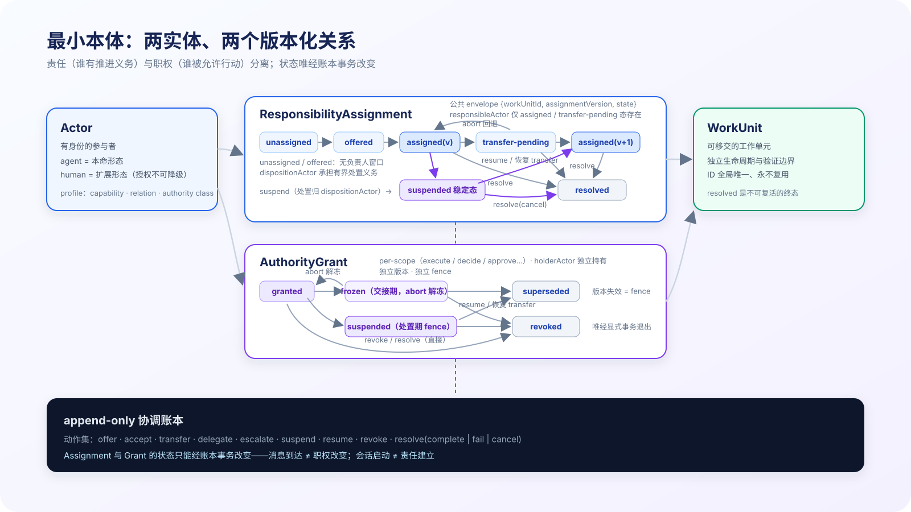
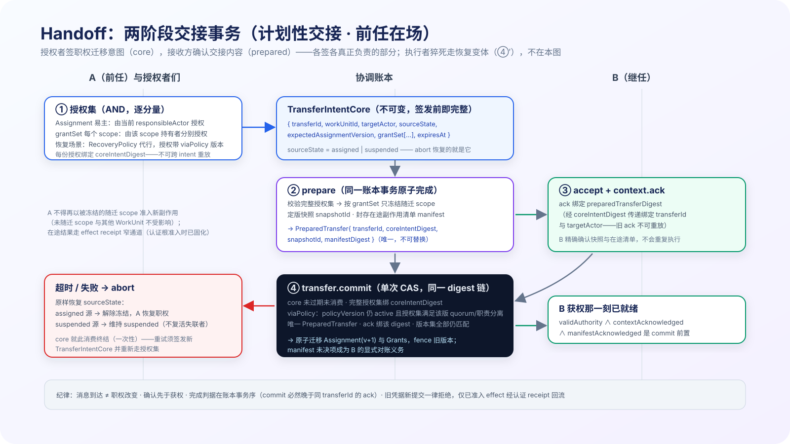

# TeamAct：去中心化 Agent 协作中的职权迁移与上下文交接

## Abstract

Multi-agent 系统构成一条光谱。**中心化**端（orchestrator-workers / agent team）：职权的创建与迁移集中于编排者，worker 间通常无需点对点交接。**去中心化**端：长命的、有身份的对等 agent（和人）组成团队，工作在参与者之间流动，职权的创建与迁移分布于对等参与者，没有任何一个上下文拥有全局。前者已被成熟的编排模式充分覆盖；后者在工作换手时暴露出两个必要问题——**职权续接是否安全？继任者上下文是否就绪？**

**TeamAct 是去中心化一族的协调范式**，中心化仅作对照边界。它**不主张 Handoff 是去中心化 multi-agent 的普适核心**。它针对一个明确的问题域：**同一未完成 WorkUnit 的责任或职权跨 Actor 迁移，且继任者的安全行动依赖前任产生的状态**。该域内必须同时解决两个问题——职权续接安全与继任者上下文就绪；解法有两族（解耦式 fence-and-reclaim 与耦合式事务交接，§1.2）。TeamAct 的**可检验设计主张**是：把两者耦合为一个可审计的 **Handoff 事务（authority line 与 context line 的耦合闭环）**，并给出何时该选耦合、何时解耦更优的判据（§1.2；与相邻传统的六轴对照见 §1.4；不适用域见 §8）。本文给出支撑这一事务的最小本体（两个实体、两个版本化关系——责任指派与 per-scope 职权授予）、两阶段交接事务、最小协作循环（三步）与六条可检验不变量；push/pull、执行心跳、检查点、fencing、消息确认等此前的机制成果全部归位为闭环的**实现与可靠性策略**，不再占据内核。

---

## 1. 问题与定位

### 1.1 两族 multi-agent，本文只为其一

中心化与去中心化是**光谱的两个极端原型**，现实系统多为混合；**区分轴是"谁有权创建与迁移职权"，不是状态存放在哪**（中心化系统同样可以外化持久状态、甚至允许 worker 间交接——只要创建与迁移权集中在编排者，它仍是中心化的）：

| | 中心化极端（orchestrator-workers） | 去中心化极端（peer collaboration） |
|---|---|---|
| **职权的创建与迁移权** | 集中于编排者：分派、回收、改派皆经中心 | 分布于对等参与者：任何 Actor 可发起 offer 或**提出** transfer proposal（签发与授权规则见 §3.1） |
| 交接形态 | worker 间通常无点对点交接，经中心中转 | 职权续接与上下文连续**必须被解决**；解法族既含点对点移交（耦合式），也含经共享状态的接续（解耦式）——见 §1.2，"必须点对点"不是定义 |
| 参与者生命周期 | worker 通常由编排者创建与回收 | 参与者长命自治，跨任务存续 |
| 成熟度 | 已被编排框架与 agent-team 模式充分覆盖 | 协调语义缺少 first-class 支持——本文的对象 |

诚实边界：TeamAct **不冒称覆盖全部 multi-agent**。它针对去中心化端与混合形态中的对等协作部分；纯中心化场景请直接使用编排模式，本模型与它的连续性仅在 §2.2 的 delegation 配置处说明。

### 1.2 系统形态假设

- **A1**：参与者长命且有身份（跨任务存续，积累能力档案与责任记录）；
- **A2**：人是参与者之一（会拍板、会承接工作、也会成为瓶颈）；
- **A3**：工作跨会话（进程重启、上下文压缩、供应商中断；执行者可能中途更换）；
- **A4**：责任要可审计（谁在何时对什么负责，事后可追溯；验证独立于产出者）；
- **A5**：副作用排他——关键动作（部署、花钱、合并、对外承诺）不能安全地重复或并行执行，重复执行有真实代价。

**问题域与设计主张（非必然性推导）**：A1–A5 是**适用域描述，不是充分条件**——它们合取推不出"必须存在耦合的 Handoff 事务"（反例：进度持续写入复制账本、非幂等副作用由 effect-scoped lease 排他保护、失联后 fence 旧 lease、继任者从共享状态重新认领并自行重建——满足全部假设，却没有点对点交接）。域内真正**必要**的只有两个问题：

1. **职权续接安全**（succession）：排他副作用权从一个 Actor 转到下一个，全程无双主、无伪造、可追溯；
2. **继任者上下文就绪**（readiness）：继任者行动前能达到"足以安全继续"的信息状态。

两个问题的达成与否由**模型中立的结果性质**衡量——不引用任何 TeamAct 机制，适用于评价一切方案（含解耦式基线与其他传统）：

- **O1 排他**：关键副作用不被并发或重复执行——无论系统以何种方式（职权、lease、调度或环境约束）表示"谁可行动"；
- **O2 可归责**：任意时刻"谁在负责、谁做了什么"可事后重建；
- **O3 安全续接**：易主后继任者能在不违反 O1/O2 的前提下继续推进；
- **O4 有界处置**：在**声明的环境假设下**（时钟/部分同步、监测器存活与调度公平——有界**探测**本身即依赖这些，任何系统皆然），参与者失效在有界时间内被探测，且系统在有界时间内进入其**声明的安全处置态**（续接、显式悬置或终止），处置责任在该系统自身的治理语义下可追溯。恢复**完成**是否有界额外取决于合格继任者可用性——任何协议都无法无条件保证，不作为结果性质。

比较维度是达成 O1–O4 的**代价**：上下文不可恢复率、恢复延迟、协调开销、误判处置率（误悬置/误恢复造成的可用性损失——任何含失效探测的系统皆有此维度）。

本文的**触发条件**（比 A1–A5 更窄，缺一则退化为纯分配或纯恢复问题）：**同一未完成 WorkUnit 实际发生 Actor 易主**，且**继任者的安全行动依赖前任产生的状态**（含未外化的意图与在途副作用）。

两个必要问题在域内有**两族解法**：

- **解耦式（fence-and-reclaim）**：succession 走 lease 失效 + fence + 重新认领；readiness 走共享状态自行重建。代价：继任者持权但未就绪的缺口、责任出现无人负责的空窗、放弃前任在场的合作价值（封存在途副作用、移交未外化意图）、人类继任者难以"回放重建"；
- **耦合式（TeamAct 的设计主张）**：把两者耦合为一个可审计事务（§3.1），利用前任在场的合作，保证获权即就绪、责任连续无空窗、在途副作用显式随交接继承、人类继任者以推送式策展上下文 + 显式接受完成。

**耦合是设计选择，不是逻辑必然**。选择判据——计划性易主为主、存在需前任封存的在途外部副作用、审计/SLA 要求责任连续无空窗、继任者含人类 → 耦合式；崩溃主导、共享状态即是全部上下文、认领 churn 便宜 → 解耦式足够。**TeamAct 通体采用耦合形态**：常规路径是合作式 Handoff（§3.1），失联恢复走降级的耦合变体（§3.4——就绪门槛保留，输入退化）。纯解耦式 fence-and-reclaim 是**模型外部的合法基线**，站在本体之外参与对照与反驳（O1–O4、§8），不被收编进本文。

### 1.3 五类失效 = 闭环破损的五种形态

数月生产实践反复出现的失效（实测记录见 gap 文档），在本模型中获得统一解释——**每一类都是职权线或上下文线的断点**：

| 失效 | 断的是哪条线 |
|---|---|
| F1 义务误归属（旁观者被塞进别人的工作） | 上下文线过宽：交接范围未按接收者收窄 |
| F2 时序失真（并行协作渲染成混乱时间线） | 两条线的事件被压进一根壁钟序 |
| F3 续接断链（会话恢复了，不知道"续的是谁的哪份职权"） | 职权线与执行记录断开 |
| F4 人工责任悬置（升级给人后石沉大海） | 职权线在人类节点处没有状态与探测 |
| F5 执行静默失联（执行者悄然消失无信号） | 职权持有者失去生命迹象，线上无人察觉 |

**证据地位的诚实声明**：F1–F5 采集自我们自己以交接为形态的实践。它们是"该形态下闭环破损真实发生且有代价"的**存在性证据**，不是"交接是普适核心"的证明——一个按黑板形态运转的团队会产出黑板形状的失效目录。本文不作普适性主张（§1.2）；F1–F5 的作用是标定问题域真实存在、破损有代价，并为不变量 I1–I6 提供反例来源。

### 1.4 相邻传统对照（六轴，按最强形式呈现）

比较轴：**分配**（谁接活）、**承诺**（义务的表示与维持）、**排他**（副作用互斥）、**状态连续**（换手时信息如何延续）、**故障恢复**（参与者失效怎么办）、**拓扑**（控制权在哪）。每个传统按其**最强形式**呈现，不做"被本文吸收"式降格：

| 传统 | 最强形式与主轴 | 与 TeamAct 的真实差异 |
|---|---|---|
| **Contract Net**（Smith 1980） | 分配轴的成熟答案，且不止首次分配：支持**递归转包**，award 可携带执行所需数据（状态连续轴的早期形态） | 不处理职权版本化 fence、在途副作用继承、换手期的归属审计。本文 offer/accept 是 CNP 形态的特例；CNP 不要求也不提供交接闭环 |
| **联合意图 / SharedPlans**（Cohen–Levesque、Grosz–Kraus） | 承诺轴的基础答案：联合活动的共同心智性质、partial SharedPlans 与 contracting-out actions；对部分失败和误解具有鲁棒性 | 承诺与协作计划位于团队心智模型层，不以持久账本、版本 fence、可审计的责任连续性为对象。Responsibility 是承诺的账本化、可迁移化——差异在表示层与可验证性 |
| **STEAM**（Tambe） | 在联合意图与 partial hierarchy 上给出故障恢复轴的实现：监测团队与成员表现，并在必要时重组团队 | TeamAct 不抢"失败监测 / 团队重组"的发明权；差异在于把恢复的授权、职权 fence、责任连续性与处置轨迹做成持久、可验证的协议对象 |
| **Blackboard**（Nii 1986） | 状态连续轴的强答案；**控制模型本就多样**（控制可位于知识源、黑板或独立控制器），可实现调度与互斥 | 模型本身**不规定** authority/fencing 语义——可在其上实现版本化排他，但那是实现叠加，非模型内容；succession 与归属审计同理不在模型语义内。"黑板 = 无排他职责"是错误刻画（r7 已纠）；准确差异是"未规定"，不是"做不到" |
| **FIPA ACL** | 通信语义轴：communicative acts 对信念/目标/意图有**形式语义**，不是纯传输 | 规范定义心智层的语义效果，但**不提供持久 authority 账本与 fencing 契约**——这是规范边界，不是缺陷。纪律 1（消息到达 ≠ 职权改变）针对的正是这条边界；本文在 ACL 语义之上补的是账本化的职权状态 |
| **共识/分布式一致**（Paxos/Raft、CRDT、2PC、fencing token） | 排他轴与一致性**基座** | 层次不同：本文账本/CAS/fence 显式承袭之；新增的是被保证一致的对象——责任、职权、含在途副作用的上下文，跨 agent 与 human |
| **组织结构/角色/规范** | 拓扑轴的常设答案：角色 = 常设 Grant 模板 + 默认指派策略 | 组织答"平时如何"，Handoff 答"运行时如何安全变更"；大而稳的组织角色主导，小而流动的团队运行时迁移主导 |
| **编排扇出 / 单上下文派** | 拓扑轴另一端：分解-汇聚，或以单一持续上下文**回避交接** | 工作可分解为独立读多写少小包时更优。其"上下文交接极难"的判断与本文一致，分歧在对策（回避 vs 闭环工程化）；同一系统可两态并用 |

定位（不再有"互斥/吸收"清单）：TeamAct 在六轴中把 **succession + 状态连续 + 审计**三件事耦合为一等事务；分配轴复用 CNP 形态，承诺轴承袭联合意图传统，一致性基座复用分布式系统成果。它是设计空间中的**一个点**，由 §1.2 的判据决定何时选它——不是对任何传统的替代或收编。

### 1.5 一手文献锚点

下列锚点只支撑 §1.4 对相邻传统的最强形式刻画，不用于证明 TeamAct 是普适核心。缺席性判断一律读作"原模型 / 规范未定义该语义"，不读作"无法在其上实现"。完整 claim ledger、来源利益与适用边界见 [外发文档一手来源审计](../../review-notes/2026-07-29-teamact-source-audit.md)。

- Contract Net：Smith, [The Contract Net Protocol](https://doi.org/10.1109/TC.1980.1675516)（1980）。
- Blackboard：Nii, [Blackboard Systems, Part Two](https://doi.org/10.1609/aimag.v7i3.550)（1986）。
- 联合意图：Cohen & Levesque, [Teamwork](https://www.sri.com/publication/teamwork/)（1991）。
- SharedPlans：Grosz & Kraus, [Collaborative plans for complex group action](https://doi.org/10.1016/0004-3702%2895%2900103-4)（1996）。
- STEAM：Tambe, [Towards Flexible Teamwork](https://arxiv.org/abs/cs/9709101)（1997）。
- Agent 通信语义：FIPA, [Communicative Act Library Specification](https://www.fipa.org/specs/fipa00037/SC00037J.html)（2002）。
- 事务提交与 fencing：Gray & Lamport, [Consensus on Transaction Commit](https://arxiv.org/abs/cs/0408036)；Burrows, [The Chubby lock service](https://static.usenix.org/events/osdi06/tech/full_papers/burrows/burrows_html/)。

## 2. 最小本体



*图 v3-1：Actor 与 WorkUnit 之间的两个版本化关系——ResponsibilityAssignment（含 suspended 稳定处置态）与 per-scope AuthorityGrant（frozen 交接期 / suspended 处置期两种 fence）；一切状态唯经账本事务改变。*

### 2.1 两个实体

- **Actor**：有身份的参与者。**Agent 是本命形态，human 是扩展形态**（§6）——同一抽象，不同接入。profile 三维：capability（擅长什么）、relation（与谁同源，独立验证的回避依据）、authority class（可持有哪些权限范围）。
- **WorkUnit**：可移交的工作单元。判据不变：**有独立的生命周期与验证边界**。可 split 出子单元。

其余一切皆非实体：offer、accept、transfer 是**动作**；它们的痕迹是账本上的**事件**；动作作用的对象是下面这个关系。

### 2.2 两个关系：责任指派与职权授予

责任与职权是**两个独立版本化的关系**，不能压进一个结构——单一 Binding 无法记录"每个 scope 由谁持有"，delegation 与 approval gate 就无法真正表达：

```
ResponsibilityAssignment { workUnit, responsibleActor, version, status }
  status: unassigned → offered(1:N 候选) → assigned(v) → transfer-pending(A→B) → assigned(v+1) | resolved
          assigned(v) → suspended（安全处置态，§3.4；稳定，唯经显式事务退出）
          suspended → assigned(v+1)（resume 或恢复 transfer）| resolved

AuthorityGrant { workUnit, scope, holderActor, authorityVersion, status }
  scope: execute | decide | approve | …（可扩展）
  status: granted → frozen（交接期冻结，abort 解冻）| suspended（处置期 fence，唯经显式事务退出）
          → superseded | revoked
```

- **Responsibility（责任）**：推进义务——谁该干这件事，中断时由谁承担恢复义务。每个 WorkUnit 恒有且仅有一份 Assignment（唯一性是**治理承诺**——单一责任人对抗义务弥散（F1），不是从 A4/A5 推出的必然）；
- **Authority（职权）**：决策与副作用权——**per-scope 独立持有、独立版本、独立 fence**。execute 的转移不牵连 approve 的持有。

三种协作模式成为两关系的三种配置：

| 配置 | ResponsibilityAssignment | AuthorityGrants | 对应场景 |
|---|---|---|---|
| **peer transfer** | 迁移给 B | 相关 scope（如 execute）随迁给 B | 对等团队移交（本模型的主场景） |
| **delegation** | B 承担执行责任 | decide / approve 留在 A | 中心化编排在本模型中的表达——orchestrator 就是持续 delegate 且不放权的 Actor（对照边界） |
| **approval gate** | 执行责任在 agent | approve 在 human | 人类审批（§6） |

**版本是安全的根**：Assignment 与每个 Grant 各自版本化；变更即递增，旧版本随新版本生效而失效（§7-I2）——这是所有 fencing 机制的语义源头。**前提：WorkUnit ID 全局唯一且永不复用，resolved 是不可复活的终态**——否则跨单元/跨代的版本号可被混淆。

### 2.3 动作与账本

动作集：`offer / accept / transfer / delegate / escalate / suspend / resume / revoke / resolve(complete|fail|cancel)`。每个动作是账本（append-only 协调账本）上的一个事务事件；**Assignment 与 Grant 的状态只能经账本事务改变**——不能由消息到达、会话启动或任何旁路推断。账本仍只记协调迁移；产物、消息内容、知识各归权威存储，以稳定 ID 联接。

## 3. 核心事务：Handoff 闭环

对处在触发条件内、选择耦合式路径的系统（判据见 §1.2），协调复杂性集中在这一个事务上。**Handoff = 职权迁移与上下文交接的耦合闭环**：



*图 v3-2：授权集签 TransferIntentCore（含 sourceState）→ prepare 原子产出唯一 PreparedTransfer → B 的 ack 绑定 preparedTransferDigest → commit 单次 CAS 校验整条 digest 链与版本集；abort 原样恢复 sourceState，core 一次性。*

### 3.1 双状态线与两阶段事务

职权线与上下文线必须在一个**两阶段事务**中收敛——否则会出现"A 已失权、B 又不能行动"的悬空窗口。事务身份拆为**两个不可变记录**：授权发生在 prepare 之前，而快照与在途清单到 prepare 才生成——单一记录无法既被授权者签署又承载 prepare 产物（要么签未知内容，要么授权后内容可被替换）。拆分同时厘清分工：**授权者签署职权迁移意图（core），接收方确认交接内容（prepared）——各签各真正负责的部分**：

```
TransferIntentCore {                    // 授权对象：签发前即完整，永不改写
  transferId, workUnitId, targetActor,
  sourceState,                          // assigned | suspended —— abort 恢复的是这个源态
  expectedAssignmentVersion,
  grantSet[ {scope, fromHolder, expectedAuthorityVersion} ],   // 本次随迁的职权集合
  expiresAt
}

PreparedTransfer {                      // prepare 的原子产物：绑定 core，承载交接内容
  transferId, coreIntentDigest,
  snapshotId,                           // 上下文快照（prepare 时定版）
  manifestDigest                        // 在途副作用清单的定版摘要
}
```

**授权集（AND，不是任一单签）**：一次 transfer 生效需要对其 **TransferIntentCore** 的逐分量完整授权——

- Assignment 易主：由**当前 responsibleActor** 授权；
- grantSet 中**每一个**被迁移的 Grant：由**该 scope 的当前 holder 分别**授权（responsibleActor 不能代签他人持有的 scope——否则执行者可擅自转移 human 的 approve 权）；
- **每份授权是绑定不可变 core 的记录**：`{transferId, coreIntentDigest, relationKey(Assignment 或具体 scope), expectedVersion, signer, viaPolicy?(policyVersion)}`——授权不能跨 intent、跨 target、跨 grantSet 重放；**由 RecoveryPolicy 代行的授权必须携带 viaPolicy 版本引用**（时效校验入 commit CAS，规则见 §3.4；混合场景合法：Assignment 可由 policy 代行、在世 holder 的 scope 仍正常自签）；授权者也**不签署尚不存在的内容**（快照与清单由 PreparedTransfer 承载，接收方 ack 确认）；
- commit 时校验**完整授权集合与同一不可变 core**（coreIntentDigest 一致），缺任一授权即拒绝；
- **恢复例外**：唯一的绕过路径是**预声明的 RecoveryPolicy**——必须**分别声明**可恢复的 `Assignment` 与各 AuthorityGrant scope（responsibleActor 失联时，Assignment 本身的易主授权正来自这里）、授权者或法定人数、超时阈值与失联证据要求；**探测到失联本身不产生任何职权**，只触发 policy 的执行；紧急临时授权若存在，也只能是 policy 预声明允许的法定人数动作——不构成创造职权的第二条旁路。

其他任何 Actor 至多**提出 proposal**——proposal 不冻结职权、不产生任何状态变更，只是请求授权集签发。

```
阶段一  prepare(core)：
        · 前置：授权集齐备且**均绑定 coreIntentDigest**（上述 AND 规则）
        · 按 grantSet **只冻结声明随迁的 scope**（未随迁的 scope 持有者不受影响；
          sourceState=suspended 时各 scope 已处 suspended fence——不转普通 frozen，仅锚定版本）
        · A 不得再准入新副作用；在途结果走 effect receipt 窄通道（见下）
        · 上下文快照定版 snapshotId；封存 inFlightEffectManifest
          （每项：effect ID、幂等键、准入状态、是否已观测）
        · 冻结、快照、封存与 **PreparedTransfer 的产出在同一账本事务中原子完成**
          ——授权之后交接内容不可再替换
        · 恢复义务与失联探测仍归 A

阶段二  accept：B accept + context.ack(preparedTransferDigest)
        · digest 经 coreIntentDigest 传递绑定 transferId 与 targetActor——
          旧事务的 ack、被替换内容的 ack 都无法重放
        · ack 即**精确确认 snapshotId 与 manifest**：B 知悉全部在途副作用，不会重复执行

提交    transfer.commit：单次 CAS 校验同一条 digest 链
        { core 未过期未消费；完整授权集均绑定 coreIntentDigest；
          含 viaPolicy 的授权：所引 policyVersion 仍为当前 active 且满足其 quorum（§3.4）；
          唯一 PreparedTransfer 存在且绑定同一 coreIntentDigest；
          ack 绑定该 preparedTransferDigest；
          expectedAssignmentVersion 与 grantSet 全部 expectedAuthorityVersion 仍匹配 }
        → 原子迁移 Assignment(v+1) 与 grantSet 内 Grants，fence 对应旧版本
        → **manifest 中未决项成为 B 的显式对账义务**
        （B 获权的那一刻即已 ready——validAuthority ∧ contextAcknowledged ∧ manifestAcknowledged
          是 commit 的前置条件）

超时/失败 → abort：**原样恢复 sourceState**——assigned 源：解除冻结，A 恢复完整职权；
        suspended 源：维持 suspended（Grants 从未离开 fence，不存在"abort 复活失联者"）；
        **core 就此消费终结**（一次性：每 transferId 至多一次 prepare、至多一份
        PreparedTransfer）——重试须签发新 TransferIntentCore 并重新走授权集；
        账本记录 abort 原因与终态
```

**Effect receipt 窄通道**（在途结果的唯一回流路径，不与 I2 冲突）：commit 后 A 的旧 authorityVersion 已被 fence——旧凭据发起的**任何新提交一律拒绝**；manifest 中已准入 effect 的迟到结果经独立的 `effect.observed(effectId, resultDigest)` 回执事件关联。**receipt 有自己的认证根，在 effect 准入时固化**：`{admissionId, effectId, requestDigest, adapterIdentity}`——回执必须凭 effect-scoped 的 receipt capability 或外部适配器签名产生；**旧 Actor 身份与旧 Run token 本身不能产生 receipt**（仅知道 effect ID 的旧执行实例或旁观者无法伪造结果）；无法认证的外部回执只能记为 `untrusted observation`，由新 holder B 对账后裁定，不直接表示 effect 成功。receipt 不能创建新 effect、不能修改 WorkUnit 或上下文，按 effect ID / 幂等键去重。fence 边界的准确表述：**被 fence 的是"以旧凭据发起变更的权力"；receipt 是独立的、effect-scoped 的 append capability**，其权源是准入时的固化记录，不是任何已撤销的 authority。

三条纪律，各堵一类事故：

1. **消息到达 ≠ 职权改变**。上下文包送达 B 不改变职权——职权只经账本上完整 digest 链（授权集 → PreparedTransfer → ack → commit）的事务变更；未授权的 proposal 与任何消息都不能冻结或迁移职权。堵住"我收到了所以我接手了"与"任何人自签自抢"。
2. **确认先于获权**。绑定 preparedTransferDigest 的 context.ack（即精确确认快照与 manifest）是 commit 的前置条件——B 不存在"拿到职权但缺上下文或不知在途副作用"的状态；无法确认则 abort。堵住断链与重复执行。
3. **完成判据在账本事务序**。handoff 完成 = transfer.commit 落账，且账本中该 commit 必然晚于同 transferId 的 context.ack（§7-I3 机械可检验）——**不是发送方"我已交出"，也不是接收方"我收到了消息"**。

### 3.2 交接的上下文：快照与最小完备集

上下文以**带版本的快照**交接，最小完备集四要素（沿用交接契约）：**事实**（做了什么 + 产出坐标）、**意图**（为什么 + 放弃的权衡）、**边界**（开放问题 + 风险）、**行动**（期望下一棒做什么）。快照传意图与边界；细节由接收方按需从共享协作历史回读——**推送传意图，回读传细节**的双通道原则不变。requiredContextVersion 在 offer 中声明，acknowledged 针对该版本。

### 3.3 三种迁移动作，语义不混用

| 动作 | 语义 | 关系变化 |
|---|---|---|
| **transfer** | 同一 WorkUnit 换承担者 | Assignment：v → v+1（两阶段事务，§3.1）；**显式声明随迁的 Grant scope 集合**——迁责任不自动迁全部职权，未声明的 scope 原持有者不受影响 |
| **delegate** | 派生子 WorkUnit（或部分 scope）给 B，A 保留监督/决策权 | 子 WorkUnit 新建 Assignment 给 B；decide/approve Grants 留 A；父 Assignment 不失效 |
| **resolve** | 终结：complete / fail / cancel | Assignment → resolved（终态不可复活）；全部 Grants → revoked。complete 的产出以不可变坐标落账，供独立验证绑定 |

**顺序移交（sequential handoff）**是组合动作：当前 WorkUnit resolve(complete) + 为后继工作创建新 WorkUnit 并 offer 给下一棒——**不在同一 WorkUnit 上换手**（那是 transfer），二者混用会破坏职权唯一性。

### 3.4 失效恢复即闭环修复

- 职权持有者失联（F5）→ 生命迹象断供被探测 → 走 **transfer 的恢复变体**（仍是耦合形态，见下）；
- 上下文线断（F3）→ 接收方从快照 + 账本回放 + 共享历史三源重建；
- 人类节点悬置（F4）→ approval gate 的 Assignment 带 SLA 与升级路径（§6）。

**恢复变体 ≠ 解耦式 reclaim**：失联恢复仍走 §3.1 的事务形态，只是各输入**显式退化**——RecoveryPolicy 授权替代前任签名；快照退化为最后 durable 检查点；在途清单退化为按账本准入记录推导（继任者背悲观对账义务）；context.ack 退化为继任者对重建上下文的**自证确认**。"就绪先于激活"的门槛保留。TeamAct **有意不提供**"先认领、后重建"的 reclaim 原语：宁可让工作经 `suspend` 进入可稳定保持的悬置态（见下）等待能自证就绪的继任者或人工升级，也不接受"持权但无法行动"的接管——代价是恢复接管可能更慢，这是显式取舍。纯 fence-and-reclaim（就绪与获权分离）是模型外部的基线设计（§1.2、§8），不是本节路径的别名。

**悬置是与 transfer 同级的账本事务，不是默认 limbo**。`suspend` 复用 §3.1 的事务形态——不可变意图 + 授权绑定 digest + 提交时 CAS：

```
SuspendIntent {
  suspendId, workUnitId, policyVersion,
  expectedAssignmentVersion,
  scopeSet[ {scope, expectedAuthorityVersion} ],   // 必须为覆盖闭包（见下）
  failureEvidenceDigest, observedHeartbeatGeneration,
  cutoff, expiresAt, dispositionActor
}
```

- **授权**：RecoveryPolicy 授权者按 policy（quorum/职责分离）签发，每份授权绑定 suspendIntentDigest——不可跨 intent、跨 WorkUnit 重放；
- **覆盖闭包**：scopeSet 必须覆盖失联 Actor 在该 WorkUnit 上持有的**全部** action-enabling 有效 Grants（能推进工作或产生关键副作用的每个 scope）——commit 时对账本活跃 Grant 集校验，覆盖不全则**事务失败**，不产生"Assignment 已悬置、旧 Actor 仍可合法行动"的半悬置；
- **提交 CAS 与心跳线性化**：commit 校验 Assignment/scopeSet 版本集、`observedHeartbeatGeneration` 与**当前 active policyVersion**（policy 时效规则见下）仍匹配（前提：生命迹象落在与账本同一串行化域的观测位点——心跳事件或 lastSeen 水位）。**更新的心跳先落账 → suspend 因观测陈旧而失败**（A 属"等你回来"）；**suspend 先提交 → 旧心跳、旧 Run、旧 TransferIntent 全部因版本失效被拒**（I2）。suspend 显式递增 Assignment 与 scopeSet 内全部 Grant 版本；陈旧/重放证据由 evidenceDigest + 观测锚点 + expiresAt 挡在 CAS 外；
- **事务效果**：scopeSet Grants 置 suspended（新提交拒绝，effect receipt 窄通道不受影响）、Assignment 置 suspended、处置责任显式记到 dispositionActor（policy 指定治理角色）。

suspended 是**稳定态**：不自动解除，唯经显式事务退出——`resume`、恢复变体 transfer 或 `resolve(cancel)`。安全性：suspended 下失联 Actor 在该 WorkUnit 上不存在任何有效 action-enabling 职权，分区归来的旧执行实例无法写入（I2）——"显式悬置"因此是 O4 意义上可稳定保持的安全处置态。账本分界：suspend **之前**失联者回归可按 §5.2 以新 Run 续接（属"等你回来"）；suspend **之后**必须经 resume 重新授权（已进入处置）。**治理信任根**：合法授权者恶意停工无法由协议消除，见 §8。

**退出事务与 suspend 同级，不留旁路**：

```
ResumeIntent {
  resumeId, workUnitId, policyVersion,
  expectedSuspendedAssignmentVersion, targetActor,        // 原 Actor
  scopeSet[ {scope, expectedSuspendedAuthorityVersion} ], // 精确 suspended 集合
  recoveryContextDigest,                                  // 暂停期账本水位 + receipt 对账摘要
  expiresAt
}
```

- `resume` 授权绑定 resumeIntentDigest，**一次性消费**——旧 resume 授权无法在二次 suspend 后重放；commit 原子递增 Assignment 与 scopeSet 全部版本（新 authorityVersion 复活）；
- **复活不跳过对账，确认不可重放**：targetActor 的确认是**一次性 ack**，绑定 `{resumeIntentDigest, expectedSuspendedAssignmentVersion, recoveryContextDigest}` 三元组并列为 commit 前置条件——即使二次悬置后上下文摘要未变，旧确认也无法复用于新 ResumeIntent；对账对象是暂停期间落账的 effect receipt 与账本水位，避免复活后重复执行已有回执的副作用；
- 恢复变体 transfer 从 suspended 退出时，TransferIntentCore 绑定 `sourceState=suspended`——abort 原样恢复 suspended（§3.1），**接管失败不会复活失联者**；
- **退出线性化**：`resume` / 恢复变体 transfer / `resolve(cancel)` 三者共用同一 CAS 锚（suspended Assignment 版本）——先提交者胜出，其余因版本失效自动失败，无需额外协调；
- **policy 时效**（统一适用于 suspend、resume 与恢复变体 transfer 的全部 RecoveryPolicy 授权）：commit CAS 除版本集外，还须校验**所引 policyVersion 仍为当前 active policy**、且授权集仍满足该版本的 quorum/职责分离要求——已撤销或已轮换的 policy 签出的未过期 intent 一律拒绝。**机械锚点**：SuspendIntent 与 ResumeIntent 自带 `policyVersion` 字段；恢复变体 transfer 的 policy 引用位于**授权记录的 `viaPolicy` 字段**（§3.1）——三处 CAS 校验的都是具体字段，不是一句声明。

## 4. 核心循环（最小）

```
Establish/Bind ──→ Act ──→ Handoff or Resolve
```

- **Establish/Bind**：通过 offer/accept（或两阶段 transfer）确立 Assignment 与所需 Grants——从此责任与职权归属明确；
- **Act**：执行。**单 agent 内循环（ReAct：思考-行动-观察，含其 goal-directed 长跑形态）完整地活在这一步**，含自检与产出落地——执行内循环再强也只覆盖一次执行的持续性，跨执行的义务连续性由 §5.4 承担；
- **Handoff or Resolve**：显式出口，二选一——移交出去（transfer / delegate / 顺序移交）或终结（resolve）。**"不了了之"不是合法出口。** 二选一约束的对象是**在场的执行者**；执行者失效时循环被系统性中断——`suspend`（§3.4）是治理层对中断的接管与安全停放，不是执行者的第三出口；`resume` 或恢复变体 transfer 重启循环。

与 ReAct 的关系一句话：**ReAct 回答一次执行内怎么思考与行动；TeamAct 在它外面包两端——Bind 回答"责任从哪合法地来"，Handoff/Resolve 回答"责任到哪合法地去"。** 此前八步中的 Wake/Discover、Inspect、Orient、Verify、Commit 都是这三步的实现细化，归入 §5。

## 5. 实现与可靠性策略层

以下机制是闭环的**实现手段**，不是内核语义——同一闭环可以有不同实现取舍。

### 5.1 push 与 pull（精确定义）

push / pull **只描述 transfer offer、通知与上下文包如何流动**：

- **push**：主动送达——可携带上下文包、可立即触发接收方执行实例（低延迟；需要逐接收者确认、幂等与背压）；
- **pull**：从 durable 共享协调状态**发现与取得**——接收方在空闲/定时/回合起点查询待办的 offer 与未确认上下文（解耦；需要发现延迟与积压治理）。

**二者都不能单独建立责任关系**——Assignment 与 Grant 只由账本事务建立。push 送达不等于 accept；pull 发现不等于 assigned。可靠组合：durable 共享状态为真相，push 降延迟，pull 兜底发现。

**传输确认与语义确认必须分开**：消息确认链（created → enqueued → delivered → seen → processed）只是**传输层**证据——它证明"包到了、被读了"，不证明"上下文被理解并足以开工"。context line 的 acknowledged 消费的是**显式语义确认事件** `context.ack(snapshotId, version|hash, requiredRefs)`——接收方核对快照版本与必需引用后主动发出（transfer 事务内即绑定 preparedTransferDigest 的那次 ack，§3.1）；消息 processed 不自动产生 context.ack，更不等于义务 fulfilled。

### 5.2 可靠执行（A3 成立时启用）

- **Run**：Assignment 下的一次执行实例（一次会话）。started / 心跳 / 终态；中断恢复 = 同一 Assignment 下新 Run。**Run 是可靠执行层的概念，不是协作内核**——它存在只因为执行者会死。
- **检查点**：Run 在关键点落 durable 检查点（进度 + 未观测副作用 + 恢复点）——静默失联后新 Run 的进度来源。
- **Fencing**：一切写入与副作用携带完整凭据 **`{workUnitId, authorityScope, authorityVersion, runGeneration}`**——四段各有职责：workUnitId 防跨单元混淆（依赖 ID 永不复用 + resolved 不可复活的前提，§2.2）；authorityScope + authorityVersion 做 **per-scope fence**（execute 易主不牵连 approve 的持有；涉多 scope 的操作须绑定相应 grant 集合）；runGeneration 隔离分区复活的旧执行实例。Assignment/Grant 变更（含 cancel、transfer、revoke、suspend）使对应 scope 的旧 authorityVersion 失效，Run 更替使旧 generation 失效——旧实例既不能覆盖检查点也不能提交副作用。副作用准入与账本事务同一串行化域提交；无法校验凭据的外部系统诚实降级为"检测 + 对账"。

### 5.3 记忆与上下文重建

四层记忆分工不变：**工作记忆**（Run 内，易失）/ **团队知识**（共享检索；候选经 provenance 晋升）/ **私有记忆**（per-Actor）/ **责任记忆**（协调账本）。铁律：**任何决定 Assignment / Grant 状态的信息不得只存在于工作记忆**。会话更替后的重建三源：交接快照或最后检查点（意图与进度）+ 账本回放（责任与职权状态）+ 知识检索与历史回读（细节）。

### 5.4 义务巡检循环（reconciler）——I6 的运行时化身

I1–I6 定义了"账本上的义务状态该是什么、违例长什么样"，但**不变量不会自我执行**。纯事件驱动的运行时是被动的：参与者由消息唤醒、回合结束即休眠——义务的探测与处置依赖"恰好有参与者活着且记得"。这个缺口有两种实现形态：

- **参与者自觉 + 启发式兜底**（许多系统的现状形态，含本文成文时我们自己的系统）：执行者自设定时唤醒（声明式等待）、退出前检查等启发式提醒。结构缺陷：探测责任落在最不可靠的位置——**失联者自己**（F5 的根源：报告失败需要失败者还活着）；启发式读的是消息形态而非账本义务，义务与提醒可以各自漂移；
- **常驻巡检循环（reconciler）**：一个系统级循环持续对账 **desired**（账本上的 Assignment、SLA、处置时限）与 **observed**（心跳观测位点、处置事务落账情况），差异即触发 I6 对应态别的处置——低风险类直接执行：催办、唤醒探测，以及**机械重放式 re-offer**（仅当候选集、路由规则与 policy 版本已由 WorkUnit/SLA policy **预声明**时按既定参数 CAS 重放；需要选择或改变候选者时降为 proposal/escalation 交授权主体——否则 re-offer 就是变相分派）；高风险类只**创建 disposition proposal**（suspend / 恢复 transfer——授权另走三段式，见下）。

**授权边界（关键约束）**：reconciler 不是编排者，也**不签署任何关系授权**。高风险处置走严格三段式：① reconciler 记录 detection evidence、创建 **disposition proposal**——与 §3.1 一致，proposal 无状态效果、不需职权；② **policy 指定的授权主体**（RecoveryPolicy 声明的签署者/法定人数，或相关 holder）签署授权记录——"policy 已存在"**不构成** reconciler 的代签权；③ 账本在授权集齐备后按既有 CAS 规则 commit。reconciler 不持有任何 WorkUnit 的 execute/decide/approve 职权——不能替参与者行动、不能替人批准、不能分派工作。**去中心化排除的是"决策与分派的常设中心"，不排除"探测与兜底的守护进程"**——正如分布式数据库有 repair/compaction 线程而不因此变成中心化。

**reconciler 自身的可靠性契约**（它是 liveness 根，不能成为新的静默单点）：扫描水位 durable，保证**重启不漏扫**——允许重扫，重复由下游吸收；**一切处置**（催办、唤醒、机械重放 re-offer、disposition proposal）经 **durable disposition outbox + 幂等消费**落地，处置身份为 `{workUnit, violationKind, observedVersion, dispositionKind, escalationStage}`——同一违例的"催办 → 升级 → proposal"是**不同处置**，不被去重误吞；执行语义 at-least-once，重复安全由 outbox 幂等消费与账本 CAS 共同承担；reconciler 自身的生命迹象落在可被**外部健康检查**观测的位点——**守护者的失效必须比被守护者的失效更容易被发现**。以上是运行时可靠性不变量，不引入新内核实体；reconciler 可审计（每次处置落账）且可替换（其判定式就是 I6 的检验式，任何实现可对照验证）。

**两层循环，不可混淆**：执行层的 goal-directed 循环——单参与者在一个 Run 内围绕目标持续操作（ReAct 的长跑形态）——解决"**一次执行内**的持续性"，它随执行者之死而死；义务巡检循环解决"**跨 Run、跨 session、跨参与者**的义务连续性"，它存在的意义正是执行者会死。完整系统两层都要：Run 内用 goal 循环提高单次执行的自主性，Run 之上用 reconciler 保证义务不失去跟进。准确的归因：reconciler 是 F3/F4/F5 三类失效**共同缺失的运行时驱动与兜底层**——根治由各自的状态与机制（F3 之于 Run lineage 与检查点、F4 之于审批 WorkUnit 与双层 SLA、F5 之于权威心跳与失联证据）**加上**"有循环持续检查并推进它们"共同构成：状态没有驱动者会失去跟进，驱动者没有状态则无物可驱。goal 循环无论多强都替代不了这一层。

## 6. 人类作为 Actor（扩展，不占内核）

人类是 Actor 的扩展形态——内核对人机一视同仁（同样的 Assignment 与 Grant、同样的账本、同样的探测），扩展处理人的特殊性：

- **approval gate 配置**：执行责任在 agent，approve Grant 在 human——人的批准事项是一个带 Assignment 的 WorkUnit，因此有 offered 级与 assigned 级双层 SLA、有职责悬置探测；
- **授权不可降级**：SLA 超时只能催促、升级、搁置、取消——系统永远不能代行 approve；
- **人的 SLA 是社会约定**：可提醒不可强制——这是本模型对人类节点的诚实边界。

## 7. 不变量（可检验；gap 文档逐条映射现状与缺口）

**层次声明**：I1–I6 是 **TeamAct 协议的内部验收标准**——检验一个实现是否忠实于本文设计；它们**不是问题域的准入门槛**。评价任何方案（含解耦式基线与其他传统）的是 §1.2 的模型中立结果性质 O1–O4 及其代价维度；本文的主张是：**在 O4 声明的环境假设下** I1–I6 蕴含 O1–O4——I6 的探测与处置时限覆盖处置进入，`suspend`（§3.4）提供可稳定保持的悬置态，恢复完成不在承诺内；此蕴含本身是可检验主张，反例即有效批评。竞品完全可以用不同机制达成同样的结果性质。

| # | 不变量 | 检验方式 |
|---|---|---|
| **I1 职权唯一（per scope）** | 任一 `(workUnit, scope)` 任一时刻至多一个 valid AuthorityGrant holder；Assignment 恒唯一；变更唯经账本事务 | 账本回放中同 `(workUnit, scope)` 无重叠 granted 区间 |
| **I2 版本 fence（per scope）** | Grant 被 supersede/revoke/**suspend** 即旧 authorityVersion 对该 scope 失效；Assignment v+1 生效即旧 v 失效；**不牵连未涉及的 scope**。旧凭据发起的任何新提交一律拒绝；唯一并行通道是 effect receipt（§3.1）——独立的 effect-scoped append capability，权源为准入时固化的认证根，非任何已撤销 authority。前提：WorkUnit ID 永不复用、resolved 不可复活 | 持旧凭据（§5.2 四段式）的**新提交一律被拒，无接受分支**；仅 fence 前已准入的 effect 以已记账进行中义务的身份经认证 receipt 回流——receipt 事件只关联 manifest 内 effect ID 且须过认证根校验；跨 scope 无误伤 |
| **I3 交接两阶段有序** | transfer 完成 = `transfer.commit` 落账；**digest 链有序**：授权集绑定 coreIntentDigest → prepare 原子产出 PreparedTransfer → `context.ack` 绑定 preparedTransferDigest → commit 校验全链一致且必然晚于该 ack；prepare 前置**完整授权集**（Assignment 由 responsibleActor、每个迁移 Grant 由其 holder 分别授权；恢复唯经预声明 RecoveryPolicy）；core 一次性；prepare 后超时必有 abort 或 commit，无永久 frozen | 账本序可机械检验：每个 commit 前存在同 transferId 的唯一 PreparedTransfer、绑定其 digest 的 ack、绑定 coreIntentDigest 的完整授权记录；每个 prepare 有终结事件 |
| **I4 全程落账** | Assignment 与 Grant 的生命周期及所有迁移 append-only 可回放 | 任意时刻的责任与职权归属可由回放重建，无需询问任何 Actor |
| **I5 验证独立** | resolve(complete) 的验证者 ≠ responsibleActor（同源按 relation 回避）；结论绑定产出的不可变版本 | 验证记录的 actor 与版本字段可审计；产出新版本使旧结论过期 |
| **I6 有界探测与有界处置** | 在**声明的 timing/failure-detector 假设下**：每个 Assignment 有 SLA；responsibleActor 需给出生命迹象；**职责悬置**（offered 无人接超时）、**执行失联**（assigned 但无生命迹象）、**职责无承接**（既无 valid Assignment 也无受监督路径）三态可从账本判定；且每次判定后须在 policy 声明的**处置时限**内落对应态别的**终点**处置事务——职责悬置：re-offer/escalate；执行失联：恢复变体 `transfer.commit`、`suspend` 或 `resolve`（**prepare 只是中间步**——时限内未 commit 必须转 suspend/resolve，abort 解冻不算处置）；职责无承接：escalate（重建监督路径）或 `resolve` | 账本可机械检验：检测事件与对应**终点**事务的间隔 ≤ 处置时限；suspended 状态下失联 Actor 在该 WorkUnit 的全部 action-enabling Grants 已 fence（覆盖闭包校验）；有检测无终点处置即违例（探测与处置的运行时载体：§5.4 义务巡检循环） |

## 8. 讨论与局限

- **论断的自指风险（显式对冲）**：本文诞生于一个已按交接方式运转的团队，失效目录也采自它——存在"把现有协议的特征写进假设，再由假设推出现有协议"的循环风险。对冲方式：不作普适性主张（Abstract）、问题域与触发条件显式声明（§1.2）、承认域内存在解耦式替代并给出选择判据（§1.2）、相邻传统按最强形式对照（§1.4）。剩余自指以可反驳形式暴露，且反驳标准是**模型中立且可判定的**：结果性质 O1–O4 及其代价（§1.2），不是本文自己的不变量。判定规则——被检验的命题是 §1.2 的**选择判据**本身：在**判据预测应选择耦合式**的工作负载与环境假设下，且双方采用**相同的 O1–O4 验收阈值**（含 detection/disposition SLA——不允许以更宽松的界限充当"达成"），若某系统（如解耦式基线）在达成 O1–O4 的前提下于四个代价维度（上下文不可恢复率、恢复延迟、协调开销、误判处置率）构成 **Pareto 支配**（至少一维严格更优且无一维更差），即构成对选择判据的有效反驳；在判据预测解耦式更优的负载上解耦式胜出，是判据的**预测成功**，不构成反驳。非支配的混合结果（一优两劣等）属于设计权衡——既不构成反驳，**也不构成本文的辩护**。I1–I6 只是 TeamAct 内部验收标准（§7），不作竞品准入门槛。
- **不适用域与不必选域**：A5 不成立（工作近幂等、重复无代价）→ TeamAct 的强 fencing 与事务开销**不值成本**，黑板/stigmergy 是自然候选（此判据只谈成本收益——它们同样能协调受控的现实动作，不被锁进幂等域）；工作可全程分解为独立小包扇出汇聚 → 编排模式；未发生易主、或继任不依赖前任状态 → 纯任务分配即可；处在域内但崩溃主导、共享状态即是全部上下文、认领 churn 便宜 → 解耦式 fence-and-reclaim 足够（§1.2），无需耦合事务。
- **只覆盖去中心化一族**：中心化编排请直接用 orchestrator-workers 模式；本模型的 delegation 配置只说明二者的连续性，不主张替代。
- **治理信任根**：RecoveryPolicy 的授权者集合是协议的信任根——合法授权者恶意停工（滥用 suspend/恢复）无法由协议消除，只能由 policy 自身的 quorum、职责分离与审计缓解；协议保证的是滥用**全程落账、可见可追溯**，不是不可能。
- **协议遵守不是硬约束**：LLM 参与者靠约定 + 运行时门禁兜底；账本让破损可见，不让破损不可能。
- **人的节点只能软治理**（§6）。
- **协调有开销**：只适合责任真实转移、职责中断有代价的工作。
- **验证边界**：收敛自个位数参与者、单治理者的实践；更大规模未验证。

## 附录 A：old → new 概念迁移表

| v2（六实体 + 八步） | v3 | 说明 |
|---|---|---|
| WorkUnit | WorkUnit | 不变 |
| Actor profile（§2.2） | Actor（实体） | 升为两实体之一；agent 本命、human 扩展 |
| Offer（实体） | Assignment 的 offered 态 + offer 动作 | 去实体化 |
| Claim（实体；lease/generation） | Assignment 的 assigned 态 + accept 动作；**Responsibility 与 Authority 拆分为两个独立关系**（Assignment / per-scope Grant） | 去实体化 + 语义细化 |
| Attempt（实体） | **Run**（§5.2 可靠执行层） | 移出内核；改名避免与协作语义混淆 |
| Outcome（实体） | resolve(complete) 的产出坐标 | 并入 Assignment 终结记录 |
| Transition（实体） | 账本事件类型集（§2.3 动作） | 回归事件本质 |
| 八步回合 | 三步循环（Bind → Act → Handoff/Resolve；`suspend` 为循环外治理中断，§4） | Wake/Inspect/Orient/Verify/Commit 降为实现细化 |
| HumanGate（内核 §2.3） | 人类 Actor 扩展（§6）+ approval gate 配置 | 移出内核 |
| 三分量 fencing token {纪元, 认领代数, 尝试代数} | 四段凭据 `{workUnitId, authorityScope, authorityVersion, runGeneration}`：纪元的复活防护由 WorkUnit ID 永不复用 + resolved 终态承接；认领代数演进为 per-scope authorityVersion；尝试代数即 runGeneration | **非同构映射**——新增 scope 维度、显式 ID 前提；安全性论证见 §5.2 与 I2 |
| 悬置 / 失联 / 无承接三态 | I6 的账本判定式 | 不变，落到不变量 |
| wake/obligation/readability 三维 | 上下文线的实现策略（§5.1 收窄交接范围 + readability 独立） | 归实现层 |
| 消息 ACK 五态链 | **传输层**确认（§5.1）；语义确认是独立的 `context.ack` 事件，传输 processed 不自动构成语义 ack | 归实现层，且与语义层显式分离 |

## 附录 B：Open Questions（v3 待收敛）

1. **authorityScope 粒度**：`execute / decide / approve` 三档是否够用？是否需要资源级 scope（如"只可改文档不可发消息"）？
2. **delegation 链**：A delegate B、B 再 delegate C 时，A revoke 是否级联？委托深度是否设界？
3. **requiredContextVersion 的声明者**：由交接方在 offer 中声明，还是由 WorkUnit 的验收契约预先定义？两者冲突时以谁为准？
4. **RecoveryPolicy 的构成**："必须预声明、按 scope 生效、失联探测本身不产生职权"已入规范（§3.1）；待收敛的是 policy 内容——授权者是治理者还是法定多数？quorum 的构成与阈值？超时与失联证据的标准形态？（临时授权仅限 policy 预声明的法定人数动作已入规范）
5. **delegation 下的验证独立**：A 保留 decide 权时，A 可否担任 resolve 的 verifier？（倾向：可以 decide 不可 verify，理由待写实）
6. **文献锚点（已收敛）**：§1.5 已逐条追到一手论文 / 正式规范；完整 claim ledger 与 `use / use-with-caveat / reject` 结论见 [source-audit](../../review-notes/2026-07-29-teamact-source-audit.md)。不再用模糊的"近期 LLM-MAS 文献"证明普适性，也不以二手导读替代 2PC / fencing 原始来源。
