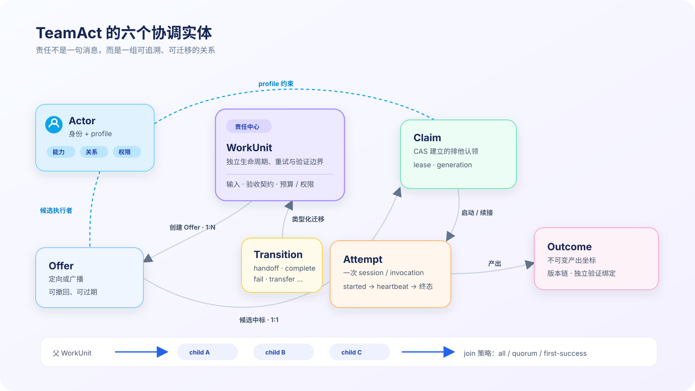
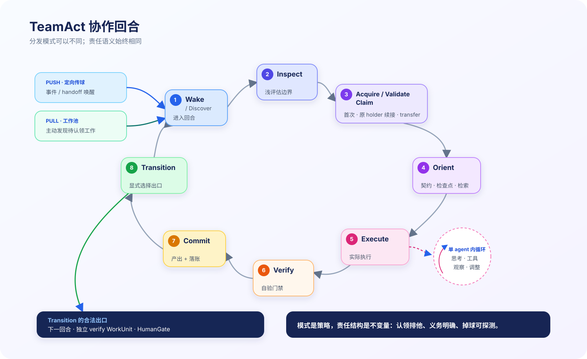
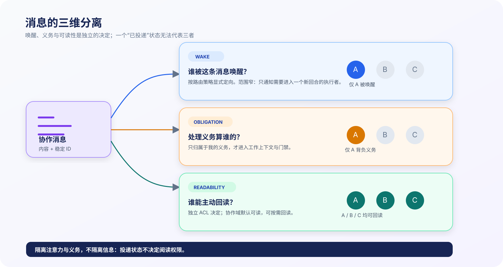
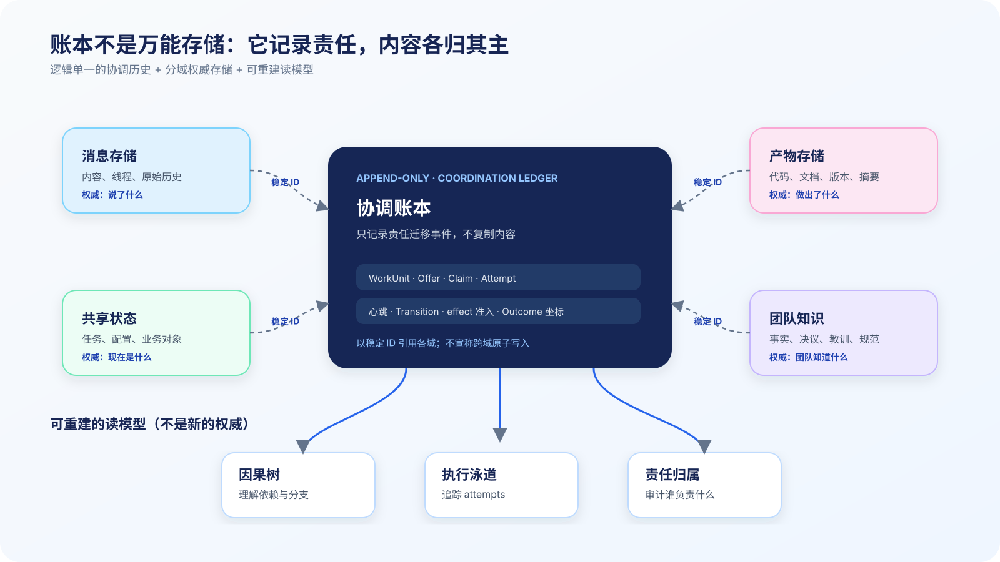

# TeamAct：长时人机混合团队的责任协调模型

## Abstract

单 agent 的行为可以用"思考—行动—观察"的内循环刻画（ReAct）。当多个**长命的、有身份的** agent 与人类组成持续协作的团队时，出现了内循环之外的一层问题：工作由谁认领、义务算在谁头上、上下文如何在交接中不失真、记忆如何跨越单次会话的生灭、认领者悄悄消失时谁来发现。本文提出 **TeamAct**：一个以 *WorkUnit / Claim / 协调账本（coordination ledger）* 为核心的**责任协调模型**。它定义六个协调实体、一个八步协作回合、上下文传递与记忆管理的分层设计、职责交接协议，以及六条不变量。模型的立场是：**执行状态回答"程序怎么继续跑"，责任状态回答"团队怎么不掉球"**——后者需要独立于任何单个 agent 的显式结构。

**阅读路线**：第一次阅读先看 §1–§3，建立“为什么需要责任层、六个实体怎样进入一个回合”的心智模型；需要实现消息与上下文边界时读 §4，需要处理换手与僵尸执行者时读 §6–§7；§5、§8–§9 与附录是记忆、存储和运行时语义的参考层，不必线性通读。

---

## 1. 问题定义

### 1.1 系统形态假设

本模型针对满足以下四条假设的协作系统设计（不满足这些假设的系统不需要本模型，见 §10）：

- **A1 — Agent 长命且有身份**：agent 跨任务存续，积累记忆、能力档案与责任记录；agent 之间以身份互相认识。
- **A2 — 人是团队成员**：人不只是发起者与消费者——人拍板、审批、也承接工作；因此**人也会成为瓶颈、也会掉球**。
- **A3 — 工作跨会话**：一项工作横跨多次进程重启、上下文窗口压缩、模型供应商中断；执行者可能中途被替换。
- **A4 — 责任要可审计**：谁在什么时候对什么负责，必须事后可追溯；验证必须独立于产出者。

### 1.2 五类失效模式

在满足 A1–A4 的系统里，仅有消息系统与执行可靠性机制时，我们从数月实践中反复观察到五类结构性失效（具体实测记录见 [gap-migration](./teamact-v2-gap-migration.md)）：

| 失效模式 | 症状 | 缺失的东西 |
|---|---|---|
| **F1 义务误归属** | 消息路由正确，但处理义务与上下文注入按"会话容器"粒度计算——旁观者被塞进别人的工作 | 义务的 per-recipient 归属判定 |
| **F2 时序失真** | 并行协作按壁钟到达序渲染，因果断裂 | 审计序 / 因果树 / 执行泳道的投影分层 |
| **F3 续接断链** | 会话中断后能"继续跑"，但不知道续的是**哪项工作、谁的认领、第几次尝试** | 执行尝试与责任的 lineage |
| **F4 人类黑洞** | 升级给人的事项无限期搁置——人是系统里唯一没有掉球保护的执行者 | 人的待办的认领状态、SLA 与探测 |
| **F5 静默死亡** | 执行者因外部故障悄然消失，无失败信号，靠人偶然发现 | 执行的生命迹象（心跳/租约）与探测 |

### 1.3 核心论断

五类失效同源：**系统只持久化了执行状态与消息内容，没有持久化责任状态**。责任状态必须：

1. **外化**——不能活在任何单个 agent 的上下文里（A3：agent 会死、会失忆、会被替换）；
2. **一等**——认领、义务、交接是显式实体与事件，不是从言语行为里推断的（"我来做"不构成结构化的认领）；
3. **统一覆盖人与 agent**（A2：人的责任同样需要状态、SLA 与探测）。

## 2. 协调模型：实体与关系



*图 1：TeamAct 实体关系*

### 2.1 六个实体

| 实体 | 定义 | 生命周期与关键属性 |
|------|------|-------------------|
| **WorkUnit** | 一个可独立认领的工作单元。判据：**有独立的生命周期、重试边界与验证边界**。"等一个人类决策"同样是 WorkUnit | 输入与依赖、验收契约、预算/权限边界；可 split 出子单元、按策略 join |
| **Offer** | 将 WorkUnit 提供给候选执行者的行为，1:N | 定向（指名执行者）或广播（进入 pull pool）；带"无人认领"超时；可撤回、可过期 |
| **Claim** | 执行者对 WorkUnit 的排他认领，1:1 | 由 CAS 建立；持有 lease（心跳续约）与 generation（易主计数）；**跨 attempt 存续** |
| **Attempt** | claim 之下的一次实际执行（一次会话 / 一次 invocation） | started / heartbeat / 终态三段；以 parent 链相连——中断恢复 = 同 claim 下新 attempt |
| **Outcome** | attempt 产出的**不可变坐标** | 内容寻址（版本号或摘要）；新版本 supersede 旧版本；是独立验证绑定的对象 |
| **Transition** | WorkUnit 状态的类型化迁移 | complete / fail / escalate / park / resume / cancel / transfer / split / **handoff**（复合迁移：complete 当前单元 + 创建带依赖的后继单元并定向 offer，§6.1）——每种迁移语义不同，禁止笼统的"传出去了" |

### 2.2 Actor：正交的执行者维度

执行者不构成第二套实体分类。任何执行者以 **ActorRef（身份）+ profile** 被引用；profile 含三个维度：

- **capability**：擅长什么（辅助传球判断的依据）；
- **relation**：与其他 actor 的同源/家族关系（独立验证的回避依据）；
- **authority**：可批准什么、可 review 什么、可签发什么。

粗粒度的执行者类别（agent / human / external）只是 profile 的一个字段，用于选择 SLA 档位与超时后的 Transition 类型。**判断一个东西是否进入协调模型，看它是否有独立生命周期与验证边界，不看它"是人还是程序"。**

### 2.3 人是一等执行者

"等人批准 / 等人配置 / 等人决策"建模为执行者是 human 的 WorkUnit（HumanGate）。由此人自动获得与 agent 相同的责任基础设施：

- **双层 SLA**：offer 级（尚未认领：超时 → 提醒/升级）与 claim 级（已认领：进度超时 → 提醒/升级/搁置/取消）；
- **统一掉球探测**（消除 F4）；
- **一条硬边界**：审批类 HumanGate 的超时动作不含任何绕过授权的降级——系统可以催促、升级、搁置、取消，**永远不能替人批准**。

## 3. 协作回合（The TeamAct Loop）



*图 2：TeamAct 协作回合*

### 3.1 八步回合

每个执行者对每项工作的参与是一个回合：

| 步骤 | 语义 | 设计要点 |
|------|------|---------|
| **Wake / Discover** | 进入回合：push 形态把定向 envelope 投递给目标并可立即排队/触发 invocation；pull 形态由执行者在空闲、定时或事件循环中查询共享协调状态，发现待认领工作 | 入口只决定谁现在进入回合，不自动证明消息已处理或工作已认领（ACK 见 §4.4，Claim 见下一步）。死信、**已被他人认领**的工作在此丢弃——两个例外：**自己持有 claim 的工作**（续接路径）与**持有效 TransferOffer 的接收者**（transfer accept 路径），均进入 Acquire/Validate |
| **Inspect** | 认领前的浅评估 | 值不值得认领、是否在能力/权限边界内——避免抢了做不了的活 |
| **Acquire / Validate Claim** | 认领或续接，三分支；**成功即原子产生 `attempt.started` 并旋转 attempt generation** | ①首次执行：CAS acquire（失败 = 别人先到，安静退出）；②**原 holder 续接**：校验并续租自己既有的 claim（同 claim 下 attempt+1 的合法入口——新 attempt 持新 attemptGeneration，**分区后复活的旧 attempt 因 attemptGeneration 过期被 fence**，§7 N2）；③易主接棒：transfer accept（§6.1） |
| **Orient** | 认领后的深定向 | 读交接契约（§4.2）、**恢复检查点（§5.3）**、检索团队记忆（§5）、读依赖与验收契约，制定计划 |
| **Execute** | 实际执行 | 单 agent 内循环（ReAct、工具调用、子代理编排）完整地活在这一步内 |
| **Verify (self)** | 自验 | 质量门禁、测试、自检——在 claim 内完成；不替代独立验证（§9.2） |
| **Commit** | 产出落地 | 产物写入权威存储 → 产出坐标（Outcome）落入协调账本；跨存储不宣称原子（§8） |
| **Transition** | 类型化移交 | 完成/传递/升级/搁置/失败——必须显式选择一种，**"不了了之"不是合法出口** |

### 3.2 工作调度的 push 与 pull

push / pull 容易被混成一个词。它至少会出现在三个不同平面：**工作如何被发现与调度**（本节）、**上下文如何取得**（§4.3）、**消息如何投递与确认**（§4.4）。三个平面可以独立组合；“主动触发了执行者”不等于“消息已处理”，也不等于“工作已认领”。

| 模式 | 入口语义 | 必须补齐的控制 | 适用与代价 |
|---|---|---|---|
| **push（主动调度）** | 生产者先持久化定向 Offer / obligation membership，再把 envelope 投递给目标；运行时可以立即排队或启动目标 invocation，交接契约也可以随 envelope 注入目标上下文 | per-recipient ACK、幂等、重试与背压；目标上下文只能按 membership 水合。**若路由目标与上下文水合范围不一致，旁观执行者会误读甚至误接工作** | 低延迟，适合专长匹配明确、上下文连续性重要的后继工作；发送方与接收方的注意力和可用性耦合更强 |
| **pull（共享状态发现）** | 生产者把 Offer / WorkUnit 写入可查询的共享协调状态或工作池；执行者在空闲、定时或事件循环中查询，Inspect 后以 CAS 竞争 Claim | 可发现性、调度公平性、饥饿/积压探测与“长期无人认领”SLA；共享状态必须是结构化责任状态，不能靠扫描原始聊天猜义务 | 解耦生产者与消费者，适合可并行、执行者可互换的工作；代价是发现延迟与调度治理 |

推荐的可靠实现通常是 **hybrid**：共享协调状态保存 WorkUnit / Offer / membership 的权威事实，push 主动触发降低延迟，pull discovery 保证触发丢失后仍能发现工作。这里“push 不独占可靠性”不意味着 push 只能携带一个空唤醒——它可以投递 envelope、注入目标上下文并启动 invocation；只是这些动作都不能替代 durable state 与 ACK。

两种模式共享同一套 Claim / 义务 / 探测语义——**模式是策略，责任结构是不变量**。

### 3.3 分形嵌套与委派边界

```
系统层（工作的立项与验收）
  └─ 团队层（TeamAct 回合：责任的认领与移交）
       └─ 单 agent 层（ReAct 内循环：一次执行内的思考与行动）
```

委派是递归的。一个协作 pattern 落在 Execute 内部还是升格为子 WorkUnit，由 §2.1 的 WorkUnit 判据决定：

- 临时 helper（无独立责任，随 attempt 生灭）→ Execute 内部；
- 独立负责的 worker → split 出子 WorkUnit → 完整的 offer/claim/attempt 回合；
- 评估者 → 独立的 verify-WorkUnit（§9.2）；
- 并行分支 → 子 WorkUnits + join（all / quorum / first-success）；
- 编排者 → 父 WorkUnit 的 claimer：split 与聚合就是它 Execute 的内容。

## 4. 上下文传递（Context Flow）

上下文是协作的血液，但"给所有人看所有东西"和"只给该干活的人看"都是错的。模型把上下文问题拆成两问：**注入给谁（attention）**与**谁能读到（access）**。

### 4.1 三维分离



*图 3：wake / obligation / readability 三维分离*

| 维度 | 语义 | 规则 |
|------|------|------|
| **wake** | 这条消息唤醒谁 | per-recipient：显式定向或按路由策略定向，不广播唤醒 |
| **obligation** | 处理义务算谁的；注入谁的执行上下文 | per-recipient + per-invocation-scope：**只有归属于我的义务才进入我的工作上下文与新鲜度检查** |
| **readability** | 主动回读时能看到什么 | 独立的可见性策略：协作域内默认可读，私密通道按各自策略。**投递状态不决定阅读权限** |

义务收窄、可读保持——因为接手他人工作、审计复盘、Orient 阶段的背景理解，都依赖"义务之外仍可回读"。这直接消除 F1 而不制造信息孤岛。

### 4.2 交接契约（Handoff Contract）

跨执行者的上下文传递不能依赖"转述"——转述随交接链衰减。每次 Transition(handoff / escalate) 必须附带**结构化交接契约**，其最小完备集：

| 要素 | 内容 | 为什么必须 |
|------|------|-----------|
| **事实** | 做了什么 + 产出坐标（Outcome 引用） | 让接手者验证而非轻信 |
| **意图** | 为什么这样做 + 放弃了什么权衡 | 意图无法从产物反推——丢了意图，接手者会重走弯路 |
| **边界** | 开放问题 + 已知风险 | 未决之处显式声明，避免"以为已经处理" |
| **行动** | 期望下一棒做什么 | 移交的是义务，不是信息垃圾场 |

### 4.3 上下文取得的推 / 拉双通道

这里的推 / 拉只描述**上下文怎样取得**，与 §3.2 的工作调度模式正交。一个 push-triggered invocation 仍会在 Orient 主动拉取细节；一个从工作池 pull 到的 WorkUnit 也可以附带主动推送的交接契约。

上下文传递走两条互补通道：

- **推送通道**（交接契约）：传**意图与边界**——小而结构化，交接时主动附带；
- **拉取通道**（readability + 记忆检索）：传**细节与背景**——接手者按需回读原始协作历史与团队记忆。

设计原则：**契约传意图，回读传细节**。只有推送会丢细节；只有拉取会丢意图（原始记录里没有"为什么不那样做"）。

### 4.4 消息投递协议（Delivery Protocol）

§3.2 的 push/pull 讲**工作如何被调度**，§4.2/4.3 讲**上下文如何取得**；本节再定义消息如何抵达接收者并形成可核验的 ACK。三层不能互相代替。首先分清两套状态机：

- **消息层**：管内容与消费确认。每条消息对每个接收者有迁移：`created → enqueued → delivered → seen → processed`。`enqueued` 只表示发送侧 dispatcher / 中央队列接受；`delivered` 必须来自目标 inbox / runtime 接受 envelope 的 transport ACK；`seen` 是 envelope 确实进入目标 prompt 或被目标主动读取的 attention ACK；`processed` 是接收者已完成分类/回应的 consumption ACK。任何一层都不能由发送者仅凭“invocation 已启动/结束”推断；
- **责任层**：管 WorkUnit / Offer / Claim。**普通信息消息不自动产生工作责任**——只有显式构成 Offer 或义务的消息（定向指派、审批请求、必须回应的问询）才在 membership 中标记为 obligation，进入责任模型。

投递管线：

```
消息内容（权威存储，写一次）
  → per-recipient membership（durable：每接收者的确认状态机 + 是否构成 obligation 的判定）
  ├─ push path：主动排队/触发目标 invocation，投递 envelope；发送侧只推进 enqueued，
  │  后续由目标事实推进 delivered / seen / processed
  └─ pull path：目标在回合入口或 discovery loop 查询共享 membership / work pool，取得尚未 processed
     的消息与未履行 obligation；obligation 的履行走责任层完整回合
```


*动图 2：消息的投递/消费状态与工作的责任/履行状态各自推进。`processed` 不会自动产生 Claim，也不等于 WorkUnit 已完成。*

五条规则：

1. **主动触发不是 ACK**：push 可以启动 invocation 并携带 envelope，但排队成功只到 `enqueued`；只有接收端事实才能推进 `delivered / seen / processed`。ACK 超时触发幂等重投、提醒或升级；不能把“已排队”写成“已送达/已读”，也不能把“已处理消息”写成“已完成工作”。
2. **唤醒与义务分离**：wake 是降低延迟的动作；确认状态与 obligation 在 membership 中 durable 存在——**丢唤醒不丢义务**，pull discovery 能从共享状态重新发现。
3. **重复投递幂等**：投递按消息 ID + recipient 去重；同一 envelope 重复抵达不重复推进确认状态、不产生重复义务。
4. **因果序与到达序分离**：理解用因果序（回复链/引发链），审计用到达序——两种排序都保留，互不冒充（§8 投影分层）。
5. **投递状态不决定阅读权限**（§4.1）：membership 管确认与义务，可见性策略管主动回读，二者正交。

## 5. 记忆管理（Memory Model）


*图 4：记忆分层与读写路径*

A3（工作跨会话）意味着**失忆是常态而非异常**：上下文窗口会压缩，会话会重启，执行者会更换。记忆设计的目标不是避免失忆，而是**让失忆不致命**。

### 5.1 四类记忆及其归属

| 记忆 | 内容 | 生命周期 | 归属 |
|------|------|---------|------|
| **工作记忆** | 当前 attempt 的推理过程与中间状态 | 随 attempt 生灭，**易失** | 单个执行中的会话 |
| **团队知识** | 事实、决策、教训、规范——跨 agent 可检索 | 长期，随团队演进 | 共享知识库 |
| **私有记忆** | 身份、关系、偏好、能力积累 | 长期，随 agent 演进 | 单个 agent，不共享但影响行为 |
| **责任记忆** | 谁在何时对什么负责——认领、交接、尝试、产出 | 永久（append-only） | 协调账本（§8） |

关键分工：**账本不存知识，知识库不管责任**。"我们决定采用方案 X"是团队知识；"这个决定当时由谁负责做出"是责任记忆——两者以稳定 ID 互相引用，不合并存储。

### 5.2 三条设计规则

1. **协作状态不得只存在于工作记忆。** 任何决定"谁负责什么、做到哪了"的信息，必须在产生时落入账本或交接契约——工作记忆里的"我记得我答应过"在下一次会话就不存在了。
2. **候选写入是 Commit 的副产品，不是额外义务。** Commit 步骤产生**知识候选**（Outcome 的可检索化 + 显式条目：教训、决议）并附带 provenance；候选晋升为团队知识按 §5.4 的生命周期治理——靠"有空再整理"的知识管理必然荒废，但 Commit 也不直接铸造"结论"。
3. **检索是 Orient 的标准步骤，不是可选优化。** 接手任何工作前检索团队知识（这个问题以前遇到过吗？有相关决议吗？），使个体的经验成为团队的经验。

### 5.3 失忆恢复：三源重建

执行者在会话更替后重建上下文的标准路径（这正是 attempt 可替换、claim 可存续的前提）：

```
新 attempt 的 Orient =
    交接契约 / 前一 attempt 的收尾记录或最后 durable 检查点   （意图、进度与边界）
  + 协调账本回放                                            （责任状态：我认领了什么、到哪一步）
  + 团队知识检索 + 协作历史回读                              （细节与背景）
```

**检查点是静默死亡场景的必要补充。** 正常收尾会留下契约或收尾记录，但静默死亡（F5）没有收尾——因此执行中必须在关键点落 **durable 检查点（continuation capsule）**：当前进度、未完成的副作用清单（已准入未观测的 intent）、下一恢复点。没有检查点的三源重建只对"体面死亡"有效；检查点频率是策略（按步骤、按时间、按副作用准入前），存在性是规范要求（附录 B7）。

三源缺一不可：只有账本会丢意图；只有契约会丢进度的权威性；只有回读会淹没在细节里。

### 5.4 知识生命周期

**不是所有产出都自动成为团队知识。** Outcome 是候选；进入共享知识库需要生命周期治理：

- **晋升（promotion）**：候选 → 知识，须携带 **provenance**（谁产出、是否经独立验证、来源坐标）——未经验证的候选以候选身份可检索，不冒充结论；
- **演替（supersede）**：新知识显式取代旧知识，取代链可追溯——检索默认返回当前版本，历史版本按需可达；
- **可见性**：知识条目遵循与 readability 同轴的可见性策略（团队共享为默认，私密域例外）；
- **遗忘（retirement）**：被证伪或过期的知识主动退役——错误的"团队记忆"比没有记忆更危险，退役与晋升同样需要 provenance。

## 6. 职责交接（Responsibility Transfer）

### 6.1 交接的三种形态

| 形态 | 场景 | 协议 |
|------|------|------|
| **顺序传球（handoff）** | 正常协作流：**我的单元完成，后继工作是新的责任** | 当前 WorkUnit → complete；同时创建（或早已 split 出）**带依赖关系的后继 WorkUnit** + 交接契约 + 定向 offer → 下一棒对**新单元**走完整回合（Inspect → Acquire）。**handoff 不在同一 WorkUnit 上换 holder**——那是 transfer 的事，两者混用会撞 Claim 排他不变量 |
| **易主（transfer）** | 认领者中断/被更换，**同一 WorkUnit 带着进度**换人 | 双条件缺一不可：**授权**（定向 transfer offer；签发者必须是当前认领者或有授权的调度者——否则任何人可自签自抢）+ **并发安全**（携带期望的 fencing token 做原子接棒）。接棒即承接：custody 无缝转移，接棒者可见并承认全部进行中副作用 |
| **放回池（release）** | 认领者主动放弃且无指定接收者 | 显式释放 → WorkUnit 回到可认领状态 → 义务回落 offer 级 SLA（**无主阶段不是无监督**：offer 发起方背催办责任） |


*动图 1：W-42 从 Offer、A 的 Claim/Attempt、静默失联，经过授权的 TransferOffer 原子换手给 B，再从检查点恢复并完成。WorkUnit 身份不变；变化的是 Claim holder、Attempt 与 fencing token。*

### 6.2 状态与职权怎样变化

“任务状态变了”和“谁有权继续做”不是同一件事。以动图中的 W-42 为例：

| 协调事件 | WorkUnit | Claim / 职权 | Attempt | 安全边界 |
|---|---|---|---|---|
| `offer.created` | offered | 无 holder；1:N 候选集 | 无 | 只有被 offer 不等于已承担执行责任 |
| `claim.accepted` + `attempt.started` | active | A 成为排他 holder | #1 active | 建立 token `⟨workEpoch, claimGeneration, attemptGeneration⟩` |
| `attempt.stalled` | active（待处置） | A 的 Claim 尚未被合法迁移 | #1 stalled | lease / liveness 同时参与副作用准入；不能因“看起来死了”就让 B 自抢 |
| `transfer.offered` | active | 有权签发者授权 B 接棒；A 仍是当前 holder | #1 stalled（待处置） | offer 携期望 token、签发者和有效期，只提供授权，不自行改 holder |
| `transfer.accepted` + `attempt.started` | active | B 原子成为新 holder | #2 active | Claim 与 Attempt generation 旋转；A 的旧 token 整体失效 |
| `outcome.committed` + `complete` | completed | Claim 关闭 | #2 completed | Outcome 以不可变坐标落账，后续验证绑定该坐标 |

这张表也说明 handoff 与 transfer 的根本差异：**handoff 关闭当前 WorkUnit、创建后继 WorkUnit；transfer 保留同一 WorkUnit，只迁移它的 custody。**

### 6.3 掉球探测与恢复

- 认领靠 **lease 续约**维持；执行靠 **attempt 心跳**证明活着；
- 心跳断供 + lease 过期 + SLA 超时 → 判定 stalled/dead → 探测唤醒（best-effort）→ 仍无响应 → 升级或 transfer；
- **只记录终态永远探测不到静默死亡**（F5）——探测的对象是"生命迹象的缺失"，不是"失败的出现"。

### 6.4 纠错通道

- **cancel**：关闭 WorkUnit 并使其全部既有 fencing token 失效（协作式取消——运行中 attempt 在下一检查点感知，不承诺抢占）；
- **park / resume**：显式搁置与恢复；搁置期间 claim 保留或释放按策略显式声明；
- 交接后旧执行者的迟到动作由 fencing 拦截（§7 N2）。

## 7. 不变量

以下六条是模型的硬约束（violate = 协调层 bug）；其余皆为可配置策略。

| 不变量 | 硬约束 | 防止的失败 |
|---|---|---|
| **N1 Claim 排他** | 任一时刻一个 WorkUnit 至多一个 active Claim；并发需求事前 split（Offer 1:N，Claim 1:1） | 两人都以为自己是 owner，事后再把冲突解释成“其实是两个工作” |
| **N2 Fenced effects** | token 是 `{工作纪元, 认领代数, 尝试代数}`；取消、易主、Attempt 激活分别旋转对应分量。完整 token 覆盖账本、可变状态、检查点/Outcome 与外部副作用准入；过期动作要么被拒，要么成为已记账、可对账的进行中义务 | 旧 Claim 或分区复活的旧 Attempt 继续写入、重复发消息或制造静默副作用 |
| **N3 迁移全部落账** | 认领、交接、Attempt 起止/心跳、产出坐标全部 append-only，可回放 | 责任只能靠聊天猜、静默死亡没有可观测起点 |
| **N4 验证独立** | 产出者不得认领自己的 verify-WorkUnit；结论绑定不可变 Outcome 坐标，新版本使旧结论过期 | 自审盲区、“审旧盖新” |
| **N5 有界终止** | 每个 WorkUnit 有最大迭代、超时或往返熔断；只承诺有界控制，不冒称形式化终止证明 | 无限修复循环、无止境 ping-pong |
| **N6 副作用有界** | 外部副作用必须幂等、可补偿、或显式不可重试三者居一；结果不确定时先查外部真相 | 不确定结果后的盲目重试与重复外部动作 |

N2 的副作用准入、线性化点和外部系统降级语义见附录 B2；本节只保留 reviewer 与实现者必须逐条守住的边界。

## 8. 协调账本（The Coordination Ledger）



*图 5：账本与各域权威存储的分工*

- **账本只做一件事**：append-only 地记录责任迁移事件——工作单元生命周期、offer、认领与易主、尝试起止与心跳、副作用准入、产出坐标、迁移。事件集必须**闭合且含生命周期起点**——没有"开始"事件就探测不到静默死亡。
- **内容各归其主**：消息内容、代码产物、共享状态、团队知识各有权威存储；账本以稳定 ID 引用它们，不复制内容。跨存储写入不宣称原子——先权威存储落地、再账本记引用，不一致由对账收敛。
- **视图皆投影**：因果树、执行泳道、责任归属都是从账本 + 各存储联接出的**读模型**——可重建、不权威、不合并成万能图（解决 F2 的正道是分层投影，不是更聪明的单一时间线）。
- **逻辑单一，物理自由**：模型只要求逻辑上单一的协调历史；复制、分区、共识是部署工程问题。

## 9. 治理（Governance）

### 9.1 决策边界

可逆的、不越权限边界的决策由执行者自决（事后可审计）；不可逆操作、愿景级变更、跨执行者僵局升级给治理者（人）。升级本身是一个 HumanGate WorkUnit——带 SLA 与探测，不是把球扔进虚空（§2.3）。

### 9.2 验证的两种形态

- **自验**（回合内）：质量门禁、测试——产出者自己的义务；
- **独立验证**（回合外）：一个新的 verify-WorkUnit，由非产出者认领，绑定不可变 Outcome 坐标，结论随产出版本演进而过期。自验防粗糙，独立验证防盲区与私心——两者不可互相替代。

### 9.3 授权不可降级

任何超时、探测、恢复路径都不得把"需要授权的动作"降级为"自动通过"。责任协调层的职权是**让等待可见、让阻塞升级**，不是替授权者做决定。

## 10. 讨论与局限

- **协议遵守不是硬约束。** LLM 执行者靠提示词约定 + 运行时门禁兜底，仍会漏。账本让掉球**可见**，不让掉球**不可能**——本模型是可观测性与恢复力的设计，不是形式化正确性的证明。
- **人的 SLA 是社会约定。** 对人只能催促与升级，不能强制。
- **协调有开销。** Orient 的检索、落账、探测都消耗资源——本模型只适合价值密度高、责任转移真实存在的工作（适用判据展开见 [tech-article](./teamact-v2-tech-article.md)）。
- **验证边界。** 本模型收敛自小型团队（个位数执行者、单治理者）的实践；更大规模、多治理者下的形态未经验证。

## References

- Yao, S. et al. (2022). *ReAct: Synergizing Reasoning and Acting in Language Models.* arXiv:2210.03629 — 单 agent 内循环的经典刻画；TeamAct 是其外层的团队回合。
- Anthropic (2024). *Building Effective Agents.* — workflow patterns 作为 Execute 步骤的任务内实现手段。
- Anthropic (2025). *How we built our multi-agent research system.* — orchestrator-worker 层级式协作的对照。
- Google / Linux Foundation. *Agent2Agent Protocol.* — 跨厂商互操作层；custody/liveness 有意留给参与方，正是本模型所处的位置。
- 内部：[gap-migration](./teamact-v2-gap-migration.md)（本模型与当前实现的对照、差距、迁移路径与实测失效记录）；[tech-article](./teamact-v2-tech-article.md)（面向外部读者的阐述与行业对照）。

## 附录 A：设计决议记录（思考过程的存档）

| # | 决议 | 否决的替代方案与理由 |
|---|------|--------------------|
| D1 | 单一工作本体；执行者以 ActorRef + profile 正交引用 | 否决"governor/worker/tool/event 四层节点分类"（治理角色是策略维度，不是本体分类）与"执行者类别压扁成枚举"（表达不了授权/回避/家族约束） |
| D2 | offer 1:N，claim 1:1 CAS，split-before-claim；fencing token = {工作纪元, 认领代数, 尝试代数}；fencing 覆盖落账/状态/副作用准入三层；transfer = 授权 + CAS 双条件 | 否决：无限制并行 claim；不可参数化的普适 Single Writer；只 fence 落账（副作用漏防）；release-then-reclaim（留无主窗口）；token 少任一分量（取消、易主或僵尸 attempt 漏防）；CAS 当授权（可自签自抢） |
| D3 | 账本只 canonical 责任迁移；内容各归权威存储，稳定 ID 联接；跨存储不宣称原子 | 否决：万能图；一切数据进同一事件流；"原子落账"承诺 |
| D4 | wake/obligation per-recipient；投递状态不决定阅读权限 | 否决：会话容器级全耦合；per-recipient 全隔离（杀死接手与审计） |
| D5 | 会话续接关联 attempt 链；claim 跨 attempt 存续 | 否决：续接挂投递或挂会话（都回答不了"续的是哪项工作"） |
| D6 | 演进既有 TeamAct 名称与概念，不另造新术语 | 否决：新造范式命名（认知成本 > 收益） |

> 落地策略类决议（shadow 先行、权威晋升门等）属实施计划，不入 normative 规范——见 [gap-migration](./teamact-v2-gap-migration.md)。

## 附录 B：运行时语义要点

- **B1 租约与探测**：active claim 靠 lease 续约；attempt 有 started 与心跳；心跳断供 + lease 过期 + SLA 超时 → stalled/dead → 探测 → 升级或 transfer。无人认领的 offer 超时由 offer 发起方背催办责任。
- **B2 副作用准入**：外部副作用两阶段——①准入：意向（携**完整三分量 token**{纪元, 认领代数, 尝试代数} + 幂等键）与认领迁移、尝试激活在协调账本同一串行化域内提交，token 校验发生于此；②执行：对已准入意向执行并记录观测结果。准入成功即不可撤销的派发义务，其后的易主/取消必须承认这些进行中副作用。能力允许时校验可下推至外部系统（须能持久化并比较完整 token——普通条件写只能 fence 外部资源版本，fence 不了工作归属）；两者皆不可时诚实降级为检测 + 对账。
- **B3 易主细则**：transfer offer 结构含 {工作、双方、期望 token、签发者、有效期}；接受是单次原子提交——校验未过期、未消费、签发者权限，然后消费 offer 并完成认领转移（代数 +1）。
- **B4 产出与验证绑定**：产出坐标含不可变版本（内容寻址）；验证结论绑定 {产出 ID, 摘要, 判据版本}；同一 WorkUnit 出新产出时旧产出被 supersede，绑定它的验证结论在投影层显示过期——摘要证明"结论属于哪个版本"，supersede 链回答"当前版本是谁"，合起来封住"审旧盖新"。
- **B5 聚合**：split 的子单元按父单元的 join 策略聚合（all / quorum / first-success）；聚合本身可以是一个 WorkUnit。
- **B6 对账**：跨存储序列 = 权威存储先写、账本后记引用；"产物在、账未落"由对账补账（以权威存储为准）；"账在、产物无"标记悬空引用并告警，不伪造产物。
- **B7 执行检查点（continuation capsule）**：attempt 在关键点（副作用准入前、阶段完成后、按时间周期）落 durable 检查点，**写入携带完整三分量 token**（分区复活的旧 attempt 因尝试代数过期无法覆盖新 attempt 的检查点）。内容 = {当前进度、已准入未观测的 effect intent 清单、下一恢复点、工作记忆中影响协作状态的最小快照}。新 attempt 的 Orient 从最后检查点续起（§5.3）；检查点随 attempt 终态或 WorkUnit 关闭而失效归档。
