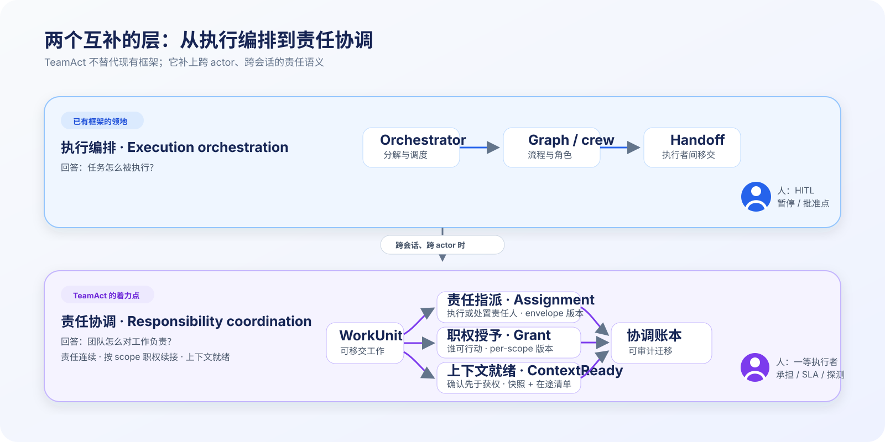
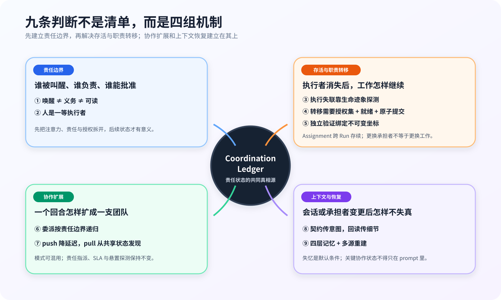
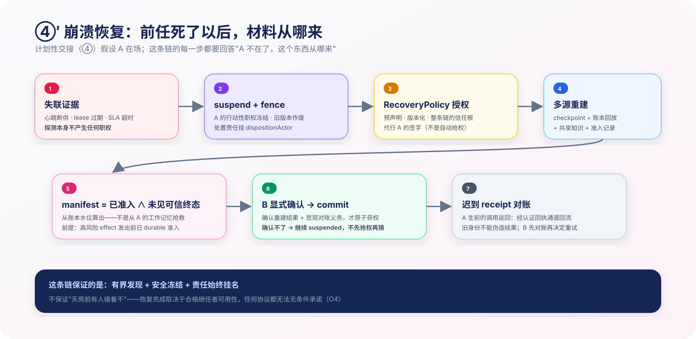
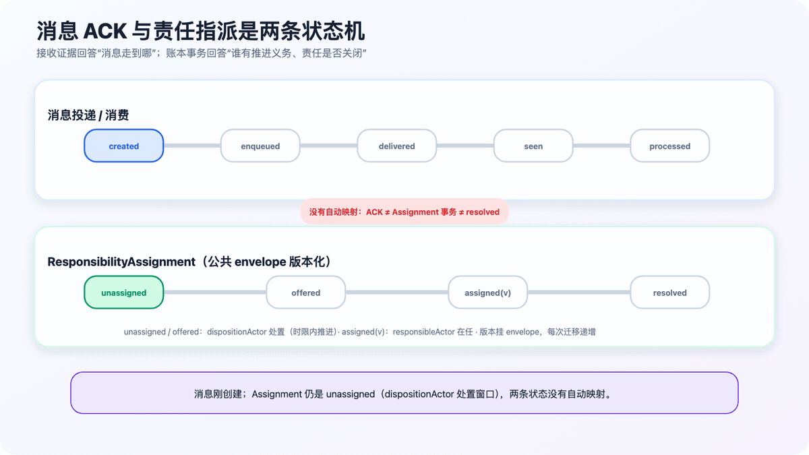
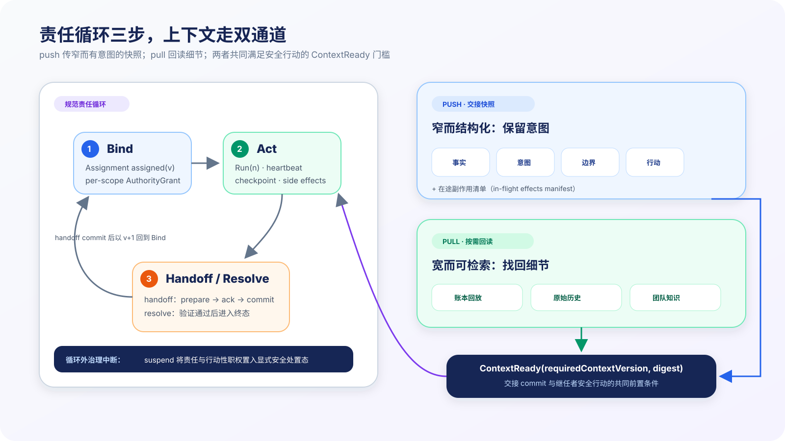
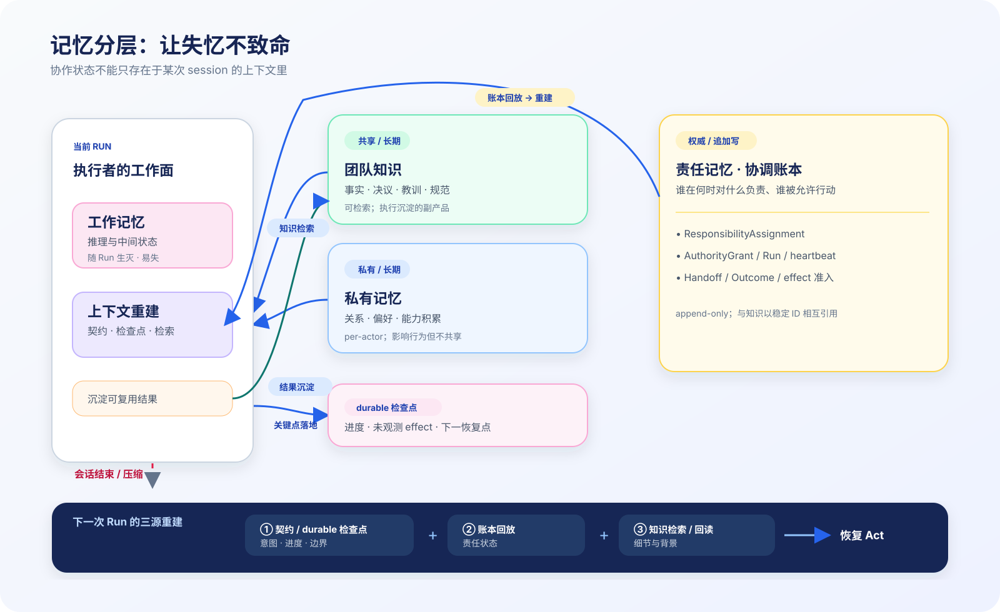

<!-- Export boundary: frontmatter 之上（含本注释）发布时全部剥离；正文自足、
     无内部文档/线程/系统坐标引用。byline 与发布渠道由发布决策定。
     内部治理关系（本文属 TeamAct v2 文档族）见 multi-agent-collaboration-paradigm.md 导航页。 -->

# 从执行编排到责任协调：一个长时人机混合团队的多 Agent 协作范式

> **写给谁**：你已经用编排框架把 multi-agent 跑起来了，或者正打算这么做。
> 这篇文章讲我们在生产里跑了几个月之后才撞上的一类问题——它不在
> "任务怎么执行"这层，而在"团队怎么对工作负责"这层。如果你的 agent
> 是一次性的，你可能永远注意不到它们；agent 越长命、与人混编越深，
> 遇到它们的风险越高——我们几个月里全数遇到。

## 1. 我们撞上的问题：执行编排之外，还缺一层

先讲一类真实的失败。我们的 agent 反复因为供应商额度耗尽或 API 中断，在夜里停止推进。调用链并非毫无信号——供应商或 CLI 往往已经返回了错误，执行层的重试也在消费这些错误。真正缺失的是更高一层的状态转换：没有任何系统把"一次调用失败"翻译成"这项跨几天的工作已经失去推进，需要有人处置"。直到人翻进度，才发现工作仍挂在原负责人名下，却早已没人继续。**失败信号存在；不存在的是责任级失效事件。**

这不是编排框架的 bug。我们执行层该有的都有：持久化状态、断点恢复、重试。问题在别处——系统里没有任何一个地方记录着"这件工作此刻归谁管、多久没推进算异常、异常了谁来发现"。**执行状态**（程序跑到哪）恢复得很好；**责任状态**（谁对什么负责）根本不存在。

> **本文的证据等级，开头说清楚。** 这篇文章里有四种不同强度的东西，请分开读：**实测的失效**——五类失效模式（§2）来自数月生产实践的反复记录；**已上线的局部机制**——事件溯源引擎、会话续接协调、义务门禁等先行件已在生产运行；**结构缺口**——这些局部机制尚未被统一的责任本体连接，这正是失效仍会发生的原因；**待验证的统一设计**——本文核心（协调账本与 WorkUnit 本体）**尚未开始实现**，§3 的一切保证是从实测问题收敛出的设计推演，不是已上线系统的行为描述。一句话：这是**当前阶段的理解与演进方向**，不是已验证的范式宣言。完整披露见 §8。

这个失败发生在一个这样的系统里：

- **逻辑 Actor 是长命的**：运行它的 session、模型乃至供应商可以更换，但稳定的 Actor 锚点不变；记忆、能力画像和责任记录都通过这个锚点连续关联。异构模型混编（Claude / GPT / Gemini / Kimi 同队），围绕一个长期软件产品持续协作与迭代。
- **人是团队成员，不是调用者**：operator 拍板愿景、审批不可逆操作、也**承接工作**（配环境、做决策）——因此人工职责同样可能逾期或失去跟进。
- **工作跨 session**：一个功能以天计，横跨多次进程重启、上下文压缩，乃至模型供应商的额度与服务中断。
- **结果要审计**：谁在什么时候对什么负责，事后必须可追溯（跨模型家族 code review 是我们的铁律）。

**本文主张的范围**也在这里划清：**单 operator、多 Agent Actor** 的团队。"多 Actor"按三样东西是否独立来数——身份锚点、会话与记忆边界、责任记录：两个各自持有独立 session 与责任记录的 Claude 是两个 Actor；同一个上下文里扮演的两个角色不是。概念上本范式不排除多 operator，但本文只对单 operator 域做主张。另一个自由度是实现形态：TeamAct 是协调层协议，与承载 agent 的产品无关——异构模型混编（Claude / GPT / Gemini / Kimi 同队）、用 skill / 系统提示词 / MCP 拼装的运行时、两个独立会话的同厂模型，都是合法实现。

**为什么这层一直缺？看看行业各自在忙什么就明白了。** 今天的 multi-agent 生态大致分三类工作，三类都已有成体系的工作；按我们审读各家官方文档的口径（2026-07，精确边界见 §5 与附录 A），它们都没有把上面那个问题做成 first-class 本体——这说的是官方文档定义的边界，不是"应用层不能自建"：

- **编排与执行框架**（LangGraph、CrewAI、AutoGen、OpenAI / Claude Agent SDK）解决"**程序怎么可靠地跑**"：graph 怎么定义、状态怎么持久化、断了怎么恢复、人怎么插进来审批。LangGraph 的 checkpointing、OpenAI Agents SDK 的可序列化 RunState、CrewAI Flows 的持久化恢复，都是这一层的扎实成果。但它们持久化的是**执行状态**——图走到哪个节点、run 在等什么输入；
- **多 agent 模式实践**（Anthropic 的 orchestrator-worker 研究系统与 workflow patterns）解决"**任务怎么拆、什么时候值得多 agent**"：lead agent 并行派生 subagents、evaluator 迭代 optimizer，以及 Anthropic 反复强调的建议——能单 agent 就别多 agent。这些模式里的 worker 通常是**任务期**的（research system 的 subagent 由 lead agent 派生、任务结束即回收），"某个 worker 对某件事长期负责"不在其问题域里；
- **互操作与工具协议**（A2A、MCP）解决"**跨边界怎么通**"：不同厂商的 agent 怎么发现彼此、交换任务状态，agent 怎么调用工具。协议管边界上的握手，不管参与方内部谁认领了什么。

三类我们全在用，它们都对。但当 agent 从"任务的执行器"变成"团队的长期成员"——工作在成员间流动、人也承接工作、执行者会静默消失——就出现了一类在这三层的官方形态里都找不到 first-class 支持的问题：**这个工作单元被谁认领？义务推进到哪了？认领者失联了谁来发现？人类成员的承诺怎么被跟踪？** 这就是本文要补的一层：**责任协调**（responsibility coordination）。它要同时回答三件事，这三件事贯穿全文的每个机制：**责任连续性**（每项工作任意时刻都能从账本查到**执行责任人**、或无人承接时的**处置责任人**——跨 session、跨执行者更替不断线）、**按 scope 的职权续接**（谁被允许决策、提交哪类副作用；换手时这些权力如何不重复、不伪造地迁移）、**上下文就绪**（接手者动手之前，如何达到"足以安全继续"的信息状态）。



*图 A：执行编排层解决"程序怎么继续跑"，责任协调层解决"每项职责任意时刻是否都可查到执行责任人、或无人承接时的处置责任人"。*

先划清一个边界：这不是说去中心化比中心化更先进。任务图已知、编排者合法持有全部分派/回收权、worker 可随时替换时，orchestrator-workers 更简单；当长期 Actor 各自持有不可随意代行的责任或职权、工作边做边长出来、没有一个上下文能合法代表全局时，才需要 peer coordination。现实系统往往混合两者：一个 WorkUnit 内用中心化编排完成执行，WorkUnit 之间与长期 Actor 之间用责任协调维持连续性。后者的代价是真实的——要多付账本、交接、失效探测与对账循环的复杂度；§6–§8 给出选择条件与不适用域。

同一条边界还有个容易走歪的方向，把话说死：**"长命 Actor"是前提的产物，不是目标**。当你的工作负载里责任与职权本来就跨 session 存续——工作以天计、审计要求责任连续、人深度参与执行——你才需要为这种存续建稳定锚点；不存在这种存续，就**不要人为制造它**。把用完即回收的 worker 刻意养成"长期成员"，只会白付整层协调成本——那是本文反对、而不是鼓励的用法。

## 2. 从我们的运行时暴露出的五类责任协调失效

开头那类静默停摆不是孤例，只是五类失效里最戏剧性的一类。先花半页把这些失效发生的世界画出来——如果你的 subagent 是 spawn 出来干完就散的，下面几个场景会代入不进去。

**我们的运行时是事件驱动的。** 一群长命 Actor 挂在群体频道上，平时**没有任何 Actor 的执行实例在跑**（常驻的只有一个确定性的系统巡检服务——§3.5 会讲它，它不是 LLM、也不是 Actor）；消息到达才唤醒某个参与者——系统为它启动一个短命的执行实例（**Run**，一次 session），把它名下的义务注入这次执行的上下文，行动之前还有门禁检查（比如"你有未读消息，先处理"）；回合结束，Run 消亡，Actor 回到休眠。所以一个 Actor 的"一天"不是一个常驻进程，而是**一串短命的 Run**：

```text
睡 → 消息到达 → Run 启动（义务注入上下文）→ 干活 → 回合结束 → Run 消亡 → 睡 → 下一条消息 → 新 Run …
```

Run 之间它在休眠，但**它名下的责任不随 session 消失**——这是理解下面一切失效的钥匙。也说清边界：这是**我们这个系统的具体形态**，不是范式的要求。TeamAct 对运行时只假设一件事：执行实例可以死，责任状态必须活。事件唤醒还是定时唤醒、上下文怎么注入、门禁怎么设，都是实现自由度。

下面五个场景都是我们数月生产实践中反复出现的失效模式的抽象（具体案例数据属于内部工程记录，此处只保留结构）。先把归因说准：五类各有自己的触发条件（每条末尾标注），**并非都由"agent 变成长期队友"导致**——F1/F2 与寿命正交，在一次性的 orchestrator + subagents 里同样可能发生。长命、跨会话、与人混编是它们的**暴露与损失放大器**，不是共同病因：同类问题跨任务累积，从单次任务内的小故障放大成责任连续性问题：

**F1 — 义务误归属。** 群体频道里进来一条不指名的消息。路由器按规则（比如"最近发言者优先"）把它派给 A——没问题。但 B 稍后因另一件事被唤醒时，系统把频道里的"未读消息"一股脑算进 B 的义务：A 名下的消息被注入 B 的执行上下文，B 的行动还被"你有未读消息"的门禁拦住。群频道只是我们撞上它的地方，**一般形式是：系统把 transport / 可见性事件当成了责任迁移——因为看见、收到或被唤醒，就推断"这件事归你"**。共享收件箱、"看见即该做"的 blackboard 约定都会复现它；反过来，定向 spawn 若原子完成任务创建与 worker 绑定，已是显式指派，结构上不会发生。解法是 §3 的账本原则：义务只由显式责任事务产生。**触发条件：transport／可见性被错误提升为义务绑定——与 Actor 寿命正交。**

**F2 — 时序失真。** 两个 agent 并行工作，回复按到达时间交错渲染成一根时间线——读者看到精确到毫秒的混乱。**触发条件：审计需要到达序、理解需要因果树、追踪需要执行泳道，三种视图被迫共用同一投影——与寿命正交。**

**F3 — 续接断链。** agent 的会话中断后重启。执行框架能恢复"程序跑到哪了"，却回答不了：我**认领**的是哪项工作？这是第几次尝试？上次尝试对外承诺了什么？**执行状态恢复了，责任状态没有。触发条件：工作寿命超过 Run/session，责任状态未随之持久。**

**F4 — 人工责任悬置。** 一件事升级给人审批后长期未处理。agent 侧有超时与重试，人工环节却没有等价的 SLA、提醒与升级路径；系统无法区分"仍在等待合理处理"与"职责已失去跟进"。**触发条件：人进入责任链，却没有等价的状态、SLA 与升级路径。**

**F5 — 执行静默失联。** 就是开头那类故事：agent 因供应商额度耗尽或 API 中断停止活动。调用级错误可能已经发生，缺的是**责任级失效事件与后续处置**——把"停止推进"升级为悬置或转移这件事，不能依赖停止者自己完成。工作停在原地，直到人类注意到异常。**触发条件：执行者可能停止，而系统缺独立的生命迹象与责任级处置。**

五类失效共同暴露的是：**责任协调没有被建模为一等系统状态**。F1/F2 首先缺责任归属与投影视图；F3/F4/F5 除了缺 Run lineage、人工 SLA、权威心跳等状态机制，还共同缺少一个持续检查并推进这些状态的运行时驱动。消息（说了什么）、执行（跑到哪了）、责任（谁该做什么）被耦合在同一根管道里，粒度各自都不对。

下文严格区分故障状态与合法迁移：**职责悬置**指义务仍有受监督的工作提供（offer）或升级路径，但超过 SLA 规定的推进窗口后，仍未被承接、处理或升级；**执行失联**指活跃的执行实例（Run）失去心跳与租约（**lease**：执行者需定期续期的持有凭证——续期停止即可判定"可能已失联"，不必等它自己报告失败）；**职责失去有效承接**指既没有有效的责任指派，也没有受监督的后续处理路径。与这些故障不同，**职责转移**是同一 WorkUnit 经授权更换承担者，**顺序移交**则是当前 WorkUnit 完成后创建后继单元。

## 3. TeamAct：责任协调范式的核心思想

我们把几个月的实践机制 + 多轮内部跨模型对抗 review 收敛成一套协调范式。本体分两层——**核心协调本体**回答"谁负责、谁有权"，压到最小：**两个实体、两个版本化关系、一本账**；**可靠执行扩展**回答"执行怎么可靠"，它存在只因为执行者会死，不占内核位置：

**核心协调本体**：

| 概念 | 一句话 |
|------|--------|
| **Actor** | 由稳定身份锚点指认的逻辑参与者——agent 是本命形态，**人是扩展形态**；Run/session/模型可更换，责任与审计仍通过锚点连续关联 |
| **WorkUnit** | 可移交的工作单元——包括"等一个人类决策"（审批同样是 WorkUnit） |
| **ResponsibilityAssignment** | 责任指派关系：**谁有推进义务**。每个 WorkUnit 恒有且仅有**一条版本化关系记录**——注意唯一的是记录，"已有负责人"只是它的其中一种状态（见下方状态链） |
| **AuthorityGrant** | 职权授予关系：**谁被允许决策/提交某类副作用**——按 scope（execute / decide / approve…）独立持有、独立版本、独立 fence。责任与职权分离后，"B 干活但 A 保留决策权"（委派）与"agent 执行、人持审批权"（审批门）都是同一结构的配置 |
| **协调账本** | offer / accept / transfer / delegate / suspend / resume / resolve——每个动作是 **append-only 账本**上的事务事件；责任与职权状态**只能**经账本事务改变，不能由"消息到了""会话启动了"推断 |

**可靠执行扩展**（不是第三个实体，是执行层对象）：

| 概念 | 一句话 |
|------|--------|
| **Run** | Assignment 下的一次实际执行（一次 session）；中断 = 记终态，**Assignment 不动**，恢复 = 同一 Assignment 下新 Run |
| **心跳 / 检查点 / reconciler** | Run 的生命迹象、进度落盘，与盯着一切义务是否仍被推进的系统级巡检循环（§3.5）——它们服务责任状态，但自己不是责任状态 |

**Assignment 的状态链**（"恒有且仅有一份"的准确含义在这里）：

```text
unassigned → offered(1:N 候选) → assigned(v) → transfer-pending(A→B) → assigned(v+1) → … → resolved
assigned(v) → suspended → assigned(v+1)（resume / 恢复 transfer）| resolved
              （suspended：安全处置态，唯经显式事务退出）
```

这条记录是一个**公共 envelope**：`{workUnitId, assignmentVersion, state}`——关系版本挂在 envelope 上，一切防陈旧的检查（CAS、fence、交接意图的锚定）统一对它做；除进入 transfer-pending 外，每次状态迁移都递增版本（transfer-pending 保持进入前的版本 v，commit 才 +1 并作废旧版）。状态只承载各自的字段：`responsibleActor` 只在 assigned / transfer-pending 态存在（transfer-pending 期间前任不失责，commit 才易主）；unassigned / offered / suspended 态**没有负责人**，取而代之的是 `dispositionActor`——一个显式记录的**处置责任人**。两类无负责人状态的承诺强度不同，分开记：unassigned / offered 是**仍需推进**的状态，字段里带可检验的时限与政策引用（nextCheckAt / offerExpiresAt + policy），超时未处置是账本上可判定的违例；suspended 是**已进入可稳定保持的安全处置态**，dispositionActor 负责后续治理，但退出**不承诺有界完成**。于是整套本体只有一条硬承诺：**每个非终态 WorkUnit，要么可查到执行责任人，要么可查到处置责任人——后者要么在时限内推进处置，要么看住一个已冻结的安全态**。"唯一记录"保证责任状态有唯一真相；无人承接的窗口（offer 发出去还没人接）不是责任真空——超时由 reconciler 按预声明规则推动 re-offer、升级或终止，但 reconciler 自己不获得选人、取消或审批权。

消息内容、代码产物、知识各有自己的权威存储，账本只记"谁在何时对什么负责"，通过稳定 ID 联接——**账本不是共享数据湖**。会话视图、执行泳道、责任归属都是从账本+各存储投影出来的**读模型**——可重建，不权威。

**这套本体怎么转起来？每个成员的工作生命周期只有三步。** **Bind**——经 offer/accept（或两阶段转移）确立"这事谁管、谁能动手"；**Act**——执行，单 agent 的思考-行动-观察循环（含它围绕目标的长跑形态）完整地活在这一步；**Handoff or Resolve**——显式出口，二选一：移交出去，或了结（完成/失败/取消）。**"不了了之"不是合法出口**——这条纪律约束的是在场的执行者；执行者中途死掉属于循环被系统性中断，由治理层显式悬置或转移（④），reconciler（§3.5）负责让中断被看见。这三步是范式的可执行骨架，下面九条设计判断可以读作在为三步的不同环节补机制。

**一个重要的诚实声明**：TeamAct **不主张**这是去中心化 multi-agent 的普适核心。它针对一个明确问题域——**同一未完成 WorkUnit 的责任或职权跨 Actor 迁移，且继任者的安全行动依赖前任产生的状态**。该域内必须同时解决两个问题：职权续接安全（无双主、无伪造、可追溯）与继任者上下文就绪。解法有两族：**解耦式**（lease 失效 → fence 旧权 → 从共享状态重新认领并自行重建——许多任务队列系统的形态）与**耦合式**（把两者绑成一个事务）。TeamAct 选择耦合式是**带判据的设计选择，不是逻辑必然**（判据见 §6/§7）；解耦式在崩溃主导、共享状态即是全部上下文的负载下更优。

九条判断不是九个同权重的段落，而是四组有先后关系的机制：先划清责任边界，再解决存活、职责转移与验证；协作扩展、上下文与恢复建立在这两层之上。



*图 C：九条判断的阅读地图。中央账本连接四组机制，但不取代各域自己的权威存储。*

### 3.1 先划清责任边界：①–②

**① 唤醒 ≠ 义务 ≠ 可读。** 唤醒回答“谁现在进入回合”，义务回答“谁必须处理、注入谁的工作上下文”，可读回答“谁主动回看时有访问权”。前两者按 recipient 收窄，可读性由独立 ACL 决定；隔离的是注意力和责任，不是协作信息。否则路由给 A 的任务，会在 B 稍后被别的事件唤醒时混进 B 的上下文（F1）。

**② 人是一等执行者。** “等人批准”同样是 WorkUnit：有认领前/后的 SLA、提醒和升级路径，也被职责悬置探测覆盖。系统因此能看见“人工审批处于未处理状态”，但授权边界不变——超时可以提醒、升级、搁置或取消，**不能替人批准**。

### 3.2 再处理存活、职责转移与验证：③–⑤

**③ 执行静默失联看生命迹象，不等失败终态。** Run 从 `started` 开始持续心跳；心跳断供、lease 过期且 SLA 超时，才说明执行者可能已经失联。没有这条正向生命线，"供应商断了，agent 连失败都没来得及报告"永远不可见。

**④ 职责转移 = 授权 → 就绪 → 原子生效，三步不并作一步。** 先说清适用面：这是**计划性易主**的主路径——前任在场、能配合签字和封存现场。执行者猝死走的是它的恢复变体，④′ 单独讲。同一件工作从 A 转到 B，走两阶段事务。第一步集齐授权：责任易主由当前承担者签字，每个随迁的职权由它的持有者**分别**签字——执行者不能替人转走审批权。第二步 prepare：冻结随迁职权、定版上下文快照、封存一份**在途副作用清单**——A 已经发出去、还没返回的外部调用。B 必须知道这份清单，否则会把同样的事再做一遍。B 确认过快照与清单，commit 才原子生效：职权迁移，旧凭据作废。**所以 B 拿到职权的那一刻，就是他准备好的那一刻**——不存在"接了工作但两眼一抹黑"的窗口（这句描述的是设计约束，不是已上线系统的行为——见开头的证据等级）。中途失败就 abort，一切原样恢复。

旧执行实例稍后复活了怎么办？防复活靠四段凭据：{工作单元 ID、职权 scope、职权版本、执行代数（generation：第几代执行实例——每次新 Run 启动即递增，旧代的写入一律拒绝）}——commit 之后旧凭据整体作废，旧 session 再醒过来，也写不进账、发不出新副作用。

那探测到失联、却一时没人能安全接手呢？治理层可以把工作**显式悬置**：失联者在这件工作上的全部行动性职权被冻结（别人的职权不受牵连——比如人持有的审批权），处置责任记在悬置态的 **dispositionActor** 名下（§3 状态链），只能经显式事务退出。工作停在可审计的安全状态，而不是无人负责地悬着。

**④′ 现在把开场那个夜里死掉的 agent，用这套机制端到端走一遍。** ④ 假设前任在场；额度耗尽的 A 不在场——没有签字，没有合作式快照，没有它亲手封存的在途清单。恢复变体的每一步都要回答"这个东西 A 不在了从哪来"：

```text
静默失联 → 有界探测 → suspend + fence → RecoveryPolicy 授权
→ 多源重建（checkpoint + 账本 + 共享知识 + 准入记录）
→ 继任者确认 → transfer commit（或继续悬置）→ 迟到回执对账
```

1. **探测，但探测不产生职权。** A 的 Run 心跳断供、lease 过期、SLA 超时——巡检循环（§3.5）判定"可能失联"，只做两件事：落探测证据，触发预声明的恢复政策。它不能借机接管任何东西。
2. **先冻结，再谈接手。** 一时没有能安全接手的继任者，就先走上一段的显式悬置：A 的行动性职权全部 fence、版本作废——**从网络分区里"复活"的 A 写不进账**；处置责任显式记到 dispositionActor 名下。夜里的第一保证在这里兑现：工作不再无人负责地悬着。
3. **签字从哪来：RecoveryPolicy。** A 死了不能签字，能代行授权的只有**预先声明的恢复政策**——一份版本化、可引用的治理策略，预先写明签署者或法定人数、超时阈值、失联证据要求、可代行的职权 scope。它是整条崩溃链的**信任根**（§8 局限 5 说的就是它）：不是"系统自动抢权"，滥用它同样全程落账。
4. **在途清单从哪来：不是从 A 的记忆里抢救，而是从账本水位上算出来。** 这里有一条 ④ 没有明说、崩溃路径却完全依赖的前提：**高风险副作用在真正离开受控边界之前，必须已经有 durable 的准入记录**（effect ID、幂等键、请求摘要、准入状态）。有了它，A 猝死后的在途清单就是一个查询：**已准入 ∧ 尚未观测到可信终态**的 effect 集合。终态证据也不能只依赖可能死掉的 Run——回执要有可验证的来源；durable outbox、供应商签名回调、独立轮询器、外部系统原生的事务语义，都是合法实现，**要求的是行为性质，不是某种固定拓扑**。做不到这套约束的外部系统，就诚实降级：只承诺检测与事后对账，不声称严格防重。
5. **哪些操作要进这套协议？按安全要求划，不是全部。** 判据：操作可能跨 Run 存续、对外可见、或重复/乱序会造成不可接受的代价（部署、花钱、合并、对外承诺）——才需要准入/fence/回执。纯读取、可丢弃的计算、天然幂等或已被底层事务完整吸收的动作，不逐条上账。这条前提的成本是真实的：需要工具网关或适配器接入、额外的持久写与对账循环——这也是 §7 说"低价值、可整单重跑的负载不适用"的一个具体原因。
6. **继任者确认后才获权。** B 收到的是一份退化的交接：恢复政策的授权替代 A 的签字，最后一个 durable 检查点替代合作式快照，从准入记录推导的清单替代 A 亲手封存的清单，外加一份悲观对账义务。B 必须**显式确认**这份重建结果，commit 才原子迁移责任与职权；B 无法确认自己安全就绪，工作就**继续悬置**——宁可停着，不接受"先抢权再慢慢猜"。
7. **迟到的回执安全回流。** A 生前发出的调用后来返回了——它只能经 effect 级的认证回执通道入账（回执的权源在准入时固化，旧 Actor 身份与旧 Run 凭据不能伪造结果）；B 先对账，再决定要不要重试。
8. **说清这条链保证了什么。** 它保证夜里停摆的工作**在有界时间内被发现、被安全冻结、责任始终有人挂名**；它**不保证**天亮前有人接着干——恢复完成还取决于合格继任者是否存在，这是任何协议都无法无条件承诺的。如果你的负载崩溃频繁、共享状态就是全部上下文、重新认领很便宜，§6 会告诉你：别用这条重链，解耦式更划算。



*图：④′ 的端到端链。与 ④ 的两阶段事务图分工明确：那张回答"计划性交接怎样原子生效"，这张回答"前任死了以后材料从哪来"。*


*图：两阶段交接事务。以计划性交接展示完整主路径；崩溃恢复在多源重建后**复用同一授权 / ack / commit 内核**（sourceState=suspended、RecoveryPolicy 代行缺席者授权），恢复材料从哪里来见 ④′ 的崩溃恢复图。WorkUnit 没有被"重新创建"；接收者确认后才原子 commit，旧凭据失效。*

**⑤ 自检与独立验证是两种工作。** Quality gate 在当前 Assignment 内完成；独立验证则是新的 verify-WorkUnit，由非产出者承接，并绑定产出的**不可变坐标**（commit hash / 内容摘要）。产出一变，旧结论自动过期——防止"审的是旧版，盖章盖在新版上"。

### 3.3 协作如何扩展：⑥–⑧

**⑥ 委派按责任边界递归。** 临时 helper 没有独立责任，留在当前 Run 内；一旦被委派者有独立 SLA、验证边界或可被单独追责，就 split 成 child WorkUnit，进入完整的 offer / accept / Run 回合。**当系统选择为这些执行节点建立独立责任边界时**，orchestrator-worker、fan-out/fan-in、evaluator-optimizer 可以按这个递归边界映射进责任层——它们原生并不依赖 TeamAct，在各自框架内已工作良好（附录 B 同此立场）。

**⑦ push、pull 与 ACK 要分层看。**（先补三个词，都按效果记：**CAS**——带版本前提的原子改写，提交时版本不匹配就失败重读，天然消灭"两人同时抢到"；**背压**——接收方处理不过来时的反向限流；**上下文水合**——唤醒执行实例时把它该知道的状态注入上下文。）

| 模式 | 它实际做什么 | 主要代价 / 必需控制 |
|---|---|---|
| **push** | 定向投递 offer / envelope，主动排队或启动目标 agent，并可注入上下文 | 延迟低，但注意力耦合；需逐接收者 ACK、幂等、背压，且上下文水合必须与路由目标一致 |
| **pull** | 从共享黑板或 offered WorkUnit pool 发现待处理项，再用 CAS 竞争承接 | 生产者/消费者解耦，但有发现延迟；需公平性、积压与"长期无人承接"治理 |
| **hybrid** | durable shared state 保存事实，push 降低延迟，pull 找回漏触发的工作 | 两条路径共享同一责任指派、义务、职责连续性与失联探测语义 |

**扫描群聊猜谁该做什么不叫 pull。** pull 的前提是共享状态已经表达 WorkUnit、候选人、义务和版本。push 也不是只能发空唤醒：它可以携带 envelope、注入上下文、启动 invocation；只是这些动作不能替代 durable state 和 `enqueued → delivered → seen → processed` 的接收证据。



*动图：消息 `processed` 只说明接收者已分类或回应；ResponsibilityAssignment 是否进入 `assigned(v)` 或 `resolved`，由独立账本事务决定。Run 在 assigned 期间可以独立启动、结束与替换。*

**⑧ 交接需要什么上下文？从"安全继续"反推，不从"我们存了什么"出发。** 三问三答，每问的答案都是被 succession 逼出来的，不是存储设计的偏好：

- **接手者动手之前必须知道什么？** 四要素：**事实**（做了什么 + 产出坐标）、**意图**（为什么 + 放弃的权衡）、**边界**（开放问题 + 风险）、**行动**（期望下一棒做什么）。这是交接快照的最小完备集——外加一份**在途副作用清单**（④/④′）：不知道 A 发出去了什么，B 就会把同样的事再做一遍。链条的收口是**接收者显式确认**：快照送达不算，B 核对过版本与清单、点头，才算就绪（④ 把它做成 commit 的前置条件）。
- **什么必须外化持久、不能只活在执行者的上下文里？** 从"前任可能已经不在场"倒推，有三类，缺任何一类安全续接都不成立：**其一**，责任、职权、进度与它们的每次迁移——真相在账本；**其二**，安全交接所需的事实、意图、边界、行动——可以持久化原文，也可以是指向各自权威存储的稳定引用，但必须在前任死后仍可获得；**其三**，高风险副作用的准入记录、在途清单与可信终态证据——④′ 的崩溃路径全靠它们。三类齐了之后，存储拓扑是自由的：责任状态在账本，产物在版本库，消息在会话存储，知识在检索库——**各有权威存储，稳定 ID 互联；账本不是把一切吸进来的共享数据湖**。
- **什么可以不推送、按需重建？** 细节。推送传意图（窄而结构化的快照），回读传细节（从共享历史与团队知识按需取）。只推送会丢细节，只回读会丢意图——原始记录通常没有"为什么没有选另一个方案"。



*图 B：规范责任循环只有 Bind → Act → Handoff/Resolve；push 传窄而有意图的快照，pull 从账本、原始历史和团队知识回读细节，两者共同满足 ContextReady 门槛。*

### 3.4 失忆之后怎样恢复：⑨

**⑨ 失忆是常态，恢复是多源重建。** 与 ⑧ 同一个推导的另一半：⑧ 的三类持久语义齐了，新会话或新 holder 的恢复就不需要读一份"大摘要"，而是从**交接快照/最后检查点 + 账本回放 + 知识检索/历史回读**多源重建：前者给意图与未完成进度，账本给责任真相，知识与历史给细节（④′ 的崩溃路径正是这条链的退化形态——快照退化为检查点，清单退化为准入记录的推导）。存储怎么分层是实现自由度，范式只要求三类语义 durable 可获得。



*图 D：安全续接需要什么持久下来——三类必须 durable 的语义，经各域权威存储与稳定 ID 互联（账本不是数据湖），新 holder 多源重建、显式确认后才获权。*

### 3.5 账本不会自己推进：跨 agent、跨 session 的义务循环

把责任状态持久化只是第一步。我们的运行时仍是事件驱动的：消息到达才唤醒参与者，回合结束后执行实例就休眠；如果负责者静默消失，让它自己报告失败本身就是悖论。因此系统还需要一个常驻 **reconciler**，持续对账账本上的 Assignment/SLA/处置时限与实际心跳、进度及处置记录，在时限内触发催办、唤醒、升级或授权提案。

这个 reconciler 是**确定性的系统服务，不是又一个 LLM agent**——对账靠比对时间戳、版本号与落账记录，不需要语义理解（LLM 只出现在它的下游：被它唤醒的执行者、签授权提案的治理者）。它没有替参与者决策、审批或选人的权力；它只负责发现差异并推动既有 policy 被执行。它和 §3 开头的三步循环也不是一回事：三步循环是**每个成员自己**的工作生命周期，定义义务的合法走法，会随执行者中断而停摆；reconciler 是**系统级**的守护循环，盯着所有成员的循环有没有断——它巡检的对象正是三步循环的断点（Bind 了没人动、Act 断了没人接、到点没有 Handoff/Resolve）。它也不同于单 agent 的 goal loop：goal loop 让**单个 Run 内**的 agent 围绕目标持续行动，reconciler 保证义务在 **Run、session 与 Actor 之间**仍有人跟进。执行者自设的定时唤醒或声明式等待仍有用，但只是局部等待机制，不能替代协作层的义务连续性。

> 完整的形式化规范（实体定义、闭合事件集、运行时语义、设计决议与被否决的替代方案）超出本文篇幅；此处保留核心思想与设计判断。

## 4. 与 Anthropic 多 agent 模式的关系：组合，不是竞争

§1 把"多 agent 模式实践"列为三类行业工作之一；这里说清 TeamAct 与其中最系统的一支——Anthropic 三份实践——具体怎么组合。参照：[Building Effective Agents](https://www.anthropic.com/engineering/building-effective-agents)（五种 workflow patterns；"简单可组合模式优于框架"）、[multi-agent research system](https://www.anthropic.com/engineering/multi-agent-research-system)（orchestrator-worker：lead agent 并行派生 subagents；**厂商内部 research eval 自报**相对单 agent +90.2%，token 用量约为单次 chat 的 15×——两个数字都限定在其 2025 年特定模型与研究系统，不是通用 benchmark）、[When to use multi-agent systems](https://claude.com/blog/building-multi-agent-systems-when-and-how-to-use-them)（三个使用信号；"先从单 agent 开始"）。

| 维度 | Anthropic patterns / research system | TeamAct |
|------|--------------------------------------|-----------|
| 回答的问题 | 一次任务内如何编排执行 | 团队如何对工作负责 |
| agent 生命周期 | 任务期（orchestrator 派生、任务毕回收） | 逻辑上 persistent（稳定 Actor 锚点、记忆与责任跨任务累积；Run/session 可生灭） |
| 拓扑 | 层级：orchestrator 拥有并管理 worker | 对等 + 治理：peer 协作，operator 是治理者与一等执行者 |
| 协调状态 | orchestrator context 为主；research system 已辅以外部 memory、filesystem artifacts 与 checkpoint | 外化的 coordination ledger |
| 人的角色 | 发起者 / 结果消费者 | 团队成员（审批 WorkUnit + approve 职权保留在人，双层 SLA） |
| 失败模型 | retry / respawn / checkpoint 恢复 | Run 链 + Assignment 存续 + fencing + 统一职责连续性探测 + 显式悬置处置 |

**两层按 §3-⑥ 的递归边界组合**：orchestrator-worker、evaluator-optimizer 等 patterns 可以完整活在一个 WorkUnit 的执行内部（临时 helper），也可以升格为 child WorkUnits（独立责任）。Anthropic 的 when-not-to 判据我们完全采纳：单任务能单 agent 做就不要多 agent。他们记录的失败模式与我们机制的对应也能交叉验证：telephone game ↔ 结构化 handoff 契约 + 可读性不隔离（接手者读原始上下文，不依赖转述）；early victory ↔ 独立验证 WorkUnit + 否定约束 + 不可变坐标绑定；context pollution ↔ 唤醒/义务 per-recipient 隔离。

## 5. 与行业框架与协议的对照

§1 的三分类在这里落成精确分层。不要按产品名比较，先按它们回答的问题分层：

| 层 | 典型框架 / 协议 | 主要回答 | 与 TeamAct 的关系 |
|---|---|---|---|
| **执行运行时** | LangGraph、CrewAI、AutoGen、OpenAI / Claude Agent SDK | 程序怎样编排、暂停、恢复与继续执行 | TeamAct 可运行在其上；不重复实现 durable execution |
| **跨厂商互操作** | Google / Linux Foundation A2A | 不同组织与厂商的 agent 怎样发现能力、交换 Task 状态 | WorkUnit 可桥接为边界 Task；内部责任连续性 / liveness 仍由参与方负责 |
| **工具协议** | MCP | agent 怎样调用工具与资源 | 与责任协调正交 |
| **责任协调** | TeamAct | 谁认领、谁有义务、谁失联、如何安全转移职责与独立验证 | 本文的问题域 |

**LangGraph 是最接近的邻居，分界线在本体而非能力。** 它已很好地回答"程序可靠地继续跑"；应用也完全可以在 graph state 里自建责任指派与归属跟踪。TeamAct 提供的是一套可复用的责任本体与约束：基于稳定 Actor 锚点的承接、责任/职权分离、人机统一 liveness、两阶段授权转移、产出绑定的独立验证。HITL 暂停点与审批 WorkUnit 有能力重叠，但后者把人建模为带 SLA、可被职责悬置探测覆盖的执行者。

本文的 "A2A"（agent-to-agent 通名）与 Google 发起、现由 Linux Foundation 治理的 Agent2Agent protocol 不是同一概念。后者负责边界互操作；TeamAct 负责参与方内部责任。详细的逐框架比较移至附录 A，常见协作模式到责任语义的映射见附录 B。

## 6. 为什么这样设计：约束、设计选择与可反驳性

每条设计对应一条系统约束。**判断本范式是否适用于你，先看你是否共享这些约束**——不共享某条，就不需要对应的设计：

| # | 约束 | 对应的设计 | 若无此约束 |
|---|------|-----------|-----------|
| C1 | 逻辑 Actor 跨 Run/session 存续，有稳定身份锚点与责任记录 | 责任指派挂 Actor 锚点、能力画像辅助分派与移交、责任可追溯 | ephemeral worker + orchestrator 即可 |
| C2 | 人是团队成员，且**人工职责也会逾期或失去跟进** | 审批 WorkUnit + 双层 SLA + 统一职责悬置探测 | 人只做发起者，HITL 暂停点即可 |
| C3 | 工作跨 session / 进程 / 供应商故障，且**执行者可能被更换** | 责任状态外化 ledger；Run 链；Assignment 跨 Run 存续；四段凭据 fencing | 编排框架的 durable execution 即可 |
| C4 | 结果要审计、验证要独立 | append-only event sourcing + 产出不可变坐标 + 验证否定约束 | 普通日志即可 |
| C5 | 异构模型 / 异构框架混编 | 协调协议定义在事件与消息层，不绑任何 agent 框架 | 用单一框架的内建编排即可 |

还有一条**约束之外的诚实边界：即使五条约束全部成立，耦合式交接也不是唯一解**。解耦式 fence-and-reclaim（§3 诚实声明）在同样约束下完全合法。我们选耦合式的具体判据：**计划性易主为主**（前任在场，可合作封存在途副作用、移交未外化意图）、**审计要求责任连续无空窗**、**继任者含人类**（人需要推送式策展上下文与显式接受，难以"回放重建"）。反向负载（崩溃主导、共享状态即是全部上下文、承接竞争便宜）应选解耦式。这个选择判据本身**可以被推翻**，而且怎么算推翻有精确规则。前提三个"同"：同一工作负载、同一环境假设、同一结果门槛（副作用不重复、责任可归属、接手者能安全继续、失效有界处置——探测与处置的时限阈值也要一样）。在判据说"该选耦合式"的负载上，如果解耦方案在所有代价维度都不更差、且至少一个维度严格更好（Pareto 支配），我们的选择规则就被证伪了。有好有坏的混合结果不算数——既不推翻本文，也不给本文背书。裁判用的标准是结果性质，不是本文自己的机制。

## 7. 有什么用 & 适用判据

**具体收益**（每条回应 §2 的一类失效）：职责悬置与执行失联可探测且**人与 agent 统一覆盖**；职责归属链全程可复盘；中断可恢复且职责转移安全（Run 链 + 两阶段事务 + fencing）；并发安全（账本 CAS 消灭"都以为对方在做"）；注意力隔离而不牺牲协作感知；治理约束（跨家族 review、决策边界）从"团队约定"变成可校验的协议。

**适用判据**——核心是两条**必需条件**：

- **职责会转移**：工作跨执行者生命周期——执行者可能中断、被替换、或把职责移交给其他执行者？
- **职责失去有效承接有代价**：需要发现"没人在做"并追溯"谁该做"，而不是任其超时重跑？

两条都"是"→ 你需要某种责任协调层。增强信号越多，完整形态越划算：人深度参与执行路径、多模型混编、审计要求高、任务以天计跨 session。

| 职责转移 | 职责失去有效承接的代价 | 建议 |
|---|---|---|
| 无：一个执行者从头做到尾 | 任意 | 不引入责任层；使用单 agent / durable execution |
| 有，但失败可直接整单重跑 | 低 | 只保留轻量 owner + status，不必上完整账本 |
| 有，且需要知道“谁该做、做到哪” | 中高 | 至少引入 WorkUnit + offer/accept 责任指派与超时探测 |
| 有，执行者可替换、人参与审批、外部副作用不可盲重试 | 高 | 使用完整 TeamAct：Run lineage、两阶段转移、fencing、审批 WorkUnit、产出绑定验证、悬置处置 |

**不适用**的判据同样看责任而非时长或次数：无职责转移（单执行者从头到尾）、执行者不可替换也无需探活、职责失去有效承接也无业务代价（超时重跑即可）——此时编排框架的 durable execution 已足够。典型：单次 pipeline 任务（→ Anthropic patterns）、高频低延迟在线服务（协调开销不可摊）、大规模同质 swarm 的 map-reduce（→ orchestrator-worker）。注意反例：**一次性但高风险的跨 actor 流程**（如一次生产迁移，多方交接 + 人工审批）依然值得责任账本——判据是职责转移与审计需求，不是运行次数。

## 8. 局限（诚实清单）

**范式固有**：

1. **协议遵守不是硬约束。** LLM agent 靠提示词约定 + 运行时门禁兜底，仍会漏——我们自己就经历过执行者因供应商中断静默消失、最终靠人工发现的案例（正是 §2 的 F5）。账本让职责无人承接或执行失联**可见**，却不能使这些失效**不可能发生**。
2. **人的 SLA 是社会约定。** 超时只能提醒与升级，不能强制人类行动，更不能绕过授权。
3. **协调开销真实存在。** 多 agent 本身就贵（参照 Anthropic 研究场景 ~15× token 的量级），协调层再加感知/落账成本；effect 准入这类前提（④′）还要求工具网关/适配器级的接入改造与额外的持久写、对账循环。只适合价值密度高的工作（开发、研究、审计敏感协作）。
4. **范式收敛自我们自身的实践，存在自指风险。** §2 的失效目录采自一个已按交接方式运转的团队——它证明该形态下协调破损真实且有代价，**不证明**交接是普适核心。对冲方式：问题域显式声明（§3 诚实声明）、承认解耦式替代并给出选择判据（§6）、反驳标准使用模型中立的结果性质而非本文自己的机制（§6 末段）。
5. **恢复治理有信任根。** 失联恢复与悬置的授权者集合是协议的信任根：合法授权者恶意停工无法由协议消除，只能由 quorum / 职责分离缓解；协议保证的是滥用全程落账、可见可追溯。

**我们实现的诚实披露**（开头证据等级框的展开，四级边界）：

- **失效已观测**：五类失效模式来自数月生产实践的反复实测记录；
- **局部机制已验证**：若干先行机制（责任归属观测、会话续接、义务门禁等）已在生产运行数月，事件溯源模式在责任归属域 rebuild = replay 无漂移；
- **统一本体未实现**：本文核心——协调账本与 WorkUnit 本体——代码改造未启动；
- **组合效果未验证**：目标范式的整体运行效果、10+ agent 与多 operator 规模。

逐项组件构成与迁移路径属内部工程记录，不在本文展开。

一句话：**本文是"从实测问题收敛出的目标范式"，不是"已上线系统的功能说明"。** 实证规模 3~7 agent、单 operator、单机；账本设计上只要求逻辑单一的协调历史（物理复制/分区是工程问题）。

## 9. 写在最后：三条 takeaway

如果只带走三句话：

1. **先判断你在不在这个问题域。** 两条判据（§7）：职责会不会转移？职责失去承接有没有代价？两条都"否"，你不需要责任协调层——单 agent 或 durable execution 就够，这也是"能单 agent 就别多 agent"这条行业忠告在责任层的对应物。
2. **在，也别一步上全套。** 最小起步是给每个工作单元记**三样**东西，不是两样：明确的 **owner**（谁在做；没人做时，谁负责处置）、带 **nextCheckAt 的非终态 status**、和一个**定期读取它们并推动处置的循环**——第三样一开始可以就是你自己每天扫一遍看板，不必先写 reconciler；但没有它，超时只是数据库里一个没人读的过期日期（§3.5 讲的正是这件事的系统化）。往上加多少，按 §7 的分级表对号入座——判据是预期损失、审计要求与副作用风险，不是等真实事故发生：一次性但高风险的流程（比如一次生产迁移），从第一天就值得完整形态。我们自己的落地也照同样的原则走：**先旁路观测、再逐步执法**——新的责任层先只记账不拦人，验证无漂移后才逐步接管。
3. **别漏掉人这个执行者。** 在我们的实践里，最深的教训不是 agent 会失联，而是"升级给人之后"成了最先暴露的责任盲区——人工环节没有 SLA、没有探测、没有升级路径。把人当一等执行者建模（有承诺、会逾期、可提醒不可强制），很多"石沉大海"就变成了可见的状态。

执行编排回答"程序怎么继续跑"，行业已在这一层投入了扎实成熟的工作；我们花了几个月才看清的是另一个问题——**"团队怎么对工作负责"需要自己的状态、自己的事务、自己的巡检循环**。系统能跑，和团队能负责，中间隔着的正是这一层。

## Appendix A：逐框架能力边界

> 方法注记：下表按 2026-07-29 审计时的官方文档口径（版本与链接见文末）。这些 runtime 与 TeamAct 在 durable execution 与 HITL 上有能力重叠；差异集中在是否把跨 actor 的责任指派/职权授予、归属审计和人机 liveness 作为 first-class 本体。**表格只主张"所审官方文档是否提供 first-class 本体"，不主张能力不可自建，也不保证后续版本不新增。**

| 框架 / 协议 | 编排单位 | 持久化的对象 | 人的位置 | 跨 actor 责任本体（first-class?） |
|---|---|---|---|---|
| LangGraph | graph 节点（静态定义 + `Send`/`Command` 动态派生） | graph state + checkpointer（durable、跨 session、可恢复） | interrupt / HITL 节点 | 非 first-class——责任指派 / 归属审计 / 授权需应用自行建模 |
| CrewAI | role-based crew / Flows | Flows 持久化与恢复 | 输入与审批点 | 非 first-class |
| AutoGen / AG2 | AgentChat 会话层 + Core actor runtime | actor 运行时状态 | 会话参与者 | 非 first-class——认领/义务语义需应用自行建模 |
| OpenAI Agents SDK | handoff + sessions | 可序列化 RunState（支持跨 run 的 HITL 恢复） | tool 级 HITL 审批 | 非 first-class |
| Claude Agent SDK | subagent spawn + sessions | session resume / fork、外部持久化、hooks 与 permissions | operator + permission gates | 非 first-class |
| Google / Linux Foundation A2A v1.0 | 跨厂商 Task | 协议态任务状态（异步、poll/subscribe/push、取消） | `INPUT_REQUIRED` / `AUTH_REQUIRED` + Message 可承载 HITL 输入与授权 | 人类作为责任主体、人的 SLA / liveness、跨 actor 职权版本与责任连续性非 first-class，留给参与方 |
| **TeamAct** | **WorkUnit** | **责任状态：coordination ledger（+ 各域权威 store）** | **一等执行者 + 治理者** | **first-class** |

## Appendix B：常见协作模式怎样落到责任语义

这张表用于从熟悉的框架术语回到责任语义；它不是新的模式分类法，也不主张这些模式"属于"TeamAct——多数模式在其原生框架内已工作良好，此处只回答"若你需要责任层，它们如何表达"。

| 行业协作模式 | TeamAct 表达 |
|---|---|
| supervisor / orchestrator-worker | 父 WorkUnit 的承担者 split child WorkUnits → 定向 offer → join(all) |
| handoff / router | 顺序移交创建后继 WorkUnit；同一 WorkUnit 更换承担者时走两阶段授权转移事务（授权集 → 冻结+快照 → 确认 → 原子提交） |
| peer mesh（对等协作） | offer / accept + 结构化交接契约 |
| fan-out / fan-in | split N → 并行 accept → join（all / quorum / first-success） |
| blackboard | versioned shared state（CAS）+ wake 订阅 |
| debate / consensus | 同输入 N 个平行 WorkUnit（不同执行者）→ 聚合 WorkUnit（vote / judge） |
| pull pool（工作队列） | offer 广播到 pool → accept CAS 竞争 |
| evaluator-optimizer | 执行 ↔ verify-WorkUnit 迭代；验证不通过 → 账本事务回 rework |

## References

- Anthropic, [Building Effective Agents](https://www.anthropic.com/engineering/building-effective-agents)（2024；厂商实践文章）
- Anthropic, [How we built our multi-agent research system](https://www.anthropic.com/engineering/multi-agent-research-system)
- Anthropic, [When to use multi-agent systems (and when not to)](https://claude.com/blog/building-multi-agent-systems-when-and-how-to-use-them)
- Anthropic, [Claude Agent SDK overview](https://code.claude.com/docs/en/agent-sdk/overview)
- LangChain, [LangGraph overview](https://docs.langchain.com/oss/python/langgraph/overview) / [Workflows & agents](https://docs.langchain.com/oss/python/langgraph/workflows-agents) / [Persistence](https://docs.langchain.com/oss/python/langgraph/persistence)（访问于 2026-07-29）
- Microsoft, [AutoGen Core](https://microsoft.github.io/autogen/stable/user-guide/core-user-guide/index.html) / [Managing State](https://microsoft.github.io/autogen/stable/user-guide/agentchat-user-guide/tutorial/state.html)（访问于 2026-07-29）
- OpenAI, [Agents SDK](https://openai.github.io/openai-agents-python/) / [RunState](https://openai.github.io/openai-agents-python/ref/run_state/) / [Human-in-the-loop](https://openai.github.io/openai-agents-python/human_in_the_loop/)（访问于 2026-07-29）
- CrewAI, [Flows v1.15.8](https://docs.crewai.com/v1.15.8/en/concepts/flows)
- A2A Project, [v1.0.0 Specification](https://a2a-protocol.org/v1.0.0/specification/)；Linux Foundation [立项通报](https://www.linuxfoundation.org/press/linux-foundation-launches-the-agent2agent-protocol-project-to-enable-secure-intelligent-communication-between-ai-agents)
- Model Context Protocol, [Architecture](https://modelcontextprotocol.io/docs/2026-07-28/learn/architecture) / [Specification](https://modelcontextprotocol.io/specification/2026-07-28)
- Smith, [The Contract Net Protocol](https://doi.org/10.1109/TC.1980.1675516)（1980）
- Nii, [Blackboard Systems, Part Two](https://doi.org/10.1609/aimag.v7i3.550)（1986）
- Cohen & Levesque, [Teamwork](https://www.sri.com/publication/teamwork/)（1991）
- Grosz & Kraus, [Collaborative plans for complex group action](https://doi.org/10.1016/0004-3702%2895%2900103-4)（1996）
- Tambe, [Towards Flexible Teamwork](https://arxiv.org/abs/cs/9709101)（1997）
- FIPA, [Communicative Act Library Specification](https://www.fipa.org/specs/fipa00037/SC00037J.html)（2002）
- Gray & Lamport, [Consensus on Transaction Commit](https://arxiv.org/abs/cs/0408036)；Burrows, [The Chubby lock service](https://static.usenix.org/events/osdi06/tech/full_papers/burrows/burrows_html/)
