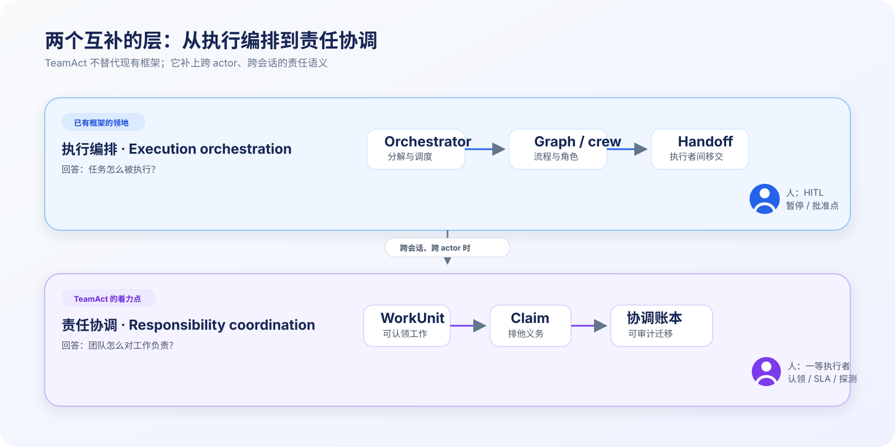
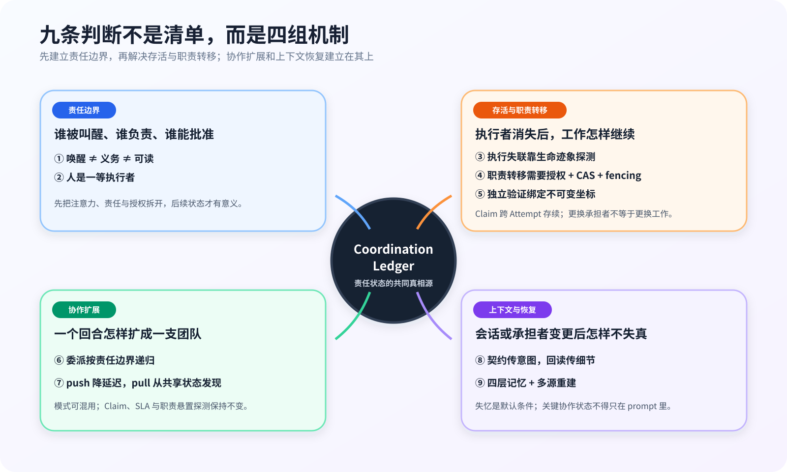
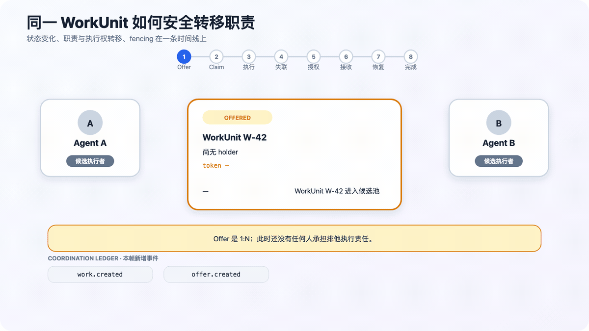
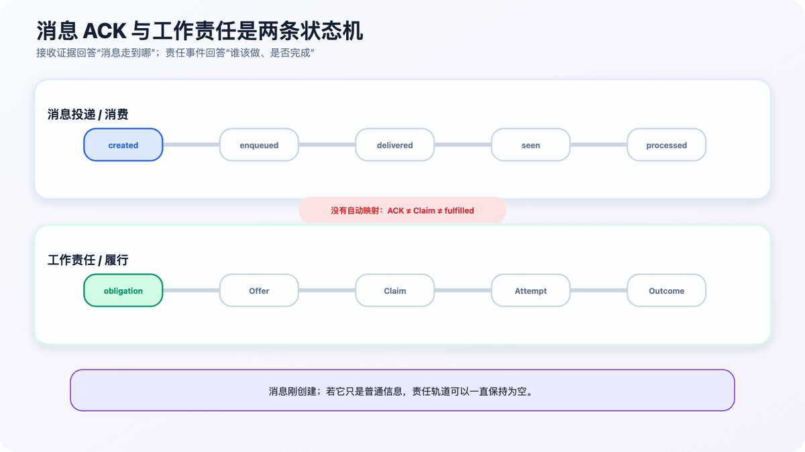
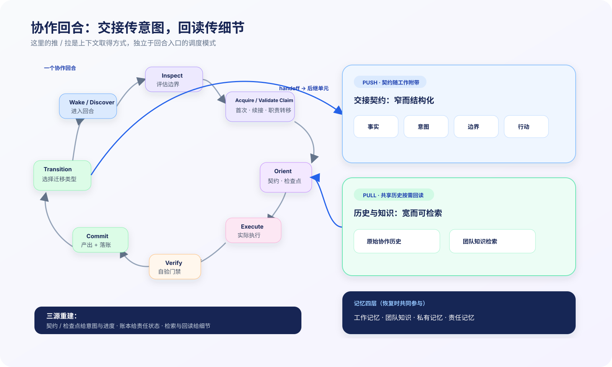
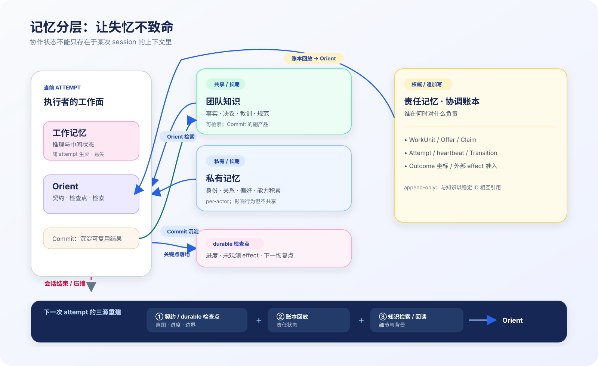

<!-- Export boundary: frontmatter 之上（含本注释）发布时全部剥离；正文自足、
     无内部文档/线程/系统坐标引用。byline 与发布渠道由发布决策定。
     内部治理关系（本文属 TeamAct v2 文档族）见 multi-agent-collaboration-paradigm.md 导航页。 -->

# 从执行编排到责任协调：一个长时人机混合团队的多 Agent 协作范式

> **写给谁**：如果你用过 orchestrator + subagents、agent team、crew 或 graph 编排——
> 你已经知道"任务怎么被执行"这层（execution orchestration）解决得如何了：
> durable execution、断点恢复、human-in-the-loop 都日趋成熟。
> 我们在生产中运行一个多 agent 团队数月后发现还有一层缺少 first-class 支持：
> **"团队怎么对工作负责"（responsibility coordination）**——谁认领了什么、义务推进到哪、
> 哪些职责已失去跟进、人如何作为有 SLA 的一等执行者被纳入协调。本文分享我们对这一层的
> 设计（TeamAct），以及它与 Anthropic 模式、主流框架的关系、用处和边界。

*图 A：执行编排层与责任协调层*

## 1. 我们的系统形态：为什么"执行编排"对我们不够

我们运行着一个持续数月的多 agent 协作系统（一个人类 operator + 多只有持久身份的 AI "猫"协作开发一个软件产品）：

- **Agent 是长命的**：每个 agent 有持久身份、独立记忆、能力画像、责任记录。异构模型混编（Claude / GPT / Gemini / Kimi 同队），累计协作交付 250+ 功能。
- **人是团队成员，不是调用者**：operator 拍板愿景、审批不可逆操作、也**承接工作**（配环境、做决策）——因此人工职责同样可能逾期或失去跟进。
- **工作跨 session**：一个功能以天计，横跨多次进程重启、上下文压缩，乃至模型供应商的额度与服务中断。
- **结果要审计**：谁在什么时候对什么负责，事后必须可追溯（跨模型家族 code review 是我们的铁律）。

现代编排框架在 durable execution 上已经走了很远（LangGraph 的 checkpointing 与跨 session 状态、OpenAI Agents SDK 的可序列化 RunState、CrewAI Flows 的持久化恢复——见 §5）。但它们持久化的对象是**执行状态**（图走到哪个节点、run 等待什么输入）。我们的生产实践反复指向另一类状态的缺失：**责任状态**——这个工作单元被谁认领、义务算谁的、认领者失联了谁来发现、人类成员的承诺怎么被跟踪。执行状态回答"程序怎么继续跑"，责任状态回答"每项职责是否始终有明确承担者"。

## 2. 当 agent 变成长期队友：五类新失效

如果你搭过一次性的 orchestrator + subagents，下面这些问题你可能从未遇到——它们只在 agent **长命、跨会话、与人混编**时出现。以下场景是我们数月生产实践中反复出现的失效模式的抽象（具体案例数据属于内部工程记录，此处只保留结构）：

**F1 — 义务误归属。** 群体频道里进来一条不指名的消息。路由器按规则（比如"最近发言者优先"）把它派给 A——没问题。但 B 稍后因另一件事被唤醒时，系统把频道里的"未读消息"一股脑算进 B 的义务：A 名下的消息被注入 B 的执行上下文，B 的行动还被"你有未读消息"的门禁拦住。**根因：唤醒、义务、可读三个正交维度被压成了一个"频道可见性"。**

**F2 — 时序失真。** 两个 agent 并行工作，回复按到达时间交错渲染成一根时间线——读者看到精确到毫秒的混乱。**根因：审计需要到达序、理解需要因果树、追踪需要执行泳道，三种视图被迫共用一根时间线。**

**F3 — 续接断链。** agent 的会话中断后重启。执行框架能恢复"程序跑到哪了"，却回答不了：我**认领**的是哪项工作？这是第几次尝试？上次尝试对外承诺了什么？**执行状态恢复了，责任状态没有。**

**F4 — 人工责任悬置。** 一件事升级给人审批后长期未处理。agent 侧有超时与重试，人工环节却没有等价的 SLA、提醒与升级路径；系统无法区分“仍在等待合理处理”与“职责已失去跟进”。

**F5 — 执行静默失联。** agent 因供应商额度耗尽或 API 中断停止活动。没有失败事件——因为报告失败同样需要执行者继续运行。工作停在原地，直到人类注意到异常。

五类失效同源：**系统持久化了执行状态与消息内容，却没有持久化责任状态**——谁认领了什么、义务推进到哪、承诺是否还活着。消息（说了什么）、执行（跑到哪了）、责任（谁该做什么）被耦合在同一根管道里，粒度各自都不对。

下文严格区分故障状态与合法迁移：**职责悬置**指义务仍有受监督的工作提供（offer）或升级路径，但超过 SLA 规定的推进窗口后，仍未被承接、处理或升级；**执行失联**指活跃的执行实例（Run）失去心跳与租约；**职责失去有效承接**指既没有有效的责任指派，也没有受监督的后续处理路径。与这些故障不同，**职责转移**是同一 WorkUnit 经授权更换承担者，**顺序移交**则是当前 WorkUnit 完成后创建后继单元。

## 3. TeamAct v2：责任协调范式的核心思想

我们把几个月的实践机制 + 多轮内部对抗讨论（含 14 轮跨模型 review）收敛成一套协调范式。本体压到最小——**两个实体、两个版本化关系、一本账**：

| 概念 | 一句话 |
|------|--------|
| **Actor** | 有持久身份的参与者——agent 是本命形态，**人是扩展形态**（同一套协调语义，人类特有的授权边界另加约束） |
| **WorkUnit** | 可移交的工作单元——包括"等一个人类决策"（审批同样是 WorkUnit） |
| **ResponsibilityAssignment** | 责任指派：**谁有推进义务**（每个 WorkUnit 恒有且仅有一份；版本化；中断时由谁承担恢复义务） |
| **AuthorityGrant** | 职权授予：**谁被允许决策/提交某类副作用**——按 scope（execute / decide / approve…）独立持有、独立版本、独立 fence。责任与职权分离后，"B 干活但 A 保留决策权"（委派）与"agent 执行、人持审批权"（审批门）都是同一结构的配置 |
| **Run** | 一次实际执行（一次 session）；中断 = 记终态，Assignment 不动，恢复 = 新 Run |
| **动作与账本** | offer / accept / transfer / delegate / suspend / resume / resolve——每个动作是 **append-only 协调账本**上的事务事件；责任与职权状态**只能**经账本事务改变，不能由"消息到了""会话启动了"推断 |

消息内容、代码产物、知识各有自己的权威存储，账本只记"谁在何时对什么负责"，通过稳定 ID 联接。会话视图、执行泳道、责任归属都是从账本+各存储投影出来的**读模型**——可重建，不权威。

**一个重要的诚实声明**：TeamAct **不主张**这是去中心化 multi-agent 的普适核心。它针对一个明确问题域——**同一未完成 WorkUnit 的责任或职权跨 Actor 迁移，且继任者的安全行动依赖前任产生的状态**。该域内必须同时解决两个问题：职权续接安全（无双主、无伪造、可追溯）与继任者上下文就绪。解法有两族：**解耦式**（lease 失效 → fence 旧权 → 从共享状态重新认领并自行重建——许多任务队列系统的形态）与**耦合式**（把两者绑成一个事务）。TeamAct 选择耦合式是**带判据的设计选择，不是逻辑必然**（判据见 §6/§7）；解耦式在崩溃主导、共享状态即是全部上下文的负载下更优。

九条判断不是九个同权重的段落，而是四组有先后关系的机制：先划清责任边界，再解决存活、职责转移与验证；协作扩展、上下文与恢复建立在这两层之上。

*图 C：九条判断的阅读地图。中央账本连接四组机制，但不取代各域自己的权威存储。*

### 3.1 先划清责任边界：①–②

**① 唤醒 ≠ 义务 ≠ 可读。** 唤醒回答“谁现在进入回合”，义务回答“谁必须处理、注入谁的工作上下文”，可读回答“谁主动回看时有访问权”。前两者按 recipient 收窄，可读性由独立 ACL 决定；隔离的是注意力和责任，不是协作信息。否则路由给 A 的任务，会在 B 稍后被别的事件唤醒时混进 B 的上下文（F1）。

**② 人是一等执行者。** “等人批准”同样是 WorkUnit：有认领前/后的 SLA、提醒和升级路径，也被职责悬置探测覆盖。系统因此能看见“人工审批处于未处理状态”，但授权边界不变——超时可以提醒、升级、搁置或取消，**不能替人批准**。

### 3.2 再处理存活、职责转移与验证：③–⑤

**③ 执行静默失联看生命迹象，不等失败终态。** Run 从 `started` 开始持续心跳；心跳断供、lease 过期且 SLA 超时，才说明执行者可能已经失联。没有这条正向生命线，"供应商断了，agent 连失败都没来得及报告"永远不可见。

**④ 职责转移 = 授权 → 就绪 → 原子生效，三步不并作一步。** 同一 WorkUnit 从 A 转到 B 是**两阶段事务**：先完成**授权集**——责任易主由当前承担者授权，每个随迁的职权 scope 由其持有者**分别**授权（执行者不能替人转走审批权；失联场景由预声明的恢复政策代行）；prepare 冻结随迁职权、定版上下文快照、封存**在途副作用清单**（A 已发出但尚未返回的外部调用——B 必须知悉，否则会重复执行）；B 确认快照与清单后，commit 原子迁移并使旧凭据失效。**B 获权那一刻已经就绪**——不存在"拿到工作但缺上下文"的窗口；失败则 abort **原样恢复事务前状态**。fencing 凭据四段：{工作单元 ID、职权 scope、职权版本、执行代数}——旧 session 即使稍后恢复也不能落账或申请新副作用。若探测到失联而无人能安全接手，治理层可将工作置入**显式悬置**：**失联者在该 WorkUnit 上持有的**全部行动性职权被 fence（其他成员的职权——如人持有的审批权——不受牵连）、处置责任记名、唯经显式事务退出——工作停在可审计的安全态，而不是无人负责的 limbo。

*动图 1：WorkUnit W-42 没有被"重新创建"；责任与职权从 A 转移给 B，执行实例从 Run #1 变成 Run #2，旧凭据失效，进度从检查点恢复。*

**⑤ 自检与独立验证是两种工作。** Quality gate 在当前 Assignment 内完成；独立验证则是新的 verify-WorkUnit，由非产出者承接，并绑定产出的**不可变坐标**（commit hash / 内容摘要）。产出一变，旧结论自动过期——防止"审的是旧版，盖章盖在新版上"。

### 3.3 协作如何扩展：⑥–⑧

**⑥ 委派按责任边界递归。** 临时 helper 没有独立责任，留在当前 Run 内；一旦被委派者有独立 SLA、验证边界或可被单独追责，就 split 成 child WorkUnit，进入完整的 offer / accept / Run 回合。**当系统选择为这些执行节点建立独立责任边界时**，orchestrator-worker、fan-out/fan-in、evaluator-optimizer 可以按这个递归边界映射进责任层——它们原生并不依赖 TeamAct，在各自框架内已工作良好（附录 B 同此立场）。

**⑦ push、pull 与 ACK 要分层看。**

| 模式 | 它实际做什么 | 主要代价 / 必需控制 |
|---|---|---|
| **push** | 定向投递 offer / envelope，主动排队或启动目标 agent，并可注入上下文 | 延迟低，但注意力耦合；需逐接收者 ACK、幂等、背压，且上下文水合必须与路由目标一致 |
| **pull** | 从共享黑板或 offered WorkUnit pool 发现待处理项，再用 CAS 竞争承接 | 生产者/消费者解耦，但有发现延迟；需公平性、积压与"长期无人承接"治理 |
| **hybrid** | durable shared state 保存事实，push 降低延迟，pull 找回漏触发的工作 | 两条路径共享同一责任指派、义务、职责连续性与失联探测语义 |

**扫描群聊猜谁该做什么不叫 pull。** pull 的前提是共享状态已经表达 WorkUnit、候选人、义务和版本。push 也不是只能发空唤醒：它可以携带 envelope、注入上下文、启动 invocation；只是这些动作不能替代 durable state 和 `enqueued → delivered → seen → processed` 的接收证据。

*动图 2：消息 `processed` 只说明接收者已分类或回应；WorkUnit 是否被承接、是否产生可验证产出，由另一条责任状态机决定。*

**⑧ 上下文走双通道。** 交接时用窄而结构化的契约传**事实、意图、边界、行动**；接手者再从共享历史与团队知识按需回读细节。只有推送会丢细节，只有拉取会丢意图——原始记录通常没有“为什么没有选另一个方案”。

*图 B：调度入口与上下文取得正交；push-triggered 回合仍会拉取细节，pull 发现的工作也可以附带交接契约。*

### 3.4 失忆之后怎样恢复：⑨

**⑨ 失忆是常态，记忆分四层。** 工作记忆随 Run 生灭；团队知识跨 actor 共享；私有记忆维持身份与关系；责任记忆由协调账本保存。新会话或新 holder 的恢复不是读一份“大摘要”，而是从**交接契约/最后检查点 + 账本回放 + 知识检索/历史回读**多源重建：前者给意图与未完成进度，账本给责任真相，知识与历史给细节。

*图 D：任何决定“谁负责什么、做到哪”的信息，都不能只存在于易失的工作记忆。*

> 完整的形式化规范（实体定义、闭合事件集、运行时语义、设计决议与被否决的替代方案）超出本文篇幅；此处保留核心思想与设计判断。

## 4. 与 Anthropic 多 agent 模式的关系：组合，不是竞争

Anthropic 的三份实践参照：[Building Effective Agents](https://www.anthropic.com/research/building-effective-agents)（五种 workflow patterns；"简单可组合模式优于框架"）、[multi-agent research system](https://www.anthropic.com/engineering/multi-agent-research-system)（orchestrator-worker：lead agent 并行派生 subagents；**其内部 research eval** 上相对单 agent +90.2%，token 用量约为单次 chat 的 15×——两个数字都限定在其研究场景）、[When to use multi-agent systems](https://claude.com/blog/building-multi-agent-systems-when-and-how-to-use-them)（三个使用信号；"先从单 agent 开始"）。

| 维度 | Anthropic patterns / research system | TeamAct v2 |
|------|--------------------------------------|-----------|
| 回答的问题 | 一次任务内如何编排执行 | 团队如何对工作负责 |
| agent 生命周期 | 任务期（orchestrator 派生、任务毕回收） | persistent（身份、记忆、责任跨任务累积） |
| 拓扑 | 层级：orchestrator 拥有并管理 worker | 对等 + 治理：peer 协作，operator 是治理者与一等执行者 |
| 协调状态 | orchestrator context 为主；research system 已辅以外部 memory、filesystem artifacts 与 checkpoint | 外化的 coordination ledger |
| 人的角色 | 发起者 / 结果消费者 | 团队成员（审批 WorkUnit + approve 职权保留在人，双层 SLA） |
| 失败模型 | retry / respawn / checkpoint 恢复 | Run 链 + Assignment 存续 + fencing + 统一职责连续性探测 + 显式悬置处置 |

**两层按 §3-⑥ 的递归边界组合**：orchestrator-worker、evaluator-optimizer 等 patterns 可以完整活在一个 WorkUnit 的执行内部（临时 helper），也可以升格为 child WorkUnits（独立责任）。Anthropic 的 when-not-to 判据我们完全采纳：单任务能单 agent 做就不要多 agent。他们记录的失败模式与我们机制的对应也能交叉验证：telephone game ↔ 结构化 handoff 契约 + 可读性不隔离（接手者读原始上下文，不依赖转述）；early victory ↔ 独立验证 WorkUnit + 否定约束 + 不可变坐标绑定；context pollution ↔ 唤醒/义务 per-recipient 隔离。

## 5. 与行业框架与协议的对照

不要按产品名比较，先按它们回答的问题分层：

| 层 | 典型框架 / 协议 | 主要回答 | 与 TeamAct 的关系 |
|---|---|---|---|
| **执行运行时** | LangGraph、CrewAI、AutoGen、OpenAI / Claude Agent SDK | 程序怎样编排、暂停、恢复与继续执行 | TeamAct 可运行在其上；不重复实现 durable execution |
| **跨厂商互操作** | Google / Linux Foundation A2A | 不同组织与厂商的 agent 怎样发现能力、交换 Task 状态 | WorkUnit 可桥接为边界 Task；内部责任连续性 / liveness 仍由参与方负责 |
| **工具协议** | MCP | agent 怎样调用工具与资源 | 与责任协调正交 |
| **责任协调** | TeamAct | 谁认领、谁有义务、谁失联、如何安全转移职责与独立验证 | 本文的问题域 |

**LangGraph 是最接近的邻居，分界线在本体而非能力。** 它已很好地回答"程序可靠地继续跑"；应用也完全可以在 graph state 里自建责任指派与归属跟踪。TeamAct 提供的是一套可复用的责任本体与约束：身份化承接、责任/职权分离、人机统一 liveness、两阶段授权转移、产出绑定的独立验证。HITL 暂停点与审批 WorkUnit 有能力重叠，但后者把人建模为带 SLA、可被职责悬置探测覆盖的执行者。

本文的 "A2A"（agent-to-agent 通名）与 Google 发起、现由 Linux Foundation 治理的 Agent2Agent protocol 不是同一概念。后者负责边界互操作；TeamAct 负责参与方内部责任。详细的逐框架比较移至附录 A，常见协作模式到责任语义的映射见附录 B。

## 6. 为什么这样设计：约束、设计选择与可反驳性

每条设计对应一条系统约束。**判断本范式是否适用于你，先看你是否共享这些约束**——不共享某条，就不需要对应的设计：

| # | 约束 | 对应的设计 | 若无此约束 |
|---|------|-----------|-----------|
| C1 | agent 长命、有身份与责任记录 | 责任指派挂身份、能力画像辅助分派与移交、责任可追溯 | ephemeral worker + orchestrator 即可 |
| C2 | 人是团队成员，且**人工职责也会逾期或失去跟进** | 审批 WorkUnit + 双层 SLA + 统一职责悬置探测 | 人只做发起者，HITL 暂停点即可 |
| C3 | 工作跨 session / 进程 / 供应商故障，且**执行者可能被更换** | 责任状态外化 ledger；Run 链；Assignment 跨 Run 存续；四段凭据 fencing | 编排框架的 durable execution 即可 |
| C4 | 结果要审计、验证要独立 | append-only event sourcing + 产出不可变坐标 + 验证否定约束 | 普通日志即可 |
| C5 | 异构模型 / 异构框架混编 | 协调协议定义在事件与消息层，不绑任何 agent 框架 | 用单一框架的内建编排即可 |

还有一条**约束之外的诚实边界：即使五条约束全部成立，耦合式交接也不是唯一解**。解耦式 fence-and-reclaim（§3 诚实声明）在同样约束下完全合法。我们选耦合式的具体判据：**计划性易主为主**（前任在场，可合作封存在途副作用、移交未外化意图）、**审计要求责任连续无空窗**、**继任者含人类**（人需要推送式策展上下文与显式接受，难以"回放重建"）。反向负载（崩溃主导、共享状态即是全部上下文、承接竞争便宜）应选解耦式。这个选择判据本身**可被反驳**，且判定规则是精确的：在判据预测应选耦合式的负载上，**同一工作负载、同一环境假设、同一结果门槛**（关键副作用不重复、责任可归属、继任者安全续接、失效有界处置——含相同的探测/处置 SLA 阈值）下，若解耦方案在代价维度上构成 **Pareto 支配**（至少一维严格更优且无一维更差），即证伪我们的选择规则；非支配的混合结果（有优有劣）**既不构成反驳、也不构成本文的辩护**。反驳标准是结果性质，不是本文自己的机制。

## 7. 有什么用 & 适用判据

**具体收益**（每条回应 §2 的一类失效）：职责悬置与执行失联可探测且**人与 agent 统一覆盖**；职责归属链全程可复盘；中断可恢复且职责转移安全（Run 链 + 两阶段事务 + fencing）；并发安全（账本 CAS 消灭"都以为对方在做"）；注意力隔离而不牺牲协作感知；治理约束（跨家族 review、决策边界）从"团队约定"变成可校验的协议。

**适用判据**——核心是两条**必需条件**：

- **职责会转移**：工作跨执行者生命周期——执行者可能中断、被替换、或把职责移交给其他执行者？
- **职责失去有效承接有代价**：需要发现"没人在做"并追溯"谁该做"，而不是任其超时重跑？

两条都"是"→ 你需要某种责任协调层。增强信号越多，完整形态越划算：人深度参与执行路径、多模型混编、审计要求高、任务以天计跨 session。

| 职责转移 | 职责失去有效承接的代价 | 建议 |
|---|---|---|
| 无：一个执行者从头做到尾 | 任意 | 不引入责任层；使用单 agent / durable execution |
| 有，但失败可直接整单重跑 | 低 | 只保留轻量 owner + status，不必上完整账本 |
| 有，且需要知道“谁该做、做到哪” | 中高 | 至少引入 WorkUnit + offer/accept 责任指派与超时探测 |
| 有，执行者可替换、人参与审批、外部副作用不可盲重试 | 高 | 使用完整 TeamAct：Run lineage、两阶段转移、fencing、审批 WorkUnit、产出绑定验证、悬置处置 |

**不适用**的判据同样看责任而非时长或次数：无职责转移（单执行者从头到尾）、执行者不可替换也无需探活、职责失去有效承接也无业务代价（超时重跑即可）——此时编排框架的 durable execution 已足够。典型：单次 pipeline 任务（→ Anthropic patterns）、高频低延迟在线服务（协调开销不可摊）、大规模同质 swarm 的 map-reduce（→ orchestrator-worker）。注意反例：**一次性但高风险的跨 actor 流程**（如一次生产迁移，多方交接 + 人工审批）依然值得责任账本——判据是职责转移与审计需求，不是运行次数。

## 8. 局限（诚实清单）

**范式固有**：

1. **协议遵守不是硬约束。** LLM agent 靠提示词约定 + 运行时门禁兜底，仍会漏——我们自己就经历过执行者因供应商中断静默消失、最终靠人工发现的案例（正是 §2 的 F5）。账本让职责无人承接或执行失联**可见**，却不能使这些失效**不可能发生**。
2. **人的 SLA 是社会约定。** 超时只能提醒与升级，不能强制人类行动，更不能绕过授权。
3. **协调开销真实存在。** 多 agent 本身就贵（参照 Anthropic 研究场景 ~15× token 的量级），协调层再加感知/落账成本。只适合价值密度高的工作（开发、研究、审计敏感协作）。
4. **范式收敛自我们自身的实践，存在自指风险。** §2 的失效目录采自一个已按交接方式运转的团队——它证明该形态下协调破损真实且有代价，**不证明**交接是普适核心。对冲方式：问题域显式声明（§3 诚实声明）、承认解耦式替代并给出选择判据（§6）、反驳标准使用模型中立的结果性质而非本文自己的机制（§6 末段）。
5. **恢复治理有信任根。** 失联恢复与悬置的授权者集合是协议的信任根：合法授权者恶意停工无法由协议消除，只能由 quorum / 职责分离缓解；协议保证的是滥用全程落账、可见可追溯。

**我们实现的诚实披露**（四分，避免读者高估落地进度）：

- **已上线**：系统整体已运行数月；以下局部先行机制已上线（**各自落地时间不一，最近的在近一个月内**）——责任归属观测的事件溯源引擎（append-only log + 可重建投影 + 探测唤醒）、会话续接协调器、义务新鲜度门禁、结构化等待声明、能力画像辅助的工作分派判断；
- **尚未开始实现**：本文的核心——CoordinationLedger 与 WorkUnit 本体。目前只有设计与迁移计划（shadow 先行、逐路径 authority 晋升），代码改造未启动；
- **已验证**：事件溯源模式在责任归属域的生产可行性（rebuild = replay 无漂移）、§2 的失效模式与根因归纳、多轮跨模型对抗 review 的收敛过程本身；
- **未验证**：目标范式的整体运行效果、10+ agent 与多 operator 规模。

一句话：**本文是"从实测问题收敛出的目标范式"，不是"已上线系统的功能说明"。** 实证规模 3~7 agent、单 operator、单机；账本设计上只要求逻辑单一的协调历史（物理复制/分区是工程问题）。

## Appendix A：逐框架能力边界

> 方法注记：下表针对各框架 2026 年的官方文档口径（链接见文末）。这些 runtime 与 TeamAct 在 durable execution 与 HITL 上有能力重叠；差异集中在是否把跨 actor 的责任指派/职权授予、归属审计和人机 liveness 作为 first-class 本体。**表格只主张"是否 first-class"，不主张能力不可自建。**

| 框架 / 协议 | 编排单位 | 持久化的对象 | 人的位置 | 跨 actor 责任本体（first-class?） |
|---|---|---|---|---|
| LangGraph | graph 节点（静态定义 + `Send`/`Command` 动态派生） | graph state + checkpointer（durable、跨 session、可恢复） | interrupt / HITL 节点 | 非 first-class——责任指派 / 归属审计 / 授权需应用自行建模 |
| CrewAI | role-based crew / Flows | Flows 持久化与恢复 | 输入与审批点 | 非 first-class |
| AutoGen / AG2 | AgentChat 会话层 + Core actor runtime | actor 运行时状态 | 会话参与者 | 非 first-class——认领/义务语义需应用自行建模 |
| OpenAI Agents SDK | handoff + sessions | 可序列化 RunState（支持跨 run 的 HITL 恢复） | tool 级 HITL 审批 | 非 first-class |
| Claude Agent SDK | subagent spawn + sessions | session resume / fork、外部持久化、hooks 与 permissions | operator + permission gates | 非 first-class |
| Google A2A protocol | 跨厂商 Task | 协议态任务状态（异步、poll/subscribe/push、取消） | 协议范围外 | scope 外——责任连续性 / liveness 留给参与方 |
| **TeamAct v2** | **WorkUnit** | **责任状态：coordination ledger（+ 各域权威 store）** | **一等执行者 + 治理者** | **first-class** |

## Appendix B：常见协作模式怎样落到责任语义

这张表用于从熟悉的框架术语回到责任语义；它不是新的模式分类法，也不主张这些模式"属于"TeamAct——多数模式在其原生框架内已工作良好，此处只回答"若你需要责任层，它们如何表达"。

| 行业协作模式 | TeamAct v2 表达 |
|---|---|
| supervisor / orchestrator-worker | 父 WorkUnit 的承担者 split child WorkUnits → 定向 offer → join(all) |
| handoff / router | 顺序移交创建后继 WorkUnit；同一 WorkUnit 更换承担者时走两阶段授权转移事务（授权集 → 冻结+快照 → 确认 → 原子提交） |
| peer mesh（对等协作） | offer / accept + 结构化交接契约 |
| fan-out / fan-in | split N → 并行 accept → join（all / quorum / first-success） |
| blackboard | versioned shared state（CAS）+ wake 订阅 |
| debate / consensus | 同输入 N 个平行 WorkUnit（不同执行者）→ 聚合 WorkUnit（vote / judge） |
| pull pool（工作队列） | offer 广播到 pool → accept CAS 竞争 |
| evaluator-optimizer | 执行 ↔ verify-WorkUnit 迭代；验证不通过 → 账本事务回 rework |

## References

- Anthropic, [Building Effective Agents](https://www.anthropic.com/research/building-effective-agents)
- Anthropic, [How we built our multi-agent research system](https://www.anthropic.com/engineering/multi-agent-research-system)
- Anthropic, [When to use multi-agent systems (and when not to)](https://claude.com/blog/building-multi-agent-systems-when-and-how-to-use-them)
- Anthropic, [Claude Agent SDK overview](https://code.claude.com/docs/en/agent-sdk/overview)
- LangChain, [LangGraph overview](https://docs.langchain.com/oss/python/langgraph/overview) / [Workflows & agents](https://docs.langchain.com/oss/python/langgraph/workflows-agents) / [Persistence](https://docs.langchain.com/oss/python/langgraph/persistence)
- Microsoft, [AutoGen Core](https://microsoft.github.io/autogen/stable/user-guide/core-user-guide/index.html)
- OpenAI, [Agents SDK](https://openai.github.io/openai-agents-python/) / [Human-in-the-loop](https://openai.github.io/openai-agents-python/human_in_the_loop/)
- CrewAI, [Documentation](https://docs.crewai.com/)
- A2A Project, [Specification](https://github.com/a2aproject/A2A/blob/main/docs/specification.md)；Linux Foundation [立项通报](https://www.linuxfoundation.org/press/linux-foundation-launches-the-agent2agent-protocol-project-to-enable-secure-intelligent-communication-between-ai-agents) / [一周年通报](https://www.linuxfoundation.org/press/a2a-protocol-surpasses-150-organizations-lands-in-major-cloud-platforms-and-sees-enterprise-production-use-in-first-year)
